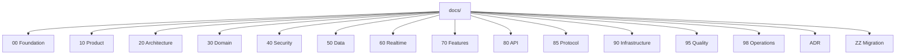

# Architecture Documentation — README and Reading Order

| Field | Value |
|---|---|
| **Title** | Architecture Documentation README and Reading Order |
| **Status** | Completed |
| **Owner** | Architecture |
| **Version** | 1.0.0 |
| **Last Updated** | 2026-07-14 |
| **Document ID** | DOC-002 |

**Dependencies:** None.

**Related Documents:** `document-manifest.yaml` (DOC source of truth), `10-vision-and-scope` (DOC-001).

---

## Purpose

This document is the entry point to the architecture documentation of the global real-time messaging platform. It explains how the documentation set is organized, the standards every document follows, and the order in which documents should be read and written. It points readers to `document-manifest.yaml`, which is the machine-readable single source of truth for document identity, status, and dependency order.

## Scope

**In scope:** documentation conventions, folder taxonomy, status model, reading order, and the mandatory document header schema.

**Out of scope:** product, architecture, and technical content itself — those live in the referenced documents. Dependency ordering is **not** defined here; it is owned exclusively by `document-manifest.yaml`.

## Architecture Impact

This document enforces documentation consistency and traceability. It codifies the standards that make the documentation set reviewable by Principal Architects and keeps every document aligned with the platform's absolute constraint: **the backend never decrypts message content.**

---

## 1. Documentation Standards

Every markdown document in this repository MUST contain, in order:

1. Title
2. Status, Owner, Version, Last Updated (header table)
3. Dependencies
4. Related Documents
5. Purpose
6. Scope
7. Architecture Impact
8. Main content (sections appropriate to the document)
9. Mermaid diagrams where useful
10. Tables where useful
11. Risks
12. Future Considerations
13. Open Questions
14. References

No document may contain TODOs, placeholders, "coming soon", lorem ipsum, or draft notes. Every document is production quality.

## 2. Status Model

| Status | Meaning |
|---|---|
| Completed | Written, validated, and consistent with all dependencies. |
| Pending | Not yet written; awaiting its dependencies. |
| Blocked | Cannot proceed due to an unresolved architectural decision. |

The authoritative status of every document lives in `document-manifest.yaml`.

## 3. Folder Taxonomy

| Category | Path prefix | Owns |
|---|---|---|
| Foundation | `docs/00-*` | README, glossary |
| Product | `docs/10-product` | Vision, personas, requirements |
| Architecture | `docs/20-architecture` | Overview, C4, principles, invariants |
| Domain | `docs/30-domain` | Model, contexts, events, sequences, lifecycle |
| Security | `docs/40-security` | E2EE, auth, keys, threats |
| Data | `docs/50-data` | Storage, schema, Redis, sync, search |
| Realtime | `docs/60-realtime` | SignalR topology, presence, receipts, push |
| Features | `docs/70-features` | Vertical-slice feature specs |
| API | `docs/80-api` | REST, hub, error model, client crypto contract |
| Protocol | `docs/85-protocol` | Transport-agnostic wire protocol |
| Infrastructure | `docs/90-infrastructure` | Deployment, workers, observability, scale |
| Quality | `docs/95-quality` | Testing, performance, DoD |
| Operations | `docs/98-operations` | Runbooks, SLOs, DR, rotation |
| ADR | `docs/ADR` | Architecture Decision Records |
| Migration | `docs/ZZ-migration` | Microservice extraction path |

## 4. Reading Order

For newcomers, read top-down: **Vision → Requirements → Architecture Principles & Invariants → Architecture Overview → Messaging Core Architecture (DOC-154) → Phase 3 Completion (DOC-155) → Phase 4 Plan (DOC-156) → Domain → Security (E2EE) → Data → Realtime → Protocol → Features → API → Infrastructure → Quality → Operations.** ADRs are read alongside the documents they govern. The build/write order is governed by `document-manifest.yaml`, not by this list.

## 5. Naming Conventions

- Files use the numeric prefix of their category and kebab-case names.
- Feature specs use the `FS-NN` prefix; sequences use `SQ-NN`; decisions use `ADR-NNNN`; operations playbooks use `OPS-NN`.
- Each document has a stable `DOC-NNN` identity defined only in the manifest.

---

## Risks

| Risk | Impact | Mitigation |
|---|---|---|
| Documents drift out of sync with the manifest | Broken build order, stale cross-references | Manifest is the single source of truth; update it every build iteration. |
| Terminology drift across documents | Ambiguity, contradictory specs | Central glossary (DOC-003..008); all docs use defined terms. |
| A document silently violates the E2EE invariant | Critical architecture breach | Validation gate on every save; invariants in DOC-023. |

## Future Considerations

- Automated CI validation of the manifest (dependency cycles, dangling references, orphan files).
- Rendering the documentation set as a static site with generated dependency graphs.

## Open Questions

| ID | Question | Owner |
|---|---|---|
| OQ-README-01 | Should manifest validation be a blocking CI gate at launch? | Architecture |

## References

- `document-manifest.yaml`
- `10-vision-and-scope` (DOC-001)
- `29-architecture-principles` (DOC-022)
- `29.5-system-invariants` (DOC-023)
