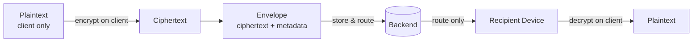

# Glossary Overview

| Field | Value |
|---|---|
| **Title** | Glossary Overview |
| **Status** | Completed |
| **Owner** | Architecture |
| **Version** | 1.2.0 |
| **Last Updated** | 2026-07-18 |
| **Document ID** | DOC-003 |

**Dependencies:** None.

**Related Documents:** `01-business-terms` (DOC-004), `02-technical-terms` (DOC-005), `03-acronyms` (DOC-006), `04-protocol-terms` (DOC-007), `05-cryptography-terms` (DOC-008), `30-domain-model-overview` (DOC-024).

---

## Purpose

This document establishes the **ubiquitous language** of the platform and governs how terminology is organized across the glossary. It is the authoritative index that binds five specialized term files into one vocabulary that every other document MUST use consistently.

## Scope

**In scope:** the glossary structure, term-ownership rules, and a curated set of the most load-bearing cross-cutting terms.

**Out of scope:** exhaustive term definitions, which live in the five specialized files. Domain modeling itself lives in `30-domain-model-overview`.

## Architecture Impact

A single, shared vocabulary prevents specification drift and contradictory designs across bounded contexts. Critically, it fixes the precise meaning of terms such as **ciphertext**, **envelope**, **metadata**, and **plaintext**, which are essential to expressing and enforcing the invariant that the **backend never decrypts message content**.

---

## 1. Glossary Structure

| File | Contains | Owner |
|---|---|---|
| `01-business-terms` | Product/domain concepts (Conversation, Channel, Contact) | Product |
| `02-technical-terms` | Engineering concepts (Slice, Command, Query, Projection) | Architecture |
| `03-acronyms` | Expansions (CQRS, DDD, E2EE, SLO) | Architecture |
| `04-protocol-terms` | Wire/protocol concepts (Packet, Frame, Ack, Cursor) | Architecture |
| `05-cryptography-terms` | Crypto concepts (Prekey, Ratchet, Sender Key) | Security |

## 2. Term Governance Rules

1. A term is defined in exactly one file (its owning category); other files reference it.
2. When a document introduces a new domain or protocol term, the corresponding glossary file MUST be updated before that document is marked Completed.
3. Deprecated synonyms are recorded with the preferred term to avoid drift.

## 3. Core Cross-Cutting Terms

| Term | Definition |
|---|---|
| Plaintext | Human-readable message content. Exists **only** on clients; never on the backend. |
| Ciphertext | Encrypted message content produced on a client. The only form of content the backend stores or routes. |
| Envelope | The transport structure carrying ciphertext plus non-sensitive routing metadata. Defined authoritatively in `85.4-encryption-envelope`. |
| Metadata | Non-content data the backend may store/route on (IDs, timestamps, participants). Minimized per `85.6-message-metadata`. |
| Conversation | Aggregate root for a messaging context (`ConversationId`), typed `Direct` / `Group` / `Channel`, with lifecycle state (`Created`, `Active`, `Archived`, `Frozen`, `Deleted`). See AD-007 / ADR-0031. |
| Membership | Entity binding a `UserId` to a Conversation, with membership state (`Invited`, `Pending`, `Active`, `Left`, `Removed`, `Blocked`) and role. Devices inherit the user's membership for authorization. |
| Role | Authorization rank within a Group/Channel: `owner`, `admin`, `moderator`, or `member`. Direct conversations have peer members only (no owner hierarchy). |
| Conversation Metadata | Non-content display attributes of a conversation (e.g., display name reference); minimized per privacy posture. |
| Conversation Settings | Non-content configuration (e.g., `maxMembers`, type-specific flags). |
| Device | A distinct client instance with its own cryptographic identity. |
| Message ID | The single immutable global identifier of a message (see invariant INV-02). |

---

## Risks

| Risk | Impact | Mitigation |
|---|---|---|
| Inconsistent use of "metadata" vs "content" | Accidental design that leaks or decrypts content | Definitions above are binding; referenced by security docs. |
| Term duplication across files | Conflicting definitions | One-owner rule per term. |

## Future Considerations

- Generate a merged, alphabetized glossary view automatically from the five files.
- Localize business terms for multi-language product surfaces.

## Open Questions

| ID | Question | Owner |
|---|---|---|
| OQ-GLOSS-01 | Do channels introduce distinct terminology requiring a sixth category? | Product |

## References

- `00-README` (DOC-002)
- `85.4-encryption-envelope` (DOC-090)
- `85.6-message-metadata` (DOC-092)
