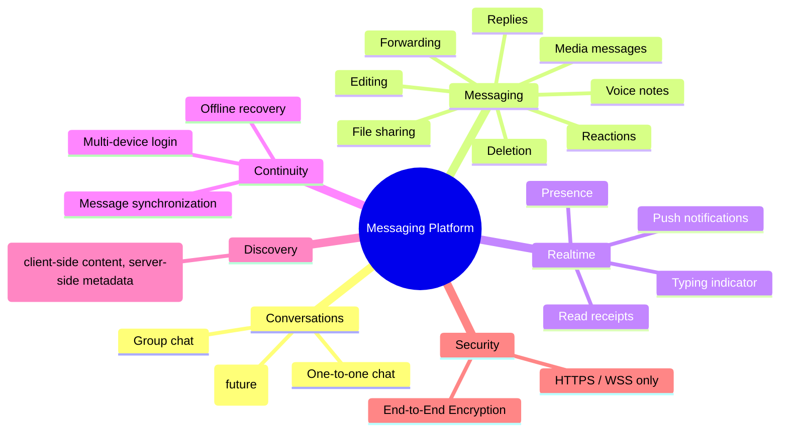

# Vision and Scope

| Field | Value |
|---|---|
| **Title** | Vision and Scope |
| **Status** | Draft |
| **Owner** | Lead Software Architect |
| **Version** | 1.0.0 |
| **Last Updated** | 2026-07-14 |
| **Document ID** | 10-vision-and-scope |

**Dependencies:** None (this is the root product document; all other documents trace back to it).

**Related Documents:**
- `11-personas-and-use-cases`
- `12-functional-requirements`
- `13-non-functional-requirements`
- `14-requirements-traceability-matrix`
- `20-architecture-overview`
- `29-architecture-principles`
- `29.5-system-invariants`
- `41-e2ee-design`

---

## Purpose

This document defines **why the platform exists**, **what it must achieve**, and **the boundaries of the initial delivery**. It is the single source of business intent for the entire engineering effort. Every downstream requirement, architectural decision, feature slice, and quality target MUST trace back to a goal stated here.

It exists to align product, engineering, security, and operations stakeholders on a shared definition of success **before** implementation begins, and to make explicit what the platform will and will not do in its first production release.

---

## Scope

**In scope for this document:**
- Business goals and the problem being solved.
- Target scale and the quality ambitions that shape the architecture.
- Product capabilities in the initial release versus deferred capabilities.
- Success metrics and guiding constraints.
- Explicit non-goals and out-of-scope items.

**Out of scope for this document:**
- Detailed functional requirements — see `12-functional-requirements`.
- Measurable quality targets and budgets — see `13-non-functional-requirements` and `96-performance-budget`.
- Architecture, technology rationale, and design — see the `20-architecture` documents.
- Cryptographic design — see `41-e2ee-design`.

---

## Architecture Impact

This document establishes the two forces that dominate every architectural decision downstream:

1. **Privacy as a product promise.** End-to-End Encryption (E2EE) is a first-class product commitment, not an optional feature. The backend **never** decrypts message content; it stores ciphertext and routing metadata only. This constraint shapes the domain model, data storage, search, notifications, and observability.
2. **Global scale.** The platform targets millions of concurrent users, which mandates a stateless, horizontally scalable, event-driven design delivered initially as a modular monolith that is cleanly extractable into microservices.

These two forces are formalized downstream as system invariants (`29.5-system-invariants`) and architecture principles (`29-architecture-principles`).

---

## 1. Problem Statement

Individuals and communities need a **real-time, private, and reliable** way to communicate across devices and geographies. Existing expectations, set by platforms such as Telegram, WhatsApp, Signal, Discord, and Microsoft Teams, demand instant delivery, strong privacy guarantees, rich media, and seamless multi-device continuity.

The platform must deliver messaging where:
- Content privacy is guaranteed by cryptography, not by policy — the operator cannot read user messages.
- Delivery is real-time and reliable, even across unreliable networks and offline periods.
- Users move seamlessly across multiple devices with a consistent, synchronized view of their conversations.
- The system scales to a global user base without a redesign.

---

## 2. Vision Statement

> To build a globally distributed, real-time messaging platform where users communicate with confidence that their conversations are private by design, delivered reliably in real time, and available consistently across every device they own — engineered to enterprise standards of security, scalability, and operability.

---

## 3. Business Goals

| ID | Goal | Rationale |
|---|---|---|
| G-01 | Guarantee message-content privacy via E2EE | Privacy is the core differentiator and trust anchor; the operator must be technically unable to read content. |
| G-02 | Deliver real-time messaging at global scale | Meet user expectations for instant, reliable communication for millions of users. |
| G-03 | Provide seamless multi-device continuity | Users expect their conversations synchronized across all their devices. |
| G-04 | Support rich communication (media, voice, files, reactions, replies) | Match the expressive capabilities of leading messaging platforms. |
| G-05 | Achieve enterprise-grade reliability and operability | Sustain availability, observability, and recoverability suitable for a global service. |
| G-06 | Preserve architectural agility | Ship fast as a modular monolith while retaining a clean path to microservices. |

---

## 4. Target Users (Summary)

Detailed personas live in `11-personas-and-use-cases`. At the vision level, the platform serves:

- **Individuals** exchanging one-to-one messages and media.
- **Groups** of users collaborating in shared conversations.
- **Communities / audiences** consuming broadcast content via Channels (a future capability).

---

## 5. Product Scope

### 5.1 Capability Overview



### 5.2 Release Scoping

| Capability | Initial Release | Future | Notes |
|---|---|---|---|
| One-to-one chat | ✅ | | Core reference slice. |
| Group chat | ✅ | | Group encryption applies. |
| Channels | | ✅ | Broadcast model; design seams reserved now. |
| Media messages | ✅ | | Encrypt-then-upload. |
| Voice notes | ✅ | | Encrypted audio; metadata only server-side. |
| File sharing | ✅ | | Encrypt-then-upload. |
| Presence | ✅ | | Privacy-controllable. |
| Typing indicator | ✅ | | Ephemeral, not persisted. |
| Read receipts | ✅ | | Metadata only; privacy-controllable. |
| Push notifications | ✅ | | Data-only push; no plaintext content. |
| Multi-device login | ✅ | | Per-device identity and keys. |
| Message synchronization | ✅ | | Ciphertext sync with per-device cursors. |
| Search | ✅ | | Client-side content search; server-side metadata search only. |
| Message reactions | ✅ | | Metadata on messages. |
| Replies | ✅ | | References with encrypted quoted content. |
| Forwarding | ✅ | | Client re-encrypts on forward. |
| Message editing | ✅ | | New immutable version; original ID preserved. |
| Message deletion | ✅ | | Soft delete / tombstone with fan-out. |
| E2EE | ✅ | | Absolute, non-negotiable. |
| HTTPS / WSS | ✅ | | All transport encrypted. |

---

## 6. Success Metrics

These are directional business targets. Precise, measurable engineering targets are defined in `13-non-functional-requirements` and `96-performance-budget`.

| ID | Metric | Target Direction | Authoritative Definition |
|---|---|---|---|
| M-01 | Concurrent connected users | Scale to millions | `94-scalability-and-capacity` |
| M-02 | Message send-to-receive latency | Real-time (sub-second typical) | `96-performance-budget` |
| M-03 | Service availability | High availability | `99-sre-slo-sli` |
| M-04 | Message delivery reliability | No lost or duplicated messages | `29.5-system-invariants` (INV-04, INV-05) |
| M-05 | Content confidentiality | Operator cannot read content | `41-e2ee-design`, `29.5-system-invariants` (INV-01) |
| M-06 | Multi-device consistency | Convergent view across devices | `85.9-synchronization-protocol` |

---

## 7. Guiding Constraints

| ID | Constraint | Source |
|---|---|---|
| C-01 | The backend never decrypts message content. | Absolute product/security mandate. |
| C-02 | All transport is HTTPS/WSS; plaintext transport is rejected. | Security mandate. |
| C-03 | Delivered initially as a modular monolith, extractable to microservices. | Architecture mandate. |
| C-04 | Built on the fixed technology stack (ASP.NET Core 10, PostgreSQL, Redis, SignalR, EF Core, Dapper, Docker). | Architecture mandate. |
| C-05 | Feature-first, vertical-slice organization with CQRS and domain events. | Architecture mandate. |
| C-06 | Every feature must be traceable to a requirement. | Governance mandate (`14-requirements-traceability-matrix`). |

---

## 8. Non-Goals (Out of Scope)

The following are explicitly **not** goals of the initial release. They are recorded to prevent scope creep and are not commitments.

- **Server-side reading, indexing, or moderation of message content.** This is architecturally impossible by design (C-01) and is not a goal.
- **Full channel/broadcast platform.** Channels are deferred; only extension seams are reserved.
- **Voice and video calling.** Not in the initial capability set.
- **Bot / third-party developer platform and public API marketplace.** Not in the initial release.
- **Monetization, payments, and advertising.** Out of scope.
- **Federation / interoperability with external messaging networks.** Out of scope.

---

## 9. Assumptions and Dependencies

| Type | Statement |
|---|---|
| Assumption | Clients are trusted execution environments capable of performing all cryptographic operations (see `84-client-sdk-crypto-contract`). |
| Assumption | Push delivery relies on external providers (APNs/FCM), which receive no plaintext content. |
| Assumption | Media is stored in object storage / CDN as ciphertext. |
| Dependency | A chosen, audited E2EE protocol underpins content confidentiality (finalized in `41-e2ee-design` / `ADR-0004`). |
| Dependency | Global message identity and ordering scheme finalized in `ADR-0008` / `ADR-0010`. |

---

## 10. Roadmap Phases (Indicative)

```mermaid
flowchart LR
    P1[Phase 1\nFoundations\nAuth, Devices, 1:1 chat, E2EE] --> P2[Phase 2\nGroups & Rich Media\nGroup chat, media, voice, files]
    P2 --> P3[Phase 3\nContinuity & Scale\nMulti-device sync, search, presence]
    P3 --> P4[Phase 4\nHardening\nObservability, DR, capacity, chaos]
    P4 --> P5[Phase 5 (Future)\nChannels & Microservice extraction]
```

Phase boundaries are indicative and refined by `12-functional-requirements` and the delivery plan; they do not alter the fixed architecture.

---

## 11. Future Considerations

- **Channels** as a first-class broadcast capability, including moderation models compatible with E2EE constraints.
- **Voice/video calling** built on the same identity, key-management, and realtime foundations.
- **Multi-region active-active** deployment and data-residency controls (`97-multi-region-and-residency`).
- **Microservice extraction** of high-load contexts (messaging, presence, media) following `ZZ-monolith-to-microservices`.
- **Disappearing messages and configurable retention** (`57-retention-ttl-and-backup`).

---

## 12. Open Questions

| ID | Question | Impacts | Owner |
|---|---|---|---|
| OQ-01 | What are the precise availability and latency SLO targets for launch? | `13-non-functional-requirements`, `99-sre-slo-sli` | SRE + Product |
| OQ-02 | Which target regions and data-residency obligations apply at launch? | `97-multi-region-and-residency`, `45-data-privacy-and-compliance` | Legal + Product |
| OQ-03 | What is the maximum supported group size for the initial release? | `FS-02-group-chat`, `64-backpressure-and-fanout` | Architecture + Product |
| OQ-04 | What is the moderation/abuse-handling model given content is never server-readable? | `44-threat-model`, `47-abuse-spam-and-rate-limiting` | Trust & Safety |
| OQ-05 | Which E2EE protocol/library is selected and what is its audit status? | `41-e2ee-design`, `ADR-0004` | Security |

---

## References

- `11-personas-and-use-cases` — who uses the platform and how.
- `12-functional-requirements` — detailed functional requirements traceable to the goals above.
- `13-non-functional-requirements` — measurable quality targets.
- `20-architecture-overview` — the architectural response to this vision.
- `29-architecture-principles` and `29.5-system-invariants` — the rules derived from the constraints above.
- `41-e2ee-design` — the design that realizes the privacy promise (G-01, C-01).
