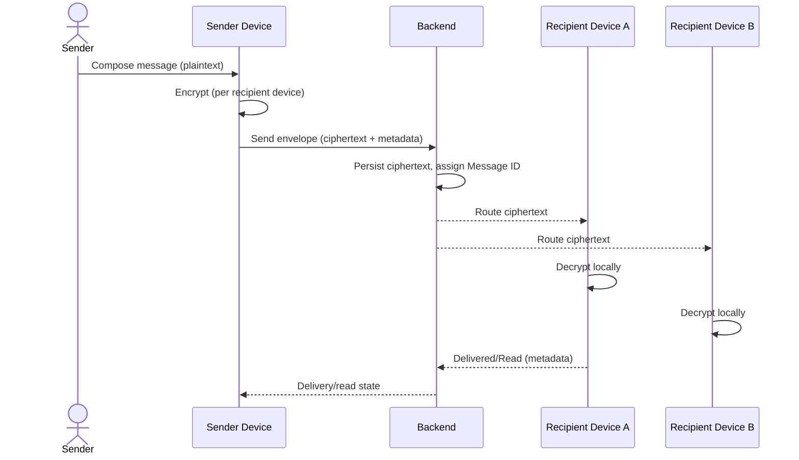
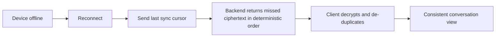

# Personas and Use Cases

| Field | Value |
|---|---|
| **Title** | Personas and Use Cases |
| **Status** | Completed |
| **Owner** | Product |
| **Version** | 1.0.0 |
| **Last Updated** | 2026-07-14 |
| **Document ID** | DOC-009 |

**Dependencies:** `10-vision-and-scope` (DOC-001).

**Related Documents:** `12-functional-requirements` (DOC-010), `35-sequences/*` (DOC-030..044).

---

## Purpose

This document defines **who** uses the platform and **how** they use it. It translates the vision into concrete personas and end-to-end use cases that downstream functional requirements, sequences, and feature specs elaborate. Every functional requirement must map to at least one use case here.

## Scope

**In scope:** primary personas, their goals, and the principal use-case journeys — including cross-device and offline scenarios that are central to a messaging platform.

**Out of scope:** detailed requirements (`12-functional-requirements`), cryptographic flows (`41-e2ee-design`), and UI design.

## Architecture Impact

The personas confirm two architecture drivers: (1) users operate multiple devices concurrently, mandating per-device identity and synchronization; and (2) users expect privacy, reinforcing that content is encrypted on clients and the **backend never decrypts message content**.

---

## 1. Personas

| ID | Persona | Description | Primary Goals |
|---|---|---|---|
| PER-01 | Individual User | A person messaging friends/family across phone and desktop. | Fast, private one-to-one chat; media sharing; continuity across devices. |
| PER-02 | Group Participant | A member of one or more group conversations. | Reliable group messaging; reactions, replies, mentions. |
| PER-03 | Power / Multi-Device User | Uses several devices simultaneously. | Consistent, synchronized history everywhere; seamless new-device onboarding. |
| PER-04 | Privacy-Sensitive User | Prioritizes confidentiality. | Assurance the operator cannot read content; control over receipts/presence. |
| PER-05 | Mobile / Intermittent User | Frequently offline or on poor networks. | Reliable delivery, offline queueing, and gap-free recovery. |
| PER-06 | Channel Audience (Future) | Consumer of broadcast content. | Follow channels and receive posts. |
| PER-07 | Platform Operator | Runs and supports the service. | Operate reliably and support users **without** access to message content. |

## 2. Primary Use Cases

| ID | Use Case | Persona(s) | Summary | Related Sequence |
|---|---|---|---|---|
| UC-01 | Register account | PER-01 | Create an account and publish public key material. | SQ-01 |
| UC-02 | Log in | PER-01, PER-03 | Authenticate a device and establish a session. | SQ-02 |
| UC-03 | Add a device | PER-03 | Register an additional device and re-sync history as ciphertext. | SQ-03, SQ-08 |
| UC-04 | Send a message | PER-01 | Encrypt on device, send ciphertext, receive delivery states. | SQ-04 |
| UC-05 | Receive a message | PER-01 | Receive routed ciphertext and decrypt locally. | SQ-05 |
| UC-06 | Group conversation | PER-02 | Send/receive within a group using group encryption. | SQ-06 |
| UC-07 | See read receipts | PER-01 | Observe delivered/read states subject to privacy settings. | SQ-07 |
| UC-08 | Share media / files | PER-01 | Encrypt-then-upload; recipients download and decrypt. | SQ-10, SQ-11 |
| UC-09 | Send a voice note | PER-01 | Record, encrypt, upload, and play back. | SQ-12 |
| UC-10 | Search | PER-01 | Search local content client-side; metadata server-side. | — |
| UC-11 | React / reply / forward | PER-02 | Enrich conversations; forwarding re-encrypts on the client. | — |
| UC-12 | Edit / delete | PER-01 | Edit (new version) or delete (tombstone) a message. | — |
| UC-13 | Receive push notification | PER-05 | Get notified without content leaving encrypted form. | SQ-13 |
| UC-14 | Reconnect & recover | PER-05 | Resume after disconnect and recover missed messages in order. | SQ-14, SQ-15 |
| UC-15 | Manage presence/typing | PER-04 | Control visibility of presence and typing. | — |

## 3. Journey: Multi-Device Send/Receive

## 4. Journey: Offline Recovery

---

## Risks

| Risk | Impact | Mitigation |
|---|---|---|
| Multi-device expectations underestimated | Broken continuity, user churn | Multi-device is a first-class driver; see `43` and `54`. |
| Privacy controls (receipts/presence) ignored | User trust erosion | Explicit privacy settings in realtime specs. |
| Operator support workflows assume content access | Invariant violation | Operator persona (PER-07) explicitly has no content access. |

## Future Considerations

- Channels audience journeys (PER-06) when channels graduate from future scope.
- Voice/video calling personas building on the same identity foundations.

## Open Questions

| ID | Question | Owner |
|---|---|---|
| OQ-PER-01 | What is the expected number of concurrent devices per user to support at launch? | Product + Architecture |
| OQ-PER-02 | What support tooling can operators use without any content access? | Trust & Safety |

## References

- `10-vision-and-scope` (DOC-001)
- `12-functional-requirements` (DOC-010)
- `43-key-management-and-devices` (DOC-049)
