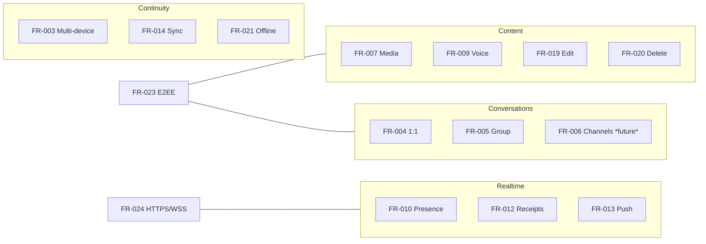

# Functional Requirements

| Field | Value |
|---|---|
| **Title** | Functional Requirements |
| **Status** | Completed |
| **Owner** | Product |
| **Version** | 1.0.0 |
| **Last Updated** | 2026-07-14 |
| **Document ID** | DOC-010 |

**Dependencies:** `10-vision-and-scope` (DOC-001), `11-personas-and-use-cases` (DOC-009).

**Related Documents:** `14-requirements-traceability-matrix` (DOC-012), `70-feature-spec-template` (DOC-069), feature specs `FS-01..FS-11` (DOC-070..080).

---

## Purpose

This document enumerates the complete set of **testable functional requirements** for the platform. Each requirement has a stable ID, a priority, acceptance criteria, and a mapping to the use cases and feature slices that realize it. It is the definitive "what the system does" reference from which feature specs and API contracts derive.

## Scope

**In scope:** functional capabilities and their acceptance criteria for the initial release, plus explicitly deferred (future) items.

**Out of scope:** quality attributes (`13-non-functional-requirements`), cryptographic mechanics (`41-e2ee-design`), and implementation.

## Architecture Impact

Every requirement is expressible under the constraint that the **backend never decrypts message content**. Content-bearing requirements (send, media, voice, edit, forward, search) are specified so the server operates only on ciphertext and metadata. This shapes the feature slices, the protocol, and the data model.

---

## 1. Requirement Priority Legend

| Priority | Meaning |
|---|---|
| Must | Required for initial release. |
| Should | High value; included if capacity allows. |
| Future | Deferred; design seams reserved. |

## 2. Functional Requirements

| ID | Requirement | Priority | Use Case | Feature Slice | Acceptance Criteria (summary) |
|---|---|---|---|---|---|
| FR-001 | Account registration | Must | UC-01 | Identity | User creates account; device publishes public key material; no private keys sent to server. |
| FR-002 | Authentication (login/logout) | Must | UC-02 | Identity | Per-device session established via JWT over HTTPS; refresh rotation supported. |
| FR-003 | Multi-device login | Must | UC-03 | Identity/Devices | Multiple devices per account, each with distinct crypto identity. |
| FR-004 | One-to-one chat | Must | UC-04, UC-05 | FS-01 | Send/receive encrypted messages with delivery states. |
| FR-005 | Group chat | Must | UC-06 | FS-02 | Group creation, membership, group-encrypted messaging. |
| FR-006 | Channels (broadcast) | Future | — | FS-03 | Deferred; extension seams reserved. |
| FR-007 | Media messages | Must | UC-08 | FS-04 | Encrypt-then-upload images/video; recipients decrypt locally. |
| FR-008 | File sharing | Must | UC-08 | FS-04 | Arbitrary encrypted file attachments with metadata. |
| FR-009 | Voice notes | Must | UC-09 | FS-05 | Record, encrypt, upload, play back; waveform metadata only. |
| FR-010 | Presence | Must | UC-15 | Presence | Online/last-seen with user privacy controls. |
| FR-011 | Typing indicator | Must | UC-15 | Presence | Ephemeral typing signal; not persisted. |
| FR-012 | Read receipts | Must | UC-07 | FS-01/02 | Delivered/read states as metadata; privacy-controllable. |
| FR-013 | Push notifications | Must | UC-13 | Notifications | Data-only push; no plaintext content in payload. |
| FR-014 | Message synchronization | Must | UC-03, UC-14 | Sync | Convergent, ordered, gap-free history across devices. |
| FR-015 | Search | Must | UC-10 | FS-10 | Client-side content search; server-side metadata search only. |
| FR-016 | Reactions | Should | UC-11 | FS-06 | Add/remove reactions as message metadata; realtime propagation. |
| FR-017 | Replies | Should | UC-11 | FS-07 | Reply referencing another message; quoted content stays encrypted. |
| FR-018 | Forwarding | Should | UC-11 | FS-08 | Forward re-encrypts content on the client for new recipients. |
| FR-019 | Message editing | Must | UC-12 | FS-09 | Edit creates a new immutable version; original Message ID preserved. |
| FR-020 | Message deletion | Must | UC-12 | FS-09 | Soft delete/tombstone with fan-out; delete-for-everyone semantics. |
| FR-021 | Offline recovery | Must | UC-14 | Sync | Missed messages recovered in deterministic order after reconnect. |
| FR-022 | Contact discovery & blocking | Should | — | FS-11 | Privacy-preserving discovery; block/mute controls. |
| FR-023 | E2EE for all content | Must | UC-04..09 | Security | All message/media content encrypted on clients; server stores ciphertext only. |
| FR-024 | HTTPS/WSS everywhere | Must | all | Security | All transport encrypted; plaintext transport rejected. |

## 3. Requirement-to-Capability Map

## 4. Acceptance Criteria Standard

Each requirement is considered met only when its feature spec defines: happy path, failure cases, authorization rules, E2EE impact (what the server sees vs. what stays client-side), and testable acceptance scenarios. This standard is enforced by the feature spec template (`70-feature-spec-template`) and the Definition of Done (`97-definition-of-done`).

---

## Risks

| Risk | Impact | Mitigation |
|---|---|---|
| Content requirements implicitly assume server access | Invariant violation | Each content FR states server sees ciphertext only (FR-023). |
| Search expectations exceed E2EE limits | Feature/legal conflict | FR-015 scoped to client-content + server-metadata only. |
| Edit/delete semantics ambiguous across devices | Inconsistent history | FR-019/020 defined via versioning and tombstones (`FS-09`). |

## Future Considerations

- Channels (FR-006) full specification.
- Voice/video calling requirements.
- Disappearing messages / configurable retention (`57`).

## Open Questions

| ID | Question | Owner |
|---|---|---|
| OQ-FR-01 | Is delete-for-everyone time-bounded, and what is the window? | Product |
| OQ-FR-02 | Are reactions/replies "Must" or "Should" for launch? | Product |
| OQ-FR-03 | What is the maximum attachment size per media/file message? | Product + Platform |

## References

- `11-personas-and-use-cases` (DOC-009)
- `13-non-functional-requirements` (DOC-011)
- `70-feature-spec-template` (DOC-069)
- `41-e2ee-design` (DOC-047)
