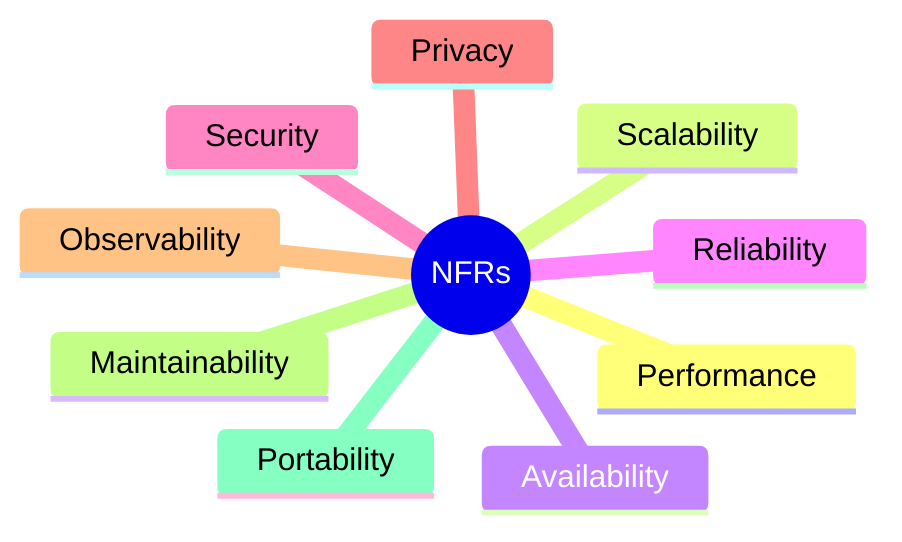

# Non-Functional Requirements

| Field | Value |
|---|---|
| **Title** | Non-Functional Requirements |
| **Status** | Completed |
| **Owner** | Architecture |
| **Version** | 1.0.0 |
| **Last Updated** | 2026-07-14 |
| **Document ID** | DOC-011 |

**Dependencies:** `10-vision-and-scope` (DOC-001).

**Related Documents:** `28-quality-scenarios` (DOC-021), `96-performance-budget` (DOC-106), `94-scalability-and-capacity` (DOC-100), `99-sre-slo-sli` (DOC-110).

---

## Purpose

This document defines the **quality attributes** the platform must satisfy — performance, scalability, availability, security, privacy, reliability, and operability — expressed as measurable requirements. These NFRs drive architecture decisions, quality scenarios, performance budgets, and SLOs.

## Scope

**In scope:** measurable quality-attribute requirements and their rationale.

**Out of scope:** functional behavior (`12-functional-requirements`), and the concrete per-operation numeric budgets (`96-performance-budget`) and SLO error-budget policy (`99-sre-slo-sli`), which refine these NFRs.

## Architecture Impact

The NFRs mandate a **stateless, horizontally scalable, event-driven** design able to serve millions of users, and they codify privacy and transport constraints (E2EE, HTTPS/WSS) as non-negotiable quality attributes. The performance and scalability NFRs are the primary justification for CQRS (EF write / Dapper read), Redis, SignalR with a backplane, and background workers.

---

## 1. Requirement Categories

## 2. Performance (NFR-P)

| ID | Requirement | Target | Refined by |
|---|---|---|---|
| NFR-P-01 | Message send acknowledgement latency | p99 < 300 ms under nominal load | `96-performance-budget` |
| NFR-P-02 | End-to-end deliver latency (online recipient) | p99 < 1 s | `96-performance-budget` |
| NFR-P-03 | Presence/typing propagation | p95 < 500 ms | `61-presence-and-typing` |
| NFR-P-04 | Conversation history page load | p95 < 400 ms | `52-read-model-and-dapper` |
| NFR-P-05 | Reconnect + sync resume | p95 < 2 s for typical backlog | `85.9-synchronization-protocol` |

## 3. Scalability (NFR-S)

| ID | Requirement | Target |
|---|---|---|
| NFR-S-01 | Concurrent connected devices | Scale horizontally to millions |
| NFR-S-02 | Stateless application nodes | Any node serves any request; no server affinity beyond Redis/token |
| NFR-S-03 | Horizontal scale-out | Add nodes without redesign; SignalR Redis backplane |
| NFR-S-04 | Data growth | Partitionable message storage; sharding path reserved |
| NFR-S-05 | Fan-out efficiency | Group delivery scales sub-linearly with membership where possible |

## 4. Availability & Reliability (NFR-A)

| ID | Requirement | Target |
|---|---|---|
| NFR-A-01 | Service availability | ≥ 99.9% monthly (launch target; refined in SLOs) |
| NFR-A-02 | No message loss | At-least-once delivery with client de-duplication |
| NFR-A-03 | No duplicate delivery to the user | Idempotent commands + dedup (INV-04) |
| NFR-A-04 | Deterministic ordering | Total order within a conversation (INV-05) |
| NFR-A-05 | Graceful degradation | Core send/receive survives dependency slowdowns via backpressure |

## 5. Security & Privacy (NFR-SEC)

| ID | Requirement | Target |
|---|---|---|
| NFR-SEC-01 | Content confidentiality | E2EE; backend never decrypts content (INV-01) |
| NFR-SEC-02 | Transport security | HTTPS and WSS only; plaintext transport rejected (INV-09) |
| NFR-SEC-03 | Authentication | Every external request authenticated (INV-08) |
| NFR-SEC-04 | Least privilege | Deny-by-default authorization |
| NFR-SEC-05 | Metadata minimization | Store only routing-essential metadata |
| NFR-SEC-06 | No plaintext in telemetry | Logs/metrics/traces never contain content or private keys (INV-11) |

## 6. Observability & Operability (NFR-O)

| ID | Requirement | Target |
|---|---|---|
| NFR-O-01 | Distributed tracing | Correlated traces across API, hub, and workers |
| NFR-O-02 | Metrics | RED/USE metrics per module, tied to the performance budget |
| NFR-O-03 | Structured logging | Correlation IDs; content/PII redacted |
| NFR-O-04 | Recoverability | Defined RPO/RTO validated periodically |

## 7. Maintainability & Portability (NFR-M)

| ID | Requirement | Target |
|---|---|---|
| NFR-M-01 | Modularity | Feature-first vertical slices; low coupling |
| NFR-M-02 | Extractability | Modules extractable to microservices without redesign |
| NFR-M-03 | Cloud-native packaging | Containerized (Docker), 12-factor configuration |
| NFR-M-04 | Testability | Deterministic tests including crypto conformance |

---

## Risks

| Risk | Impact | Mitigation |
|---|---|---|
| Unquantified NFRs | Untestable quality, disputes at review | Every NFR has a target; budgets in DOC-106. |
| Availability vs. E2EE tension (no server-side recovery of content) | User data loss on device loss | Encrypted backup design in `57`; clear user expectations. |
| Scale targets exceed single-region capacity | Latency/availability breaches | Multi-region plan in `97`. |

## Future Considerations

- Elevate availability target beyond 99.9% as the platform matures.
- Add calling-specific latency/jitter NFRs when voice/video is introduced.

## Open Questions

| ID | Question | Owner |
|---|---|---|
| OQ-NFR-01 | Confirmed launch availability SLO and error budget? | SRE + Product |
| OQ-NFR-02 | Maximum supported group size (drives NFR-S-05)? | Architecture + Product |
| OQ-NFR-03 | Target regions and residency constraints? | Legal + Product |

## References

- `10-vision-and-scope` (DOC-001)
- `28-quality-scenarios` (DOC-021)
- `96-performance-budget` (DOC-106)
- `29.5-system-invariants` (DOC-023)
