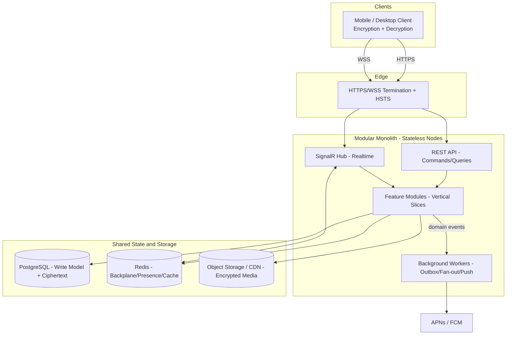
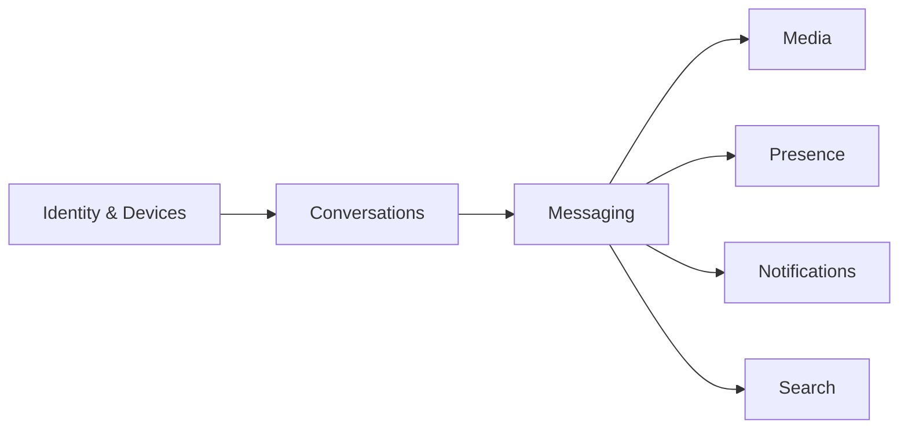

# Architecture Overview

| Field | Value |
|---|---|
| **Title** | Architecture Overview |
| **Status** | Completed |
| **Owner** | Architecture |
| **Version** | 1.0.0 |
| **Last Updated** | 2026-07-14 |
| **Document ID** | DOC-013 |

**Dependencies:** `10-vision-and-scope` (DOC-001), `12-functional-requirements` (DOC-010), `13-non-functional-requirements` (DOC-011).

**Related Documents:** `29-architecture-principles` (DOC-022), `29.5-system-invariants` (DOC-023), `21-c4-context` (DOC-014), `22-c4-container` (DOC-015), `24-modular-monolith-blueprint` (DOC-017).

---

## Purpose

This document is the architectural "constitution" of the platform. It consolidates the driving requirements and constraints into a coherent **solution strategy**: the overall style, the technology mapping, the module structure, and the key quality tactics. It is the parent document for the C4 views, the modular-monolith blueprint, and the domain model.

## Scope

**In scope:** solution strategy, quality goals, constraints, high-level structure, technology mapping, and cross-cutting tactics at a system level.

**Out of scope:** detailed diagrams (C4 documents), per-module design (`23-c4-component`), and feature-level design (feature specs).

## Architecture Impact

This document establishes the platform as a **stateless, event-driven modular monolith** built for global scale and cleanly extractable to microservices, with **client-side E2EE** as the defining constraint: the backend stores and routes ciphertext and metadata and **never decrypts message content**.

---

## 1. Top Quality Goals

Derived from `13-non-functional-requirements`:

| Rank | Quality Goal | Driving NFRs | Primary Tactics |
|---|---|---|---|
| 1 | Confidentiality (E2EE) | NFR-SEC-01/02/05/06 | Client-side encryption; ciphertext-only storage; metadata minimization. |
| 2 | Scalability | NFR-S-01..05 | Stateless nodes; Redis backplane; async fan-out; partitioning. |
| 3 | Real-time performance | NFR-P-01..05 | SignalR/WSS; Redis; CQRS read models (Dapper). |
| 4 | Reliability & correctness | NFR-A-02..04 | Idempotency; outbox/inbox; deterministic ordering. |
| 5 | Maintainability & extractability | NFR-M-01..04 | Vertical slices; low coupling; domain events. |

## 2. Constraints

| Type | Constraint |
|---|---|
| Security | E2EE; backend never decrypts; HTTPS/WSS only. |
| Technology | ASP.NET Core 10, C#, EF Core, Dapper, PostgreSQL, Redis, SignalR, Docker. |
| Architecture | Modular monolith, feature-first vertical slices, CQRS, domain events, event-driven. |
| Evolution | Must be extractable to microservices without redesign. |

## 3. Solution Strategy

**Strategy summary:**
- **Style:** Modular monolith with feature-first vertical slices; CQRS separates writes (EF Core) from reads (Dapper).
- **Realtime:** SignalR over WSS with a Redis backplane enables horizontal scale-out of stateless nodes.
- **Asynchrony:** Domain events drive background workers via the outbox pattern for fan-out, push, and projections.
- **Privacy:** Content is encrypted on clients; the backend persists ciphertext + minimal metadata only.

## 4. Module Structure (Logical)

Modules communicate via contracts and domain events only; no cross-module database access (INV-06). Module-to-context mapping is detailed in `31-bounded-contexts-and-modules`.

## 5. Technology Mapping

| Concern | Technology | Rationale |
|---|---|---|
| API host & DI | ASP.NET Core 10 | Modern, high-performance runtime. |
| Write model | EF Core + PostgreSQL | Rich modeling, migrations, transactional writes. |
| Read model | Dapper + PostgreSQL | Low-overhead, high-throughput queries. |
| Realtime | SignalR (WSS) + Redis backplane | Scalable bidirectional messaging. |
| Ephemeral/state | Redis | Presence, typing, cache, locks, rate limits. |
| Async processing | Background workers + outbox | Reliable, decoupled side effects. |
| Media | Object storage / CDN | Scalable encrypted blob storage/delivery. |
| Packaging | Docker | Cloud-native deployment. |

## 6. Cross-Cutting Tactics (System Level)

| Concern | Tactic | Detailed in |
|---|---|---|
| Consistency | Eventual consistency + read models | `26`, `52` |
| Reliability | Idempotency, outbox/inbox, retries | `ADR-0018/0024/0025/0023` |
| Ordering | Deterministic per-conversation order | `ADR-0008/0010`, `54` |
| Security | Client E2EE, deny-by-default authz, TLS | `40`, `41`, `42`, `46` |
| Observability | Traces/metrics/logs (content-redacted) | `93` |
| Scalability | Stateless nodes, backplane, partitioning | `94`, `56`, `64` |

## 7. Evolution to Microservices

The modular monolith is designed so each module can be extracted into an independent service along its existing contract and event boundaries. High-load contexts (Messaging, Presence, Media) are the first extraction candidates. The full path is defined in `ZZ-monolith-to-microservices`.

---

## Risks

| Risk | Impact | Mitigation |
|---|---|---|
| Module boundaries erode over time | Extraction becomes impossible | Architecture tests enforce INV-06/07; `24` blueprint. |
| Realtime scale bottleneck at fan-out | Latency/availability breaches | Backplane + async fan-out + backpressure (`64`). |
| E2EE limits server features (search, moderation) | Product/feature tension | Explicit scoping in `55`, `44`, `47`. |
| Eventual consistency surprises clients | UX inconsistencies | Clear client contract in protocol/sync docs. |

## Future Considerations

- Multi-region active-active deployment and data residency (`97`).
- Extraction of Messaging/Presence/Media into services (`ZZ`).
- Introduction of a schema registry for event contracts.

## Open Questions

| ID | Question | Owner |
|---|---|---|
| OQ-ARCH-01 | Confirmed global message ID/ordering scheme? | Architecture (ADR-0008) |
| OQ-ARCH-02 | Selected E2EE protocol/library and audit status? | Security (ADR-0004) |
| OQ-ARCH-03 | Single-region launch or multi-region from day one? | Architecture + Product |

## References

- `10-vision-and-scope` (DOC-001)
- `12-functional-requirements` (DOC-010)
- `13-non-functional-requirements` (DOC-011)
- `29-architecture-principles` (DOC-022)
- `29.5-system-invariants` (DOC-023)
