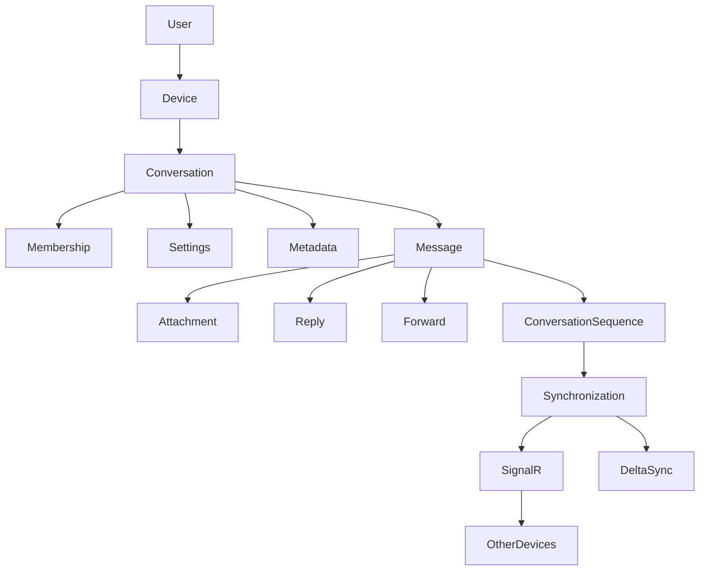
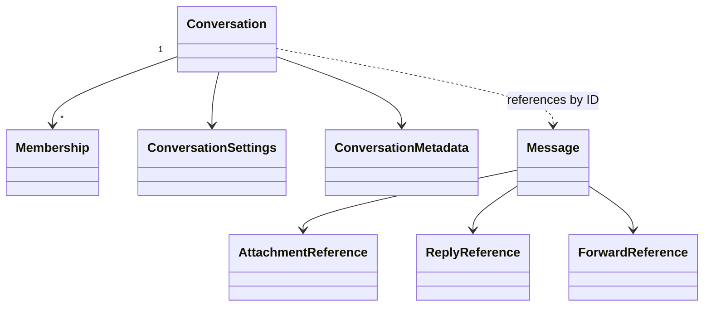
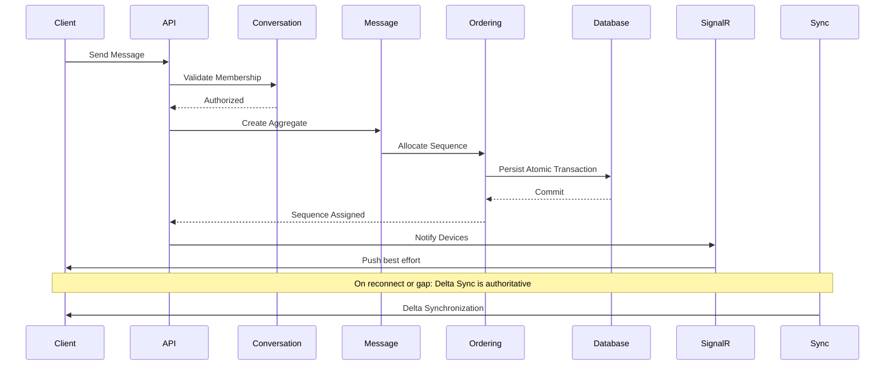
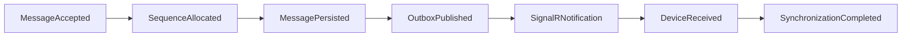
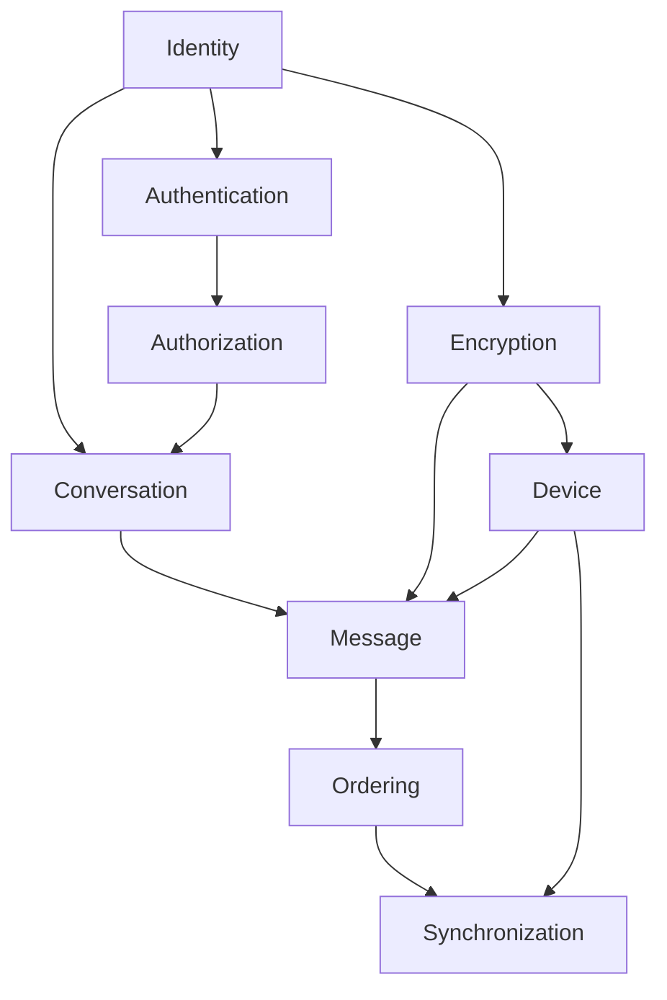

# Messaging Core Architecture

| Field | Value |
|---|---|
| **Title** | Messaging Core Architecture |
| **Status** | Completed |
| **Owner** | Architecture |
| **Version** | 1.0.0 |
| **Last Updated** | 2026-07-18 |
| **Document ID** | DOC-154 |
| **Phase** | Phase 3 – Messaging Core |

**Dependencies:** `20-architecture-overview` (DOC-013), `29-architecture-principles` (DOC-022), `29.5-system-invariants` (DOC-023), `30-domain-model-overview` (DOC-024), AD-007..AD-010.

**Related Documents:** AD-007, AD-008, AD-009, AD-010, ADR-0031, ADR-0032, ADR-0008, ADR-0010, ADR-0011, ADR-0016, RS-001..RS-004, `20.2-phase-3-messaging-core-completion` (DOC-155).

---

## Purpose

This document provides a high-level overview of the Messaging Core Architecture.

It explains how the core messaging components interact and serves as the primary entry point for engineers working on the messaging platform.

Detailed implementation decisions are documented in the corresponding Architecture Decisions (ADs) and Architecture Decision Records (ADRs).

## Scope

**In scope:**

* Conversation Architecture
* Message Architecture
* Message Ordering
* Synchronization

**Out of scope** (subsequent architecture phases):

* Delivery guarantees beyond accept/persist
* Read Receipts
* Presence
* Reactions (product feature layer)
* Push Notifications
* Media Services
* Search
* Voice & Video

## Architecture Impact

This document binds AD-007..AD-010 into a single navigable picture of the messaging engine without re-deciding those approvals. Implementation and feature work must not contradict the Messaging Core Principles or Architectural Invariants below.

---

## Messaging Core Principles

The messaging platform is designed around the following principles:

* End-to-End Encryption by default
* Immutable message architecture
* Conversation-centric domain model
* Server-authoritative ordering
* Deterministic synchronization
* Event-driven architecture
* Horizontal scalability
* Multi-device support
* Offline-first user experience
* Future multi-region readiness

---

## Architecture Overview

---

## Core Domain Model

### Conversation

Represents the communication boundary.

Responsibilities include:

* Membership
* Roles
* Permissions
* Settings
* Metadata
* Lifecycle

Conversation does **not** own message content. Messages reference `ConversationId` from outside the Conversation aggregate.

See: [AD-007](../architecture-decisions/AD-007-conversation-model.md), [ADR-0031](../ADR/ADR-0031-unified-conversation-model.md).

### Message

Represents immutable communication content.

Responsibilities include:

* Ciphertext
* Envelope
* Sender
* Attachment references
* Reply reference
* Forward metadata
* Edit version
* Tombstone state

Messages never contain authorization logic. Authorization is evaluated via Conversation membership before accept.

See: [AD-008](../architecture-decisions/AD-008-message-model.md), [ADR-0032](../ADR/ADR-0032-immutable-message-model.md).

### Conversation Sequence

Represents the canonical ordering mechanism.

Characteristics:

* Monotonic
* Server authoritative
* Conversation scoped
* Immutable after allocation
* Allocated atomically with message persistence

`MessageId` identifies a message. `ConversationSequence` (`Sequence`) orders a conversation.

See: [AD-009](../architecture-decisions/AD-009-message-ordering.md), [ADR-0008](../ADR/ADR-0008-message-id-and-ordering-strategy.md), [ADR-0010](../ADR/ADR-0010-message-ordering.md).

### Synchronization

Responsible for keeping every authorized device consistent.

Synchronization is based on:

* ConversationSequence (canonical cursor)
* Delta synchronization
* SignalR push
* Mandatory reconnect synchronization
* Idempotent processing (`MessageId`)

Real-time delivery is an optimization. Synchronization (delta sync) is the source of truth for catch-up and gap-fill.

See: [AD-010](../architecture-decisions/AD-010-synchronization.md), [ADR-0016](../ADR/ADR-0016-offline-synchronization.md), [ADR-0011](../ADR/ADR-0011-cursor-pagination.md).

---

## Aggregate Boundaries

| Owner | Owns |
|---|---|
| **Conversation** | Membership, Settings, Metadata, lifecycle |
| **Message** | Ciphertext, encryption envelope metadata, attachment refs, edit metadata, tombstone state |
| **Ordering** | ConversationSequence allocation rules |
| **Synchronization** | Sync cursor, device catch-up progress |

Messages are **not** inside the Conversation aggregate (AD-007 / AD-008).

---

## End-to-End Message Flow

---

## Event Flow

Primary accept event in the domain model is `MessageAccepted` (includes Sequence). Sequence allocation occurs in the same database transaction as persistence (AD-009).

---

## Architectural Responsibilities

| Component | Responsibility |
|---|---|
| Conversation | Membership, roles, permissions, settings |
| Message | Immutable ciphertext content + envelope |
| Ordering | Canonical conversation ordering (`Sequence`) |
| Synchronization | Multi-device consistency (delta sync) |
| SignalR | Low-latency push delivery (best effort) |
| Storage | Durable persistence |
| Encryption | Confidentiality (client-side; AD-004/AD-005) |
| Authorization | Access control over membership metadata (AD-003) |

---

## Architecture Decisions

| Decision | Description |
|---|---|
| AD-007 | Conversation Model |
| AD-008 | Message Model |
| AD-009 | Message Ordering |
| AD-010 | Synchronization |

These decisions collectively define the Messaging Core Architecture. No implementation should contradict them.

---

## Dependency Graph

Each Architecture Decision depends only on previously approved decisions. Future phases extend this architecture without modifying its foundation.

---

## Non-Goals

The Messaging Core intentionally excludes:

* Delivery guarantees beyond accept/persist semantics
* Read receipts
* Presence
* Typing indicators
* Push notifications (APNs/FCM)
* Search
* Media processing pipelines
* Voice & Video
* Moderation
* Compliance / legal hold product flows

These concerns are implemented by higher-level messaging services in later phases.

---

## Extension Points

The architecture is intentionally designed to support future capabilities including:

* Threads
* Communities
* Channels
* Reactions
* Scheduled Messages
* Temporary Messages
* AI Assistants
* Business Messaging
* Search
* Analytics
* Multi-region deployment

These extensions build upon the approved core without requiring fundamental redesign. Strategies are documented in AD-007..AD-010 Future Evolution sections.

---

## Architectural Invariants

The following invariants must always hold:

* Every Message belongs to exactly one Conversation.
* Every Message has exactly one immutable MessageId.
* ConversationSequence is the only canonical ordering mechanism within a conversation.
* Ordering is server authoritative.
* Synchronization cursors only advance forward (except explicit reset).
* Synchronization is idempotent.
* Authorization is validated before message persistence.
* Backend never stores plaintext message content (INV-01).
* Aggregate boundaries must not be violated (INV-06).

Platform-wide invariant catalog: `29.5-system-invariants` (DOC-023).

---

## Cross-Reference Map

### Architecture Decisions

* [AD-007 — Conversation Model](../architecture-decisions/AD-007-conversation-model.md)
* [AD-008 — Message Model](../architecture-decisions/AD-008-message-model.md)
* [AD-009 — Message Ordering](../architecture-decisions/AD-009-message-ordering.md)
* [AD-010 — Synchronization](../architecture-decisions/AD-010-synchronization.md)

### Architecture Decision Records

* [ADR-0031 — Unified Conversation Model](../ADR/ADR-0031-unified-conversation-model.md)
* [ADR-0032 — Immutable Message Model](../ADR/ADR-0032-immutable-message-model.md)
* [ADR-0008 — Message ID and Ordering Strategy](../ADR/ADR-0008-message-id-and-ordering-strategy.md)
* [ADR-0010 — Per-Conversation Message Ordering](../ADR/ADR-0010-message-ordering.md)
* [ADR-0011 — Cursor Pagination](../ADR/ADR-0011-cursor-pagination.md)
* [ADR-0016 — Offline Synchronization](../ADR/ADR-0016-offline-synchronization.md)

### Research

* [RS-001 — Conversation Models](../research/RS-001-conversation-models.md)
* [RS-002 — Message Models](../research/RS-002-message-models.md)
* [RS-003 — Message Ordering](../research/RS-003-message-ordering.md)
* [RS-004 — Synchronization](../research/RS-004-synchronization.md)

### Domain & Overview

* [Domain Model Overview](../30-domain/30-domain-model-overview.md) (DOC-024)
* [Architecture Overview](20-architecture-overview.md) (DOC-013)

---

## Implementation Readiness

The Messaging Core Architecture is considered complete.

All foundational architectural decisions required for implementing the messaging engine have been approved (AD-007..AD-010).

Future architecture phases extend the platform through additional services while preserving the architectural principles defined in this document.

This document is the authoritative entry point for engineering work related to the Messaging Core.

Phase closure record: [Phase 3 Completion Report](20.2-phase-3-messaging-core-completion.md) (DOC-155).

---

## Risks

| Risk | Impact | Mitigation |
|---|---|---|
| Implementers skip ADs and invent divergent models | Core inconsistency | This DOC + AD-007..010 are normative; architecture tests later |
| Confusing SignalR push with sync authority | Lost/reordered UX under disconnect | AD-010: delta sync is authoritative |
| Treating MessageId as sort key | Ordering bugs | AD-009: Sequence only |

## Future Considerations

* Wire protocol (`85.9`) and storage (`54`) documents will detail APIs and schemas.
* C4 component views should reference this DOC for Messaging module boundaries.

## Open Questions

Non-blocking product/ops knobs remain in AD-007..AD-010 (e.g., OQ-CONV-01, OQ-MSG-01, OQ-SYNC-01). None block Messaging Core completeness.

## References

* AD-001..AD-010
* DOC-013, DOC-022, DOC-023, DOC-024
* RS-001..RS-004
