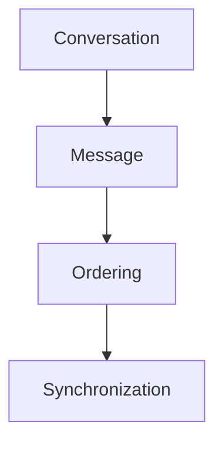
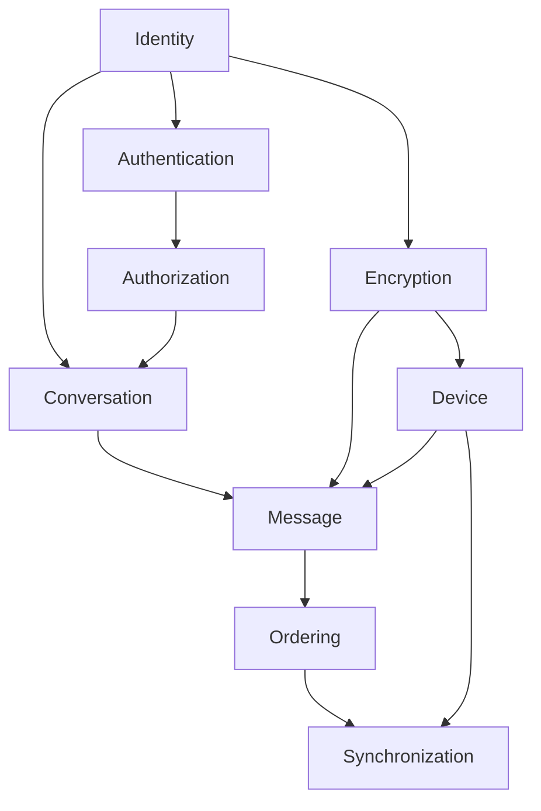

# Phase 3 Completion Report — Messaging Core Architecture

| Field | Value |
|---|---|
| **Title** | Phase 3 Completion Report — Messaging Core Architecture |
| **Document ID** | DOC-155 |
| **Status** | Completed |
| **Owner** | Architecture |
| **Version** | 1.0.0 |
| **Last Updated** | 2026-07-18 |
| **Phase** | Phase 3 — Messaging Core Architecture |
| **Architecture Status** | Complete |

**Dependencies:** `20.1-messaging-core-architecture` (DOC-154), AD-007..AD-010, DOC-013, DOC-024.

**Related Documents:** RS-001..RS-004, WS-007..WS-010, AR-007..AR-010, ADR-0031, ADR-0032, ADR-0008, ADR-0010, ADR-0011, ADR-0016, `docs/reviews/REVIEW-INDEX.md`.

---

## Purpose

This document formally records the completion of Phase 3 (Messaging Core Architecture), summarizes approved deliverables, and authorizes the project to proceed to Phase 4 while preserving the architectural baseline.

## Scope

**In scope:** Closure of Phase 3 research, workshops, reviews, decisions, ADRs, and documentation for Conversation, Message, Ordering, and Synchronization.

**Out of scope:** Phase 4 messaging services design and any implementation work.

## Architecture Impact

Phase 3 establishes the immutable architectural baseline for the messaging engine. Subsequent phases must extend this foundation; changes to AD-007..AD-010 require a new Architecture Decision and supporting ADR.

---

## Executive Summary

Phase 3 successfully establishes the architectural foundation of the messaging platform.

The Messaging Core has been fully designed, reviewed, validated, and documented through a structured Architecture Decision process.

All foundational decisions required for implementing a modern, scalable, end-to-end encrypted messaging engine have been approved.

The architecture is now considered implementation-ready and provides a stable platform for subsequent messaging services and platform capabilities.

No additional foundational architectural work is required before feature implementation begins.

---

## Phase Objective

The objective of Phase 3 was to design the complete Messaging Core Architecture.

This included defining:

* Conversation domain
* Message domain
* Canonical ordering
* Multi-device synchronization

The resulting architecture establishes the core domain model upon which all future messaging capabilities will be built.

Authoritative overview: [Messaging Core Architecture](20.1-messaging-core-architecture.md) (DOC-154).

---

## Deliverables

### Research

| ID | Title |
|---|---|
| [RS-001](../research/RS-001-conversation-models.md) | Conversation Models |
| [RS-002](../research/RS-002-message-models.md) | Message Models |
| [RS-003](../research/RS-003-message-ordering.md) | Message Ordering |
| [RS-004](../research/RS-004-synchronization.md) | Synchronization |

### Workshops

| ID | Title |
|---|---|
| [WS-007](../architecture-decisions/workshops/WS-007-conversation-model.md) | Conversation Model |
| [WS-008](../architecture-decisions/workshops/WS-008-message-model.md) | Message Model |
| [WS-009](../architecture-decisions/workshops/WS-009-message-ordering.md) | Message Ordering |
| [WS-010](../architecture-decisions/workshops/WS-010-synchronization.md) | Synchronization |

### Architecture Reviews

| ID | Verdict |
|---|---|
| [AR-007](../architecture-decisions/reviews/AR-007-conversation-model.md) | Approve with Changes (amendments applied) |
| [AR-008](../architecture-decisions/reviews/AR-008-message-model.md) | Approve with Changes |
| [AR-009](../architecture-decisions/reviews/AR-009-message-ordering.md) | Approve with Changes |
| [AR-010](../architecture-decisions/reviews/AR-010-synchronization.md) | Approve with Changes |

Every review completed successfully. Mandatory amendments were incorporated prior to approval.

### Architecture Decisions

#### AD-007 — Conversation Model

**Status:** Approved

Key outcomes:

* Unified Conversation Aggregate
* Membership as first-class entity
* Canonical Direct Conversations
* Explicit aggregate boundaries and lifecycles

See: [AD-007](../architecture-decisions/AD-007-conversation-model.md), [ADR-0031](../ADR/ADR-0031-unified-conversation-model.md).

#### AD-008 — Message Model

**Status:** Approved

Key outcomes:

* Immutable Message Aggregate
* ULID Message Identity
* Tombstones
* Attachment references
* Versioned edits

See: [AD-008](../architecture-decisions/AD-008-message-model.md), [ADR-0032](../ADR/ADR-0032-immutable-message-model.md).

#### AD-009 — Message Ordering

**Status:** Approved

Key outcomes:

* Server-authoritative ordering
* Per-conversation monotonic sequence
* Transactional sequence allocation
* Optimistic local ordering
* Future multi-region readiness (HLC path)

See: [AD-009](../architecture-decisions/AD-009-message-ordering.md), [ADR-0008](../ADR/ADR-0008-message-id-and-ordering-strategy.md), [ADR-0010](../ADR/ADR-0010-message-ordering.md).

#### AD-010 — Synchronization

**Status:** Approved

Key outcomes:

* Hybrid SignalR + authoritative delta synchronization
* ConversationSequence synchronization cursor
* Mandatory reconnect synchronization
* Multi-device convergence
* Idempotent synchronization

See: [AD-010](../architecture-decisions/AD-010-synchronization.md), [ADR-0016](../ADR/ADR-0016-offline-synchronization.md), [ADR-0011](../ADR/ADR-0011-cursor-pagination.md).

---

## Messaging Core Overview

The Messaging Core consists of four architectural pillars.



These four components collectively define the messaging engine. All future messaging services extend these components without changing their responsibilities.

---

## Dependency Graph



Every Architecture Decision depends only on previously approved decisions. The dependency graph is acyclic and internally consistent.

---

## Architectural Principles

The Messaging Core is built upon the following principles:

* End-to-End Encryption
* Immutable Messages
* Aggregate Ownership
* Explicit Domain Invariants
* Server-authoritative Ordering
* Deterministic Synchronization
* Event-driven Integration
* Multi-device Consistency
* Offline-first Operation
* Future Multi-region Evolution

These principles govern all future messaging features. See also DOC-022 and DOC-154.

---

## Implementation Readiness

| Area | Status |
|---|---|
| Conversation Model | Ready |
| Message Model | Ready |
| Ordering | Ready |
| Synchronization | Ready |
| Aggregate Boundaries | Ready |
| Domain Invariants | Ready |
| Event Model | Ready |
| Extension Strategy | Ready |

No outstanding architectural blockers remain for the Messaging Core foundation.

---

## Repository Validation

Validation completed successfully across Builds #5–#9 (and DOC-154 registration).

Verified:

* Cross-reference integrity
* Documentation manifests
* Reading order
* ADR references
* Architecture Decision references
* Glossary consistency
* Domain terminology
* Mermaid diagrams
* Internal document links

Repository status is internally consistent for the Messaging Core baseline.

---

## Phase Metrics

| Artifact | Count |
|---|---:|
| Research Documents | 4 |
| Architecture Workshops | 4 |
| Architecture Reviews | 4 |
| Architecture Decisions (AD-007..AD-010) | 4 |
| Architecture Decision Records (core set) | 6 |
| Messaging Core Overview (DOC-154) | 1 |
| Domain Model updates (DOC-024 iterations) | Multiple |
| Review package builds (Messaging Core) | 5 (#5–#9) |

Core ADRs: ADR-0031, ADR-0032, ADR-0008, ADR-0010, ADR-0011, ADR-0016.

All planned deliverables for Phase 3 have been completed.

---

## Lessons Learned

The Architecture Decision workflow proved effective for producing high-quality architectural outcomes.

Key strengths of the process include:

* Research-driven decision making
* Explicit evaluation of alternatives
* Independent architecture reviews
* Traceable architectural rationale
* Repository-wide consistency validation
* Structured documentation lifecycle

This workflow is now the standard process for future architecture phases.

---

## Phase Completion

Phase 3 is formally closed.

The Messaging Core Architecture is approved and becomes the architectural baseline for all future messaging capabilities.

Subsequent architecture work must extend this foundation rather than redesign it.

Changes to these decisions require a new Architecture Decision and supporting ADR.

---

## Next Phase

**Phase 4 — Messaging Services Architecture**

Planned architecture sprints include:

1. Delivery & Acknowledgements
2. Read Receipts
3. Presence
4. Reactions & Message Interactions
5. Media & Attachment Services
6. Push Notifications
7. Search & Indexing
8. Moderation & Safety
9. Retention & Compliance
10. Voice & Video Calling

Each sprint will follow the established lifecycle:

```text
Research → Workshop → Architecture Review → Architecture Decision → ADR
→ Architecture Documentation → Repository Validation → Approval
```

---

## Approval

| Field | Value |
|---|---|
| **Phase** | Phase 3 — Messaging Core Architecture |
| **Status** | COMPLETE |
| **Architecture Baseline** | ESTABLISHED |
| **Implementation Readiness** | APPROVED |
| **Repository Status** | STABLE |
| **Decision Date** | 2026-07-18 |

This document formally records the completion of the Messaging Core Architecture phase and authorizes the project to proceed to Phase 4 while preserving the approved architectural baseline.

---

## Risks

| Risk | Impact | Mitigation |
|---|---|---|
| Phase 4 redesigns core aggregates | Baseline erosion | DOC-154/DOC-155 + AD-007..010 are normative; require superseding AD |
| Implementers skip AD/ADR reading | Divergent code | DOC-154 is mandatory entry point |

## References

* [DOC-154 Messaging Core Architecture](20.1-messaging-core-architecture.md)
* AD-007..AD-010
* RS-001..RS-004
* `docs/reviews/REVIEW-INDEX.md`
* `docs/architecture-decisions/decision-manifest.yaml`
