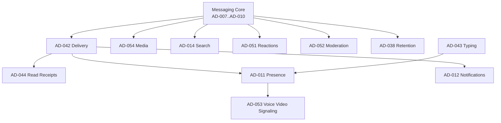

# Phase 4 — Messaging Services Architecture

| Field | Value |
|---|---|
| **Title** | Phase 4 — Messaging Services Architecture (Plan) |
| **Document ID** | DOC-156 |
| **Status** | Completed |
| **Owner** | Architecture |
| **Version** | 1.0.0 |
| **Last Updated** | 2026-07-18 |
| **Phase** | Phase 4 — Messaging Services |
| **Phase Status** | In Progress — Sprint 2 (AD-044) |

**Dependencies:** `20.2-phase-3-messaging-core-completion` (DOC-155), `20.1-messaging-core-architecture` (DOC-154), AD-007..AD-010.

**Related Documents:** `decision-manifest.yaml`, DOC-013, DOC-024, DOC-023.

---

## Purpose

This document defines the Phase 4 plan: the service layer built on top of the approved Messaging Core Architecture (Phase 3).

It establishes scope, sprint order, workflow, principles, completion criteria, and the authoritative mapping of Phase 4 services to Architecture Decision IDs in `decision-manifest.yaml`.

## Scope

**In scope:** Planning and decision identity for ten messaging services (Delivery through Voice/Video Signaling).

**Out of scope:** Executing workshops/decisions (begins with Sprint 1), implementation, and redesign of AD-007..AD-010.

## Architecture Impact

Phase 4 extends the Messaging Core without modifying foundational aggregates, ordering, or synchronization. Services integrate through domain events, sync deltas, and published contracts. Any required change to the core requires a superseding Architecture Decision.

---

## Overview

Phase 4 extends the Messaging Core established in Phase 3.

The Messaging Core defines:

* Conversation
* Message
* Ordering
* Synchronization

Phase 4 builds the operational services that transform the messaging engine into a production-ready messaging platform.

These services consume the approved architecture without modifying the foundational domain model.

Authoritative core overview: [DOC-154](20.1-messaging-core-architecture.md).  
Phase 3 closure: [DOC-155](20.2-phase-3-messaging-core-completion.md).

---

## Services in Scope

1. Delivery & Acknowledgements
2. Read Receipts
3. Presence & Typing Indicators
4. Reactions & Message Interactions
5. Media & Attachment Services
6. Push Notification Architecture
7. Search & Indexing
8. Moderation & Safety
9. Retention & Compliance
10. Voice & Video Signaling

Each service follows the established Architecture Decision workflow.

---

## Architecture Workflow

Every service must complete the following lifecycle:

```text
Research → Workshop → Architecture Review → Architecture Decision → ADR
→ Architecture Documentation → Domain Model Update → Repository Validation → Approval
```

No Architecture Decision may bypass this workflow.

---

## Phase Goals

By the completion of Phase 4, the platform will have approved architectures for:

* Reliable message delivery
* Device acknowledgements
* Read state synchronization
* Presence and typing indicators
* Rich message interactions
* Secure media handling
* Push notification delivery
* Search architecture
* Safety and moderation
* Compliance and retention
* Real-time call signaling

These services will remain independent while integrating through the Messaging Core.

---

## Phase Dependencies

Phase 4 depends on the approved Phase 3 architecture.

**Required baseline:**

* AD-007 — Conversation Model
* AD-008 — Message Model
* AD-009 — Message Ordering
* AD-010 — Synchronization

No service may contradict these approved decisions.

Any required change must be introduced through a superseding Architecture Decision.

---

## Decision ID Reconciliation

> **Important.** An early draft of this phase used AD-011..AD-020 as placeholders for the ten services. The ADRP catalog already assigns AD-011..AD-020 to other topics (e.g., AD-011 Presence, AD-012 Notifications, AD-013 Storage Strategy).  
> **Authoritative IDs are those in `decision-manifest.yaml`.** Phase 4 sprints use the reconciled IDs below.

| Sprint | Service | Authoritative AD(s) | Priority | Notes |
|---|---|---|---|---|
| 1 | Delivery & Acknowledgements | **AD-042** Delivery Semantics | Critical | Foundation for receipts/push |
| 2 | Read Receipts | **AD-044** Read Receipts | Critical | Depends on AD-042 |
| 3 | Presence & Typing Indicators | **AD-011** Presence, **AD-043** Typing | High | May share workshop; separate ADs |
| 4 | Reactions & Message Interactions | **AD-051** Reactions & Message Interactions | High | Newly catalogued for Phase 4 |
| 5 | Media & Attachment Services | **AD-054** Media & Attachment Services (umbrella); related **AD-013**, **AD-022**, **AD-023** | Critical | Storage/encryption ADs remain related |
| 6 | Push Notification Architecture | **AD-012** Notifications | High | Offline/background delivery |
| 7 | Search & Indexing | **AD-014** Search | Medium | E2EE-compatible indexing |
| 8 | Moderation & Safety | **AD-052** Moderation & Safety | Medium | Newly catalogued |
| 9 | Retention & Compliance | **AD-038** Retention; related **AD-020** Privacy Model | Medium | Privacy/compliance coordination |
| 10 | Voice & Video Signaling | **AD-053** Voice & Video Signaling | Future | Signaling only; media transport OOS |

Placeholder labels such as “plan AD-011 = Delivery” are **retired** to avoid colliding with the catalog.

---

## Service Dependency Graph



Execute from services nearest the Messaging Core outward (Delivery first).

---

## Phase Execution Order

### Sprint 1 — AD-042 Delivery & Acknowledgements

Foundation for every downstream messaging capability.

**Status:** **COMPLETE** — AD-042 Approved; ADR-0018 Accepted.

| Artifact | Path |
|---|---|
| Research | [RS-005](../research/RS-005-delivery-and-acknowledgements.md) |
| Workshop | [WS-042](../architecture-decisions/workshops/WS-042-delivery-and-acknowledgements.md) |
| Review | [AR-042](../architecture-decisions/reviews/AR-042-delivery-and-acknowledgements.md) |
| Decision | [AD-042](../architecture-decisions/AD-042-delivery-semantics.md) — Approved |
| ADR | [ADR-0018](../ADR/ADR-0018-idempotency.md) — Accepted |

### Sprint 2 — AD-044 Read Receipts

Builds on Delivery (AD-042) and Synchronization (AD-010).

**Status:** Research + Workshop complete — awaiting Architecture Review / Decision.

| Artifact | Path |
|---|---|
| Research | [RS-006](../research/RS-006-read-receipts.md) |
| Workshop | [WS-044](../architecture-decisions/workshops/WS-044-read-receipts.md) |

### Sprint 3 — AD-011 / AD-043 Presence & Typing Indicators

Uses Synchronization and SignalR; typing remains ephemeral.

### Sprint 4 — AD-051 Reactions & Message Interactions

Extends the Message domain via relations (AD-008) without mutating message identity/order rules.

### Sprint 5 — AD-054 Media & Attachment Services

Secure object storage, upload workflows, and media processing; coordinates with AD-013/AD-022/AD-023.

### Sprint 6 — AD-012 Push Notification Architecture

Extends Delivery for offline and background devices; data-only payloads (no plaintext content).

### Sprint 7 — AD-014 Search & Indexing

Indexing strategies compatible with encrypted messaging (client content search; server metadata search).

### Sprint 8 — AD-052 Moderation & Safety

Abuse reporting, blocking, spam detection, and trust features without server content inspection.

### Sprint 9 — AD-038 Retention & Compliance

Retention policies, legal hold, export, and deletion governance; coordinates with AD-020.

### Sprint 10 — AD-053 Voice & Video Signaling

Signaling architecture, session negotiation, and media coordination. **Media transport itself remains out of scope.**

---

## Architectural Principles

All Messaging Services must preserve the approved core architecture.

Services shall:

* Respect aggregate boundaries.
* Preserve message immutability.
* Use ConversationSequence as the canonical ordering source.
* Integrate through published domain events and sync-compatible control-plane deltas.
* Avoid introducing cyclic dependencies.
* Remain independently testable and deployable.
* Support horizontal scalability.
* Maintain end-to-end encryption guarantees where applicable (INV-01).

---

## Research Program (indicative)

Each sprint begins with a research document (RS-XXX) unless an existing research artifact already covers the topic. Indicative mapping:

| Sprint | Suggested research |
|---|---|
| 1 | RS-005 Delivery & Acknowledgements |
| 2 | RS-006 Read Receipts |
| 3 | RS-007 Presence & Typing |
| 4 | RS-008 Reactions & Interactions |
| 5 | RS-009 Media & Attachments |
| 6 | RS-010 Push Notifications |
| 7 | RS-011 Search & Indexing (E2EE) |
| 8 | RS-012 Moderation & Safety |
| 9 | RS-013 Retention & Compliance |
| 10 | RS-014 Voice & Video Signaling |

Research IDs are assigned when the Research Repository is extended; they must be cited by the corresponding AD.

---

## Completion Criteria

Phase 4 is complete when:

* AD-042, AD-044, AD-011, AD-043, AD-051, AD-054, AD-012, AD-014, AD-052, AD-038, and AD-053 are **Approved** (plus related ADs called out per sprint as required).
* Supporting ADRs are accepted.
* Architecture documentation is updated.
* Domain documentation is synchronized.
* Repository validation passes.
* All services integrate cleanly with the Messaging Core (AD-007..AD-010).

At completion, the platform will possess a complete architectural blueprint for all core messaging services, establishing a production-ready foundation for implementation.

---

## First Sprint Authorization

**Next action:** Begin Phase 4 Sprint 1 — **AD-042 Delivery & Acknowledgements** — only after explicit human approval to start the sprint.

Do not begin Sprint 2 until Sprint 1 has completed its review gate.

---

## Risks

| Risk | Impact | Mitigation |
|---|---|---|
| Service redesigns Message/Conversation aggregates | Core baseline erosion | DOC-154/155; require superseding AD |
| AD number confusion (draft vs catalog) | Wrong documents updated | This DOC reconciliation table is authoritative |
| Parallel sprints without Delivery foundation | Rework | Enforce execution order |

## Open Questions

| ID | Question | Owner |
|---|---|---|
| OQ-P4-01 | Should Presence (AD-011) and Typing (AD-043) share one workshop package? | Architecture |
| OQ-P4-02 | Is Media (AD-054) one AD or a spike that only ratifies AD-013/022/023? | Architecture |
| OQ-P4-03 | Phase 4 vs platform ADs (Scaling AD-016, Deployment AD-017) sequencing? | Architecture + Platform |

## References

* DOC-154, DOC-155
* AD-007..AD-010 (Approved)
* `docs/architecture-decisions/decision-manifest.yaml`
* `docs/architecture-decisions/README.md`
