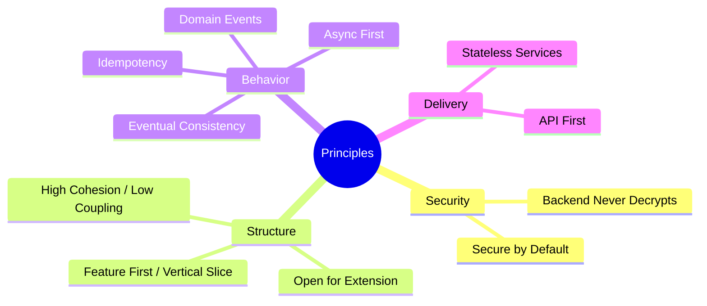
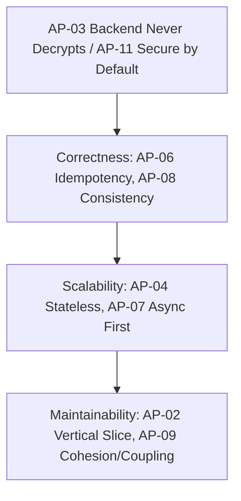

# Architecture Principles

| Field | Value |
|---|---|
| **Title** | Architecture Principles |
| **Status** | Completed |
| **Owner** | Architecture |
| **Version** | 1.0.0 |
| **Last Updated** | 2026-07-14 |
| **Document ID** | DOC-022 |

**Dependencies:** `10-vision-and-scope` (DOC-001), `13-non-functional-requirements` (DOC-011).

**Related Documents:** `29.5-system-invariants` (DOC-023), `40-security-architecture` (DOC-046), `24-modular-monolith-blueprint` (DOC-017), `25-vertical-slice-and-cqrs` (DOC-018).

---

## Purpose

This document defines the non-negotiable **design principles** that govern every architectural and implementation decision. Principles are the "rules of engagement" measured in design reviews, pull requests, and architecture tests. Where principles state a hard runtime guarantee, that guarantee is formalized as an invariant in `29.5-system-invariants`.

## Scope

**In scope:** engineering principles, their rationale, and how each is enforced.

**Out of scope:** runtime invariants (`29.5-system-invariants`), and concrete technology/design (the `20-architecture` and downstream documents).

## Architecture Impact

These principles are the source of authority for architecture tests and the Definition of Done. The overriding principle — **Backend Never Decrypts** — constrains every content-handling design across the platform.

---

## 1. Principle Catalog

| ID | Principle | Statement | Rationale | Enforcement |
|---|---|---|---|---|
| AP-01 | API First | Contracts (`80-api`, `85-protocol`) are defined before handlers are built. | Enables parallel client/server work and stable integrations. | Contract review gate; contract tests. |
| AP-02 | Feature First / Vertical Slice | Code is organized by feature slice, not technical layer; a slice owns its command→handler→data. | Maximizes cohesion; eases microservice extraction. | Architecture tests; folder conventions (`25`). |
| AP-03 | Backend Never Decrypts | The backend MUST NOT contain any code path that decrypts message content. | Core privacy promise; operator cannot read content. | Code review, threat model, invariant INV-01. |
| AP-04 | Stateless Services | Application nodes hold no client-affinity state; shared state lives in Redis/Postgres. | Horizontal scalability and resilience. | Design review; scale tests. |
| AP-05 | Domain Events | State changes emit domain events; side effects react to events. | Decoupling and auditability. | `26-event-driven-architecture`; event catalog. |
| AP-06 | Idempotency | Every retriable command carries an idempotency key and is safe to retry. | Correctness under at-least-once delivery. | Invariant INV-04; `ADR-0018`. |
| AP-07 | Async First | Fan-out, push, and projections are asynchronous by default. | Throughput and responsiveness at scale. | `92-background-workers`; outbox (`ADR-0024`). |
| AP-08 | Eventual Consistency | Cross-module state and read models converge; the UI tolerates convergence. | Scalability without distributed transactions. | Design review; read-model specs. |
| AP-09 | High Cohesion / Low Coupling | Modules communicate only via contracts and events. | Maintainability and extractability. | Architecture tests (`24`). |
| AP-10 | Open for Extension | New capabilities add slices rather than modifying shared cores. | Safe evolution. | Review; slice template. |
| AP-11 | Secure by Default | Deny-by-default authorization; TLS/WSS mandatory; least privilege. | Minimizes attack surface. | Security review; invariants INV-08/09. |

## 2. Principle Precedence

When principles appear to conflict, resolve in this order:

Security principles (AP-03, AP-11) are absolute and never traded off.

## 3. Enforcement Mechanisms

| Mechanism | Enforces |
|---|---|
| Architecture tests | AP-02, AP-09 (slice boundaries, module dependencies) |
| Contract & crypto conformance tests | AP-01, AP-03 |
| Code review checklist | All principles |
| Definition of Done gate (`97`) | All principles |
| Threat model review (`44`) | AP-03, AP-11 |

---

## Risks

| Risk | Impact | Mitigation |
|---|---|---|
| Principles treated as aspirational | Boundary erosion; extraction becomes impossible | Automated architecture tests + DoD gating. |
| Async-first misapplied to interactive paths | Perceived latency | Distinguish interactive vs. background paths in `26`/`64`. |
| Idempotency overlooked in a new slice | Duplicate side effects | INV-04 enforced; idempotency key mandatory. |

## Future Considerations

- Add a principle for multi-region data locality when `97` is adopted.
- Introduce fitness functions that continuously measure coupling.

## Open Questions

| ID | Question | Owner |
|---|---|---|
| OQ-AP-01 | Which principles are CI-blocking vs. advisory at launch? | Architecture |

## References

- `10-vision-and-scope` (DOC-001)
- `13-non-functional-requirements` (DOC-011)
- `29.5-system-invariants` (DOC-023)
- `24-modular-monolith-blueprint` (DOC-017)
