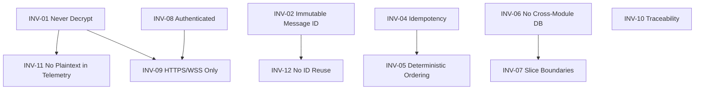

# System Invariants

| Field | Value |
|---|---|
| **Title** | System Invariants |
| **Status** | Completed |
| **Owner** | Architecture |
| **Version** | 1.0.0 |
| **Last Updated** | 2026-07-14 |
| **Document ID** | DOC-023 |

**Dependencies:** `10-vision-and-scope` (DOC-001), `29-architecture-principles` (DOC-022).

**Related Documents:** `41-e2ee-design` (DOC-047), `93-observability` (DOC-099), `44-threat-model` (DOC-050), `97-definition-of-done` (DOC-107).

---

## Purpose

This document enumerates the **invariants** — rules that must never be violated at runtime. Invariants are the correctness and safety contract of the platform. Unlike principles (which guide design), invariants are enforceable, testable, and monitored; a breach is a defect or a security incident.

## Scope

**In scope:** runtime-enforceable truths, their enforcement mechanism, their detection/monitoring, and the response to a breach.

**Out of scope:** design guidance (`29-architecture-principles`) and mechanism detail (referenced documents).

## Architecture Impact

Invariants are the top-level acceptance criteria for the whole system. INV-01 (backend never decrypts) is the defining constraint; combined with INV-05 (deterministic ordering) and INV-04 (idempotency), they make the platform private, correct, and reliable at scale.

---

## 1. Invariant Catalog

| ID | Invariant | Enforcement Mechanism | Detection / Monitor | Breach Response |
|---|---|---|---|---|
| INV-01 | The backend never decrypts message content. | No decryption code paths server-side; content stored/routed as ciphertext only. | Code review, threat model, static checks. | Treat as critical security incident; halt release. |
| INV-02 | Every message has exactly one immutable global identifier. | ID assigned once at persistence; never mutated. | Schema constraints; audits. | Reject write; alert. |
| INV-03 | Every domain/integration event is immutable once emitted. | Append-only event handling; versioned schemas. | Event-store audits. | Quarantine consumer; alert. |
| INV-04 | Retriable commands are idempotent. | Idempotency key + dedup store. | Duplicate-effect metrics. | Drop duplicate; alert on anomalies. |
| INV-05 | Message ordering within a conversation is deterministic and total. | Ordering scheme (`ADR-0008/0010`); monotonic sequence. | Gap/reorder detection in sync. | Client re-sync; alert. |
| INV-06 | No cross-module database access. | Each module owns its schema; no shared tables. | Architecture tests; schema ownership map. | Fail build. |
| INV-07 | No code path bypasses vertical-slice boundaries. | Slice conventions; dependency rules. | Architecture tests. | Fail build. |
| INV-08 | Every external request is authenticated (and authorized). | Auth middleware; deny-by-default. | Auth failure metrics. | Reject request (401/403). |
| INV-09 | Every transport is HTTPS/WSS; plaintext transport is rejected. | TLS enforcement; HSTS; WSS-only hub. | Endpoint scans. | Reject connection. |
| INV-10 | Every feature traces to a requirement. | Requirements Traceability Matrix (`14`). | RTM review at DoD. | Block merge. |
| INV-11 | Logs, metrics, and traces never contain plaintext content or private keys. | Redaction; telemetry review. | Log/PII scanners. | Purge; incident review. |
| INV-12 | A message ID is never reused across edits/versions. | Edit creates a new version referencing the original ID. | Version-chain audits. | Reject write; alert. |

## 2. Invariant Dependency View

## 3. Verification Matrix

| Invariant | Verified by |
|---|---|
| INV-01, INV-11 | Threat model (`44`), crypto conformance (`98`), telemetry review (`93`) |
| INV-02, INV-05, INV-12 | Data design (`51`), sync (`54`), ADR-0008/0010, message lifecycle (`36`) |
| INV-03 | Event catalog (`33`), event versioning (`ADR-0017`) |
| INV-04 | Idempotency (`ADR-0018`), inbox pattern (`ADR-0025`) |
| INV-06, INV-07 | Modular monolith (`24`), vertical slice (`25`), architecture tests |
| INV-08, INV-09 | AuthN/AuthZ (`42`), zero-trust/TLS (`46`) |
| INV-10 | Requirements traceability matrix (`14`), DoD (`97`) |

## 4. Enforcement Cadence

- **Build time:** INV-06, INV-07 via architecture tests; INV-10 via RTM check.
- **Test time:** INV-01, INV-04, INV-05, INV-12 via unit/integration/crypto-conformance tests.
- **Runtime:** INV-08, INV-09 via middleware; INV-01, INV-11 via monitoring and scanners.

---

## Risks

| Risk | Impact | Mitigation |
|---|---|---|
| Silent breach of INV-01 or INV-11 | Catastrophic privacy failure | Multiple independent controls (review, tests, scanners). |
| Ordering breach (INV-05) under multi-region | Reordered/duplicated messages | Ordering scheme decided in ADR-0008/0010; sync gap detection. |
| Invariants asserted only in docs, not in code | False sense of safety | Verification matrix maps each invariant to an automated check. |

## Future Considerations

- Promote invariants to consumer-driven contract tests at service boundaries after microservice extraction.
- Add multi-region ordering invariants once `97` is adopted.

## Open Questions

| ID | Question | Owner |
|---|---|---|
| OQ-INV-01 | Which invariants can be asserted automatically in CI vs. only monitored in production? | Architecture + SRE |
| OQ-INV-02 | What is the authoritative global ordering scheme (ULID / Snowflake / HLC)? | **Resolved** — AD-009: ULID MessageId + per-conversation Sequence; HLC later for multi-region |

## References

- `29-architecture-principles` (DOC-022)
- `41-e2ee-design` (DOC-047)
- `44-threat-model` (DOC-050)
- `97-definition-of-done` (DOC-107)
