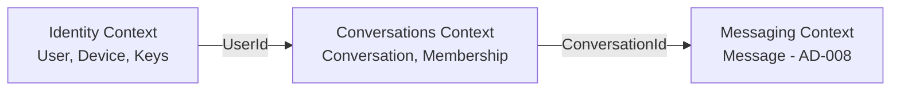
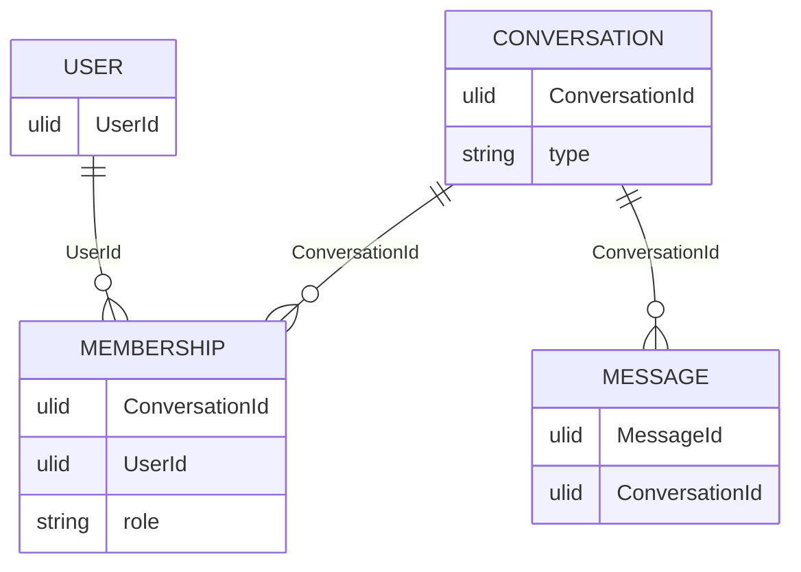

# Domain Model Overview

| Field | Value |
|---|---|
| **Title** | Domain Model Overview |
| **Status** | Completed |
| **Owner** | Architecture |
| **Version** | 1.0.0 |
| **Last Updated** | 2026-07-18 |
| **Document ID** | DOC-024 |

**Dependencies:** `00-glossary-overview` (DOC-003), `12-functional-requirements` (DOC-010), `20-architecture-overview` (DOC-013).

**Related Documents:** `31-bounded-contexts-and-modules` (DOC-025), `32-aggregates-and-invariants` (DOC-026), `33-domain-events-catalog` (DOC-027), AD-007, ADR-0031, RS-001.

---

## Purpose

This document defines the ubiquitous domain model for the messaging platform: core aggregates, identities, and relationships that all feature specs and sequences must respect. It begins with the **Conversation** model ratified by AD-007 / ADR-0031 and leaves message, ordering, and sync aggregates to subsequent approved decisions (AD-008..AD-010).

## Scope

**In scope:** Conversation and Membership aggregates; relationship to User/Device; domain events emitted by Conversations; terminology alignment.

**Out of scope (pending AD-008..AD-010):** Message payload shape, ordering sequence, sync cursors, delivery state machine detail.

## Architecture Impact

A single Conversation aggregate with a Membership sub-model is the foundation of the messaging engine. It unifies 1:1 and group pipelines, anchors authorization (AD-003), and provides the control plane for future group encryption (ADR-0020).

---

## 1. Bounded Context Sketch



| Context | Owns | Key IDs |
|---|---|---|
| Identity | User, Device, public-key material | `UserId`, `DeviceId` |
| Conversations | Conversation, Membership | `ConversationId` |
| Messaging | Message stream (pending AD-008) | `MessageId` |

No cross-module table access (INV-06). Integration is via IDs and domain events.

---

## 2. Conversation Aggregate (AD-007 / ADR-0031)

### 2.1 Conversation

| Attribute | Rules |
|---|---|
| `ConversationId` | Opaque, immutable (ULID/UUID). |
| `type` | `Direct` \| `Group` \| `Channel`. |
| `created_at` | Server time at create. |
| Display metadata | Minimized; posture for titles/avatars tracked in OQ-CONV-04. |

**Channel** type exists in the model but **must not be creatable** until FS-03.

### 2.2 Membership

| Attribute | Rules |
|---|---|
| `(ConversationId, UserId)` | Primary membership identity. |
| `role` | Group: `owner` \| `admin` \| `member`. Direct: peers (no role hierarchy required). |
| `joined_at` | Server time. |

Membership is **per UserId**. Devices of that user inherit authorization; cryptographic fan-out remains per device (AD-006).

### 2.3 Per-type invariants

| Type | Invariants |
|---|---|
| Direct | Exactly two distinct members; membership immutable; unique canonical pair key `(min(UserId), max(UserId))`; idempotent create. |
| Group | Dynamic membership; authorized role changes; ≥1 owner (or documented succession); emit events on membership change. |
| Channel | Not creatable at launch. |

### 2.4 Relationship to messages

Every message references exactly one `ConversationId`. Message structure is owned by AD-008 (not defined here beyond the foreign identity).



---

## 3. Domain Events (Conversations)

| Event | When | Consumers (indicative) |
|---|---|---|
| `ConversationCreated` | Direct or Group created | Sync projections, analytics (metadata only) |
| `MemberJoined` | User added to Group | Authz cache, group crypto (future ADR-0020) |
| `MemberLeft` | User removed / left Group | Authz cache, group crypto |
| `MemberRoleChanged` | Role update | Authz cache |
| `ConversationMetadataUpdated` | Non-content metadata change | Read models |

Events are immutable once emitted (INV-03). Payload contains IDs and roles only — never plaintext message content.

---

## 4. Sequence — Create or Resolve Direct Conversation

```mermaid
sequenceDiagram
    participant C as Client Device
    participant API as Conversations API
    participant DB as Conversations Store
    C->>API: CreateDirect(peerUserId) [authn]
    API->>API: Authorize caller; canonicalize pair(caller, peer)
    API->>DB: INSERT Conversation+Membership OR fetch by pair key
    alt Unique violation / already exists
        DB-->>API: Existing ConversationId
    else Created
        DB-->>API: New ConversationId
        API-->>API: Emit ConversationCreated
    end
    API-->>C: ConversationId + membership snapshot
```

---

## 5. Sequence — Group Membership Change

```mermaid
sequenceDiagram
    participant Admin as Admin Device
    participant API as Conversations API
    participant DB as Conversations Store
    participant Bus as Outbox / Events
    participant Authz as Authz Cache
    Admin->>API: AddMember(conversationId, userId)
    API->>API: Authorize admin role; reject if type=Direct
    API->>DB: Insert Membership
    API->>Bus: MemberJoined
    Bus->>Authz: Invalidate conversation authz
    Note over Bus: Future: sender-key rotation (ADR-0020)
    API-->>Admin: OK + updated membership
```

---

## 6. Terminology

| Term | Meaning |
|---|---|
| Conversation | Messaging context identified by `ConversationId`, typed Direct/Group/Channel. |
| Membership | Binding of a `UserId` to a Conversation with an optional role. |
| Direct | Fixed two-party conversation. |
| Group | Multi-party conversation with mutable membership and roles. |
| Channel | Future broadcast-oriented conversation type (not creatable at launch). |

Canonical glossary entries must remain consistent with `00-glossary-overview`.

---

## Risks

| Risk | Impact | Mitigation |
|---|---|---|
| Domain model drifts from AD-007 | Inconsistent implementation | ADR-0031 is normative; this doc cites it. |
| Message model assumed prematurely | Conflicting AD-008 | Message fields marked pending. |
| Channel created early | Unsupported scale/semantics | Creation gated until FS-03. |

## Future Considerations

- Expand aggregates section when AD-008..AD-010 are approved.
- Bounded contexts document (DOC-025) will refine module contracts.
- Domain events catalog (DOC-027) will version event schemas.

## Open Questions

| ID | Question | Owner |
|---|---|---|
| OQ-CONV-01 | Max group size at launch | Product + Security |
| OQ-CONV-04 | Group title/avatar encryption posture | Security + Product |

## References

- AD-007 Conversation Model
- ADR-0031 Unified Conversation Model
- RS-001 Conversation Models
- AD-001, AD-003, AD-004, AD-006
- `20-architecture-overview` (DOC-013)
- `29.5-system-invariants` (DOC-023)
