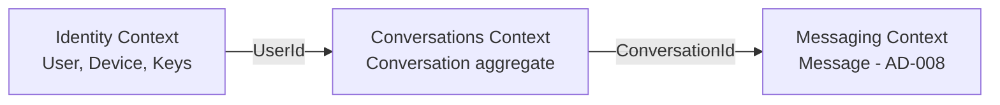
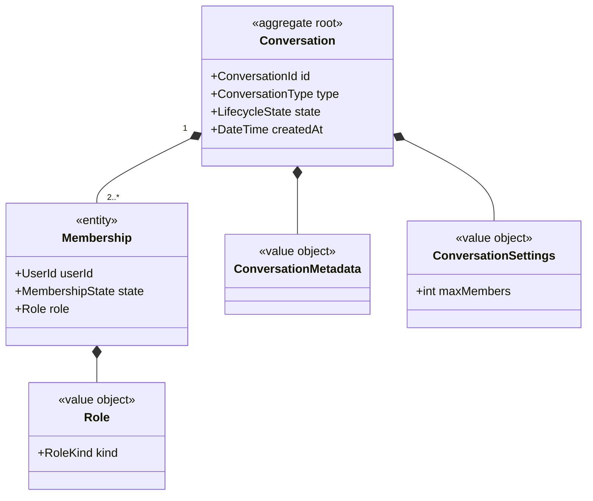
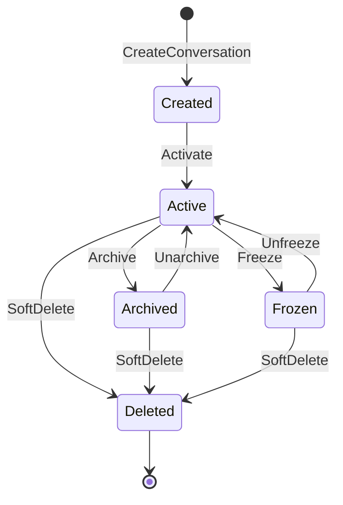
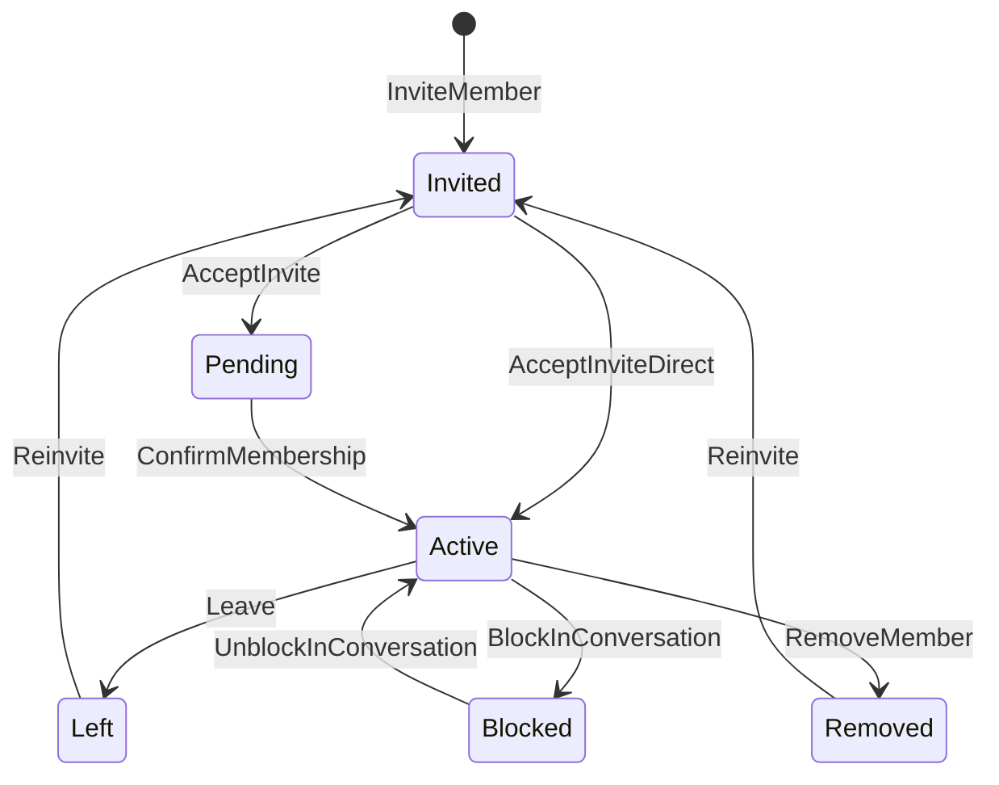

# Domain Model Overview

| Field | Value |
|---|---|
| **Title** | Domain Model Overview |
| **Status** | Completed |
| **Owner** | Architecture |
| **Version** | 1.1.0 |
| **Last Updated** | 2026-07-18 |
| **Document ID** | DOC-024 |

**Dependencies:** `00-glossary-overview` (DOC-003), `12-functional-requirements` (DOC-010), `20-architecture-overview` (DOC-013), ADR-0031 (DOC-152).

**Related Documents:** `31-bounded-contexts-and-modules` (DOC-025), `32-aggregates-and-invariants` (DOC-026), `33-domain-events-catalog` (DOC-027), AD-007, ADR-0031, RS-001.

---

## Purpose

This document defines the ubiquitous domain model for the messaging platform: core aggregates, identities, lifecycles, invariants, and relationships that all feature specs and sequences must respect. The **Conversation** model is ratified by AD-007 / ADR-0031. Message, ordering, and sync aggregates remain pending AD-008..AD-010.

## Scope

**In scope:** Conversation aggregate (including Membership, Role, Metadata, Settings); conversation and membership lifecycles; ownership; domain events; extensibility strategy; terminology.

**Out of scope (pending AD-008..AD-010):** Message payload shape, ordering sequence, sync cursors, delivery state machine detail.

## Architecture Impact

A single Conversation aggregate with a first-class Membership entity is the foundation of the messaging engine. Explicit lifecycles and invariants make authorization (AD-003), group crypto hooks (ADR-0020), and sync (AD-010) implementable without redesign.

---

## 1. Bounded Context Sketch



| Context | Owns | Key IDs |
|---|---|---|
| Identity | User, Device, public-key material | `UserId`, `DeviceId` |
| Conversations | Conversation aggregate (Membership, Metadata, Settings) | `ConversationId` |
| Messaging | Message stream (pending AD-008) | `MessageId` |

No cross-module table access (INV-06). Messages are **not** inside the Conversation aggregate.

---

## 2. Aggregate Structure

**Root:** `Conversation`  
**Entities:** `Membership`  
**Value objects:** `Role`, `ConversationMetadata`, `ConversationSettings`, `CanonicalPairKey` (Direct)  
**External references:** `UserId`, `MessageId` (outside boundary)



Normative diagrams and field-level rules: AD-007 § Aggregate Structure.

---

## 3. Conversation Lifecycle

States: `Created` → `Active` ⇄ `Archived` / `Frozen` → `Deleted` (terminal).



| State | Messaging | Notes |
|---|---|---|
| `Created` | No | Transient; launch activates in same transaction |
| `Active` | Yes | Subject to membership |
| `Archived` | No | Retained history |
| `Frozen` | No | Group/system; **not used for Direct at launch** |
| `Deleted` | No | Terminal soft-delete; id never reused |

**State ownership:** Conversations domain aggregate. Full transition table: AD-007 § Conversation Lifecycle.

---

## 4. Membership Lifecycle

States: `Invited` → `Pending` → `Active` → `Left` | `Removed` | `Blocked`.



| Type | Rules |
|---|---|
| Direct | Both members created `Active`; add/remove/`Left`/`Removed` **invalid** |
| Group | Full machine; launch may skip to `Active` on add |
| Channel | Future; subscription + publisher roles |

### Cross-cutting effects

| Concern | On membership change |
|---|---|
| Authorization | Only `Active` (+ role); cache invalidated via events |
| Notifications | Metadata-only fan-out to affected devices |
| Key rotation | Loss of `Active` triggers sender-key rotation before further group sends |
| Synchronization | Membership is control-plane sync data |
| Read models | Conversation list / membership-by-user updated from events |

---

## 5. Domain Invariants

Enforcement: **D** domain · **A** application · **DB** database.

### Direct

- Exactly two distinct participants with `Active` membership (D+DB).
- One conversation per canonical pair key (D+A+**DB UNIQUE**).
- No additional members; no owner/admin hierarchy (D).
- `Freeze` rejected at launch (D+A).

### Group

- ≥1 `Active` `owner` at all times (D).
- Last owner cannot leave/be removed without ownership transfer (D).
- `Active`+`Invited`+`Pending` count ≤ `maxMembers` (D+A).
- Roles ∈ {owner, admin, moderator, member} (D+DB).

### Channel (reserved)

- Not creatable until FS-03 (D+A).
- When enabled: only publishers create messages; subscribers read-only unless elevated (D+A).

Full invariant IDs (D-INV-*, G-INV-*, C-INV-*, X-INV-*): **AD-007**.

---

## 6. Ownership Model

| Role | Direct | Group |
|---|---|---|
| Owner | N/A (peers) | Ultimate authority; soft-delete; transfer |
| Admin | N/A | Manage members/settings |
| Moderator | N/A | Limited moderation (metadata actions) |
| Member | Both parties | Default participant |

**Ownership transfer (Group):** atomic command; former owner demoted; G-INV-01 held throughout.  
**Direct:** no ownership transfer; either peer may soft-delete per launch rule (OQ-CONV-06).

Authority matrix: AD-007 § Ownership Model.

---

## 7. Domain Events (Conversations)

| Event | When |
|---|---|
| `ConversationCreated` / `ConversationActivated` | Create/activate |
| `ConversationArchived` / `ConversationUnarchived` | Archive toggles |
| `ConversationFrozen` / `ConversationUnfrozen` | Freeze toggles |
| `ConversationDeleted` | Soft-delete |
| `MemberInvited` / `MemberJoined` | Invite / active |
| `MemberLeft` / `MemberRemoved` / `MemberBlocked` | Exit paths |
| `MemberRoleChanged` | Role / ownership transfer |
| `ConversationMetadataUpdated` | Non-content metadata |

Events are immutable (INV-03). Payloads: IDs, roles, states only — never plaintext content.

---

## 8. Sequences

### Create or Resolve Direct Conversation

```mermaid
sequenceDiagram
    participant C as Client Device
    participant API as Conversations API
    participant DB as Conversations Store
    C->>API: CreateDirect(peerUserId) [authn]
    API->>API: Authorize; canonicalize pair
    API->>DB: INSERT Conversation Active + 2 Membership Active OR fetch by pair key
    alt Exists
        DB-->>API: Existing ConversationId
    else Created
        API-->>API: ConversationCreated + Activated
    end
    API-->>C: ConversationId + membership snapshot
```

### Group Membership Change

```mermaid
sequenceDiagram
    participant Admin as Admin Device
    participant API as Conversations API
    participant DB as Conversations Store
    participant Bus as Outbox
    Admin->>API: AddMember(conversationId, userId)
    API->>API: Authorize admin/owner; reject if Direct; enforce maxMembers
    API->>DB: Membership Active or Invited
    API->>Bus: MemberJoined or MemberInvited
    Note over Bus: Authz invalidate; sync; future key rotation
    API-->>Admin: OK
```

---

## 9. Future Extensibility

| Concept | Strategy |
|---|---|
| Channels | Enable `type=Channel` + publish/subscribe roles |
| Communities | Wrapper aggregate → many `ConversationId`s |
| Threads / Topics | Message relations (AD-008), not new conversations |
| Business / AI / Support / Temporary | Additive settings + role packs |
| Broadcast Lists | Prefer Channel or client fan-out to Directs |

Never split the message pipeline by type. Details: AD-007 § Future Extensibility Strategy.

---

## 10. Terminology

| Term | Meaning |
|---|---|
| Conversation | Aggregate root; typed Direct/Group/Channel; has lifecycle state |
| Membership | Entity binding `UserId` to Conversation with state and role |
| Role | owner / admin / moderator / member (Group); peers (Direct) |
| Conversation Metadata | Display attributes (minimized; OQ-CONV-04) |
| Conversation Settings | Limits and type-specific flags (e.g., `maxMembers`) |
| Canonical Pair Key | Sorted `(UserId, UserId)` uniqueness for Direct |

Aligned with `00-glossary-overview`.

---

## Risks

| Risk | Impact | Mitigation |
|---|---|---|
| Domain model drifts from AD-007 | Inconsistent implementation | ADR-0031 + AD-007 normative; this doc cites them |
| Lifecycle ignored by clients | Authz/sync bugs | States exposed in protocol; reject invalid sends |
| Channel created early | Unsupported scale | Creation gated until FS-03 |

## Future Considerations

- DOC-026 will catalog aggregate invariants platform-wide.
- DOC-027 will version event schemas.
- Expand when AD-008..AD-010 approve Message/Sync aggregates.

## Open Questions

| ID | Question | Owner |
|---|---|---|
| OQ-CONV-01 | Max group size (`maxMembers`) | Product + Security |
| OQ-CONV-04 | Group title/avatar encryption | Security + Product |
| OQ-CONV-06 | Direct shared delete vs per-user hide | Product |
| OQ-CONV-07 | Launch invite UX vs direct-add | Product |

## References

- AD-007 Conversation Model (v2.1)
- ADR-0031 Unified Conversation Model
- RS-001 Conversation Models
- AD-001, AD-003, AD-004, AD-006
- `20-architecture-overview` (DOC-013)
- `29.5-system-invariants` (DOC-023)
