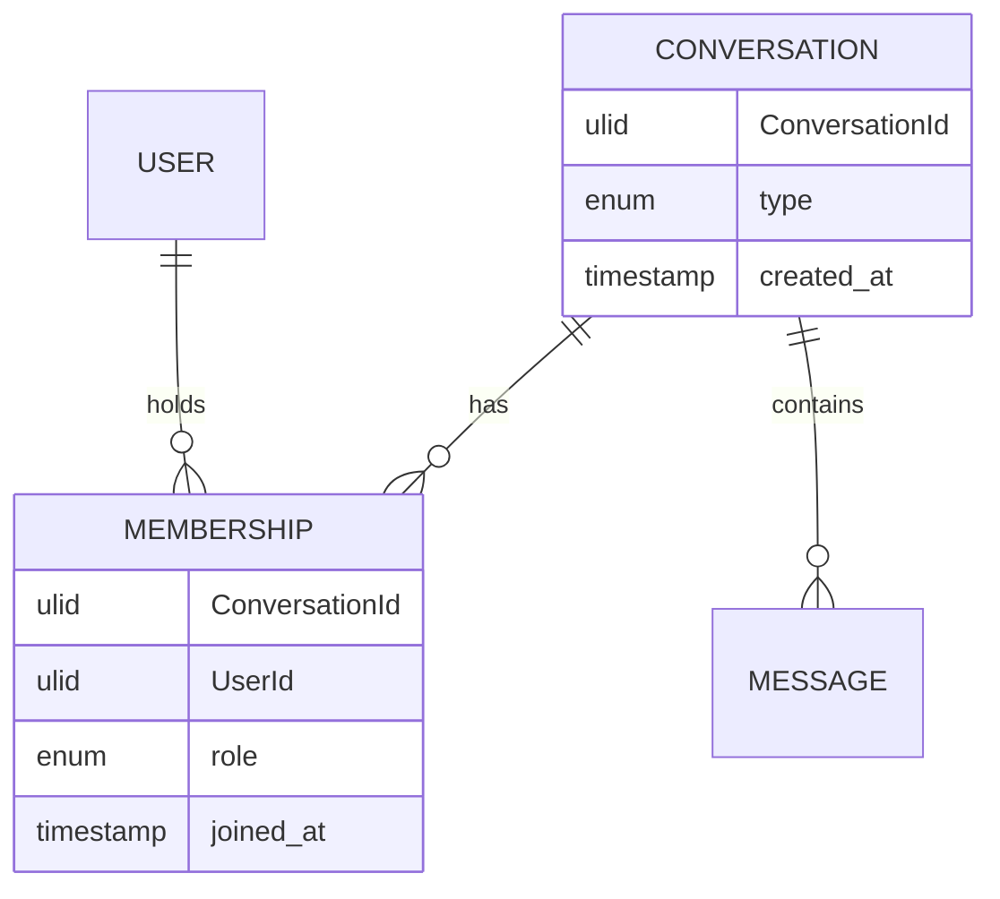

# AD-007 — Conversation Model (Decision Recommendation)

| Field | Value |
|---|---|
| **Status** | Approved |
| **Owner** | Architecture |
| **Version** | 2.0.0 |
| **Last Updated** | 2026-07-18 |
| **Workshop** | [WS-007](workshops/WS-007-conversation-model.md) |
| **Architecture Review** | [AR-007](reviews/AR-007-conversation-model.md) |
| **Related Research** | [RS-001 Conversation Models](../research/RS-001-conversation-models.md) |

## Question

How should conversations (one-to-one, group, and future channels) be modeled so that membership, roles, and message association are consistent while content remains E2EE?

---

## Context

Conversations are the container for all messaging. The platform must support 1:1 and groups at launch (FR-004, FR-005) and reserve channels (FR-006). Authorization (AD-003) is membership/role based. Group encryption (AD-004 sender-keys; future AD-020) depends on stable membership events. Sync and ordering (AD-009, AD-010) require a stable `ConversationId`.

Approved constraints AD-001..AD-006 are binding. Evidence for this decision is **RS-001**; workshop **WS-007** prepared options; review **AR-007** challenged the recommendation.

---

## Problem

Without a single conversation model, the platform risks duplicated message pipelines, inconsistent sync, and brittle authorization/encryption hooks when channels arrive. The model must unify Direct and Group today without building Discord-style hierarchy or server-readable content features.

---

## Constraints

| ID | Constraint |
|---|---|
| INV-01 | Backend never decrypts message content; conversation data is metadata-only. |
| AD-001 | Membership keyed by opaque `UserId`. |
| AD-003 | Authz over membership/roles only; deny-by-default. |
| AD-004 / AD-005 | Membership changes must be able to drive group re-keying. |
| AD-006 | Devices inherit the owning user's membership; history gated by device trust. |
| AP-09 | Conversations module remains extractable. |
| FR-006 | Channels deferred; type may be reserved, not implemented. |

---

## Decision

**Adopt RS-001 Alternative B:** a **unified `Conversation` aggregate** with:

- `ConversationId` — opaque, immutable identifier (ULID/UUID).
- `type` — `Direct` | `Group` | `Channel` (Channel **not creatable** until FS-03).
- Separate **Membership** entities: `(ConversationId, UserId, role, joined_at, …)`.
- Messages always reference exactly one `ConversationId` (message shape owned by AD-008).

**Direct (1:1):** fixed-membership two-party conversation. Exactly two distinct `UserId`s. Membership is immutable (no add/remove). Identity is deterministic via a **canonical pair key** (sorted pair of UserIds) with a uniqueness constraint and idempotent create.

**Group:** dynamic membership with roles `owner` | `admin` | `member` (AD-003). Membership changes emit durable domain events.

**Channel (future):** reserved type for restricted-write / subscription membership. API and domain reject Channel creation until FS-03.

Membership is **per user**, not per device. All of a user's devices share the same membership for authorization; encryption fan-out still addresses each device (AD-006).

### Per-type invariants

| Type | Invariants |
|---|---|
| Direct | Exactly two members; membership immutable after create; unique canonical pair key; no admin/owner role required (both parties are peers). |
| Group | ≥1 owner (or documented succession rule); membership mutable via authorized commands; role changes emit events. |
| Channel | Not creatable at launch; when enabled: restricted writers, subscription-style readers (detailed in FS-03 / future decision). |

### Required supporting structures

- **Membership-by-user projection** (or indexed query) for conversation list.
- **Domain events** on membership join/leave/role-change for authz cache invalidation and future sender-key rotation.
- Server rejects messages from non-members at accept time (stale offline clients must re-sync membership).

---

## Decision Drivers

1. **E2EE-first simplicity** — one pipeline minimizes crypto and sync edge cases (RS-001, INV-01).
2. **Uniform sync/storage** — AD-009/AD-010 need a single conversation-scoped stream.
3. **Authz fit** — Membership/Role maps cleanly to AD-003.
4. **Group crypto hook** — membership events are the control plane for sender-keys (AD-004).
5. **Channel readiness without hierarchy** — type reservation beats Alternative C complexity.
6. **Extractability** — Conversations module owns Conversation + Membership schemas (INV-06).

---

## Alternatives Considered

Aligned with **RS-001** lettering (supersedes earlier draft lettering).

### Alternative A — Separate models per type (DirectChat, Group, Channel)

- **Pros:** Explicit per-type code; independent optimization.
- **Cons:** Duplicated messaging/sync/storage paths; higher operational surface.
- **Rejected:** Fails uniformity drivers for AD-008..AD-010.

### Alternative B — Unified Conversation + Membership/Role *(chosen)*

- **Pros:** Single pipeline; channel-ready; clean authz/crypto events; corroborated by RS-001.
- **Cons:** Type invariants must be enforced; Channel semantics deferred.
- **Accepted** with AR-007 required changes applied above.

### Alternative C — Generic space/room hierarchy

- **Pros:** Maximum community flexibility.
- **Cons:** Authorization explosion; premature vs. FR scope; poor launch fit for E2EE messenger.
- **Rejected:** Over-engineering; can layer communities later without splitting the message stream.

---

## Consequences

**Positive**

- One message association and sync path for all conversation types.
- Clear membership control plane for AD-003 and future AD-020.
- Deterministic Direct conversations under concurrency.
- Channel addition does not require a new message store.

**Negative**

- Type-specific rules must be tested and documented continuously.
- Channel product rules still undefined (intentionally).
- Group display-name privacy posture still an open product/security question.

**Neutral / deferred**

- Threads modeled as message relations (AD-008 / RS-002), not nested conversations.
- Communities as optional future wrapper aggregates.

---

## Risks

| ID | Risk | Severity |
|---|---|---|
| R-007-01 | Type conditionals erode into inconsistent behavior | Medium |
| R-007-02 | Membership event loss delays re-key → former member reads new ciphertext | High |
| R-007-03 | Duplicate Direct conversations under race | Medium |
| R-007-04 | Premature Channel usage under load | Medium |
| R-007-05 | Plaintext group titles increase metadata exposure | Low–Medium |

---

## Mitigations

| Risk | Mitigation |
|---|---|
| R-007-01 | Normative per-type invariants; architecture tests; AD-026 may deepen later |
| R-007-02 | Durable outbox for membership events; crypto layer must rotate before further sends (AD-020); authz denies non-members immediately |
| R-007-03 | Canonical pair key + unique index + idempotent create |
| R-007-04 | Channel creation disabled until FS-03; reject unknown types |
| R-007-05 | Minimize stored display metadata; OQ-CONV-04 tracks encryption of titles |

---

## Future Evolution

- Enable `Channel` with FS-03 (restricted write, subscription membership).
- Optional Community aggregate referencing conversations (no message-pipeline split).
- Threads/topics as message relations, not child conversations.
- MLS trigger when group size exceeds sender-key comfort zone (AD-004) — size threshold is product-owned (OQ-CONV-01).

---

## Related Research

- **[RS-001 Conversation Models](../research/RS-001-conversation-models.md)** — primary evidence; Alternative B adopted.

---

## Related ADRs

- **ADR-0031** — Unified Conversation Model (ratification of this decision)
- **ADR-0020** — Group Encryption (depends on membership events; not ratified in this topic)

---

## Related Documents

- `docs/architecture-decisions/workshops/WS-007-conversation-model.md`
- `docs/architecture-decisions/reviews/AR-007-conversation-model.md`
- `docs/30-domain/30-domain-model-overview.md`
- `docs/30-domain/31-bounded-contexts-and-modules.md` *(pending full write)*
- `docs/70-features/FS-01-one-to-one-chat.md` *(pending)*
- `docs/70-features/FS-02-group-chat.md` *(pending)*
- `docs/20-architecture/20-architecture-overview.md`

---

## Open Questions

| ID | Question | Owner | Blocking? |
|---|---|---|---|
| OQ-CONV-01 | Maximum group size at launch? | Product + Security | No (model stable) |
| OQ-CONV-02 | Group-DM vs named group at launch? | Product | No |
| OQ-CONV-03 | Channel schema fields to reserve now? | Architecture | No |
| OQ-CONV-04 | Group title/avatar plaintext vs encrypted? | Security + Product | No |
| OQ-CONV-05 | Membership retention after leave for abuse forensics? | Trust & Safety | No |

---

## Review Outcome (2026-07-18)

**Reviewer:** Chief Software Architect · **Verdict:** Approve with Changes  
**Review artifact:** [AR-007](reviews/AR-007-conversation-model.md)

**Required changes applied:**

- Alternatives aligned to **RS-001** lettering; **RS-001** cited as Related Research.
- Per-type invariants table added; Direct treated as constrained type, not "group of 2" without rules.
- Canonical Direct pair key + uniqueness + idempotent create mandated.
- Membership clarified as **per UserId** (devices inherit).
- Channel creation gated until FS-03.
- Membership domain events and membership-by-user projection required.
- Risks/mitigations/future evolution expanded per sprint decision template.

**Residual open questions:** OQ-CONV-01..05 (non-blocking).

**Quality scores** — Architecture 9 · Security 9 · Scalability 9 · Maintainability 9 · Documentation 9 · **Overall 9.2**

---

## Approval

- **Status:** Approved
- **Owner:** Architecture
- **Reviewed by:** Chief Software Architect (Messaging Core Architecture Sprint — Conversation Model)
- **Review Date:** 2026-07-18
- **Decision Date:** 2026-07-18
