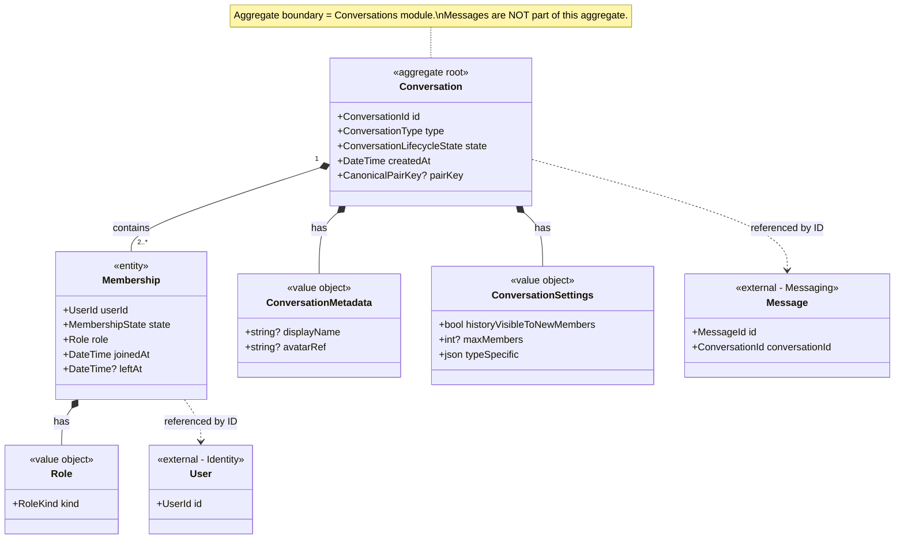
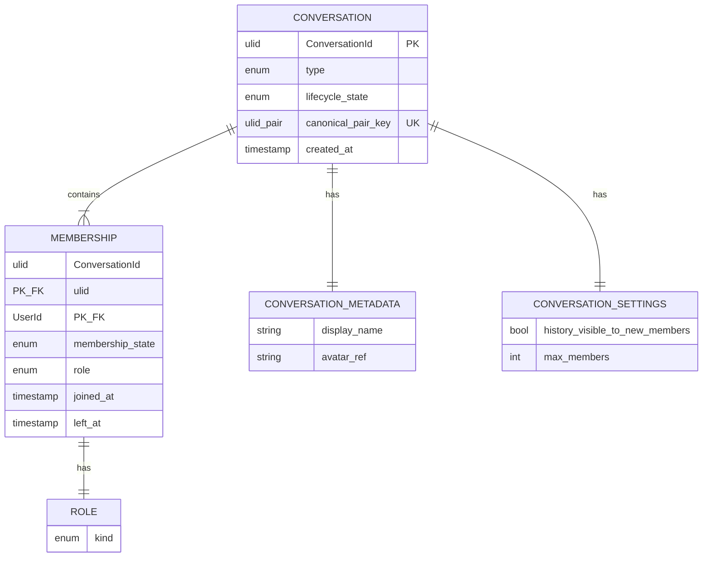
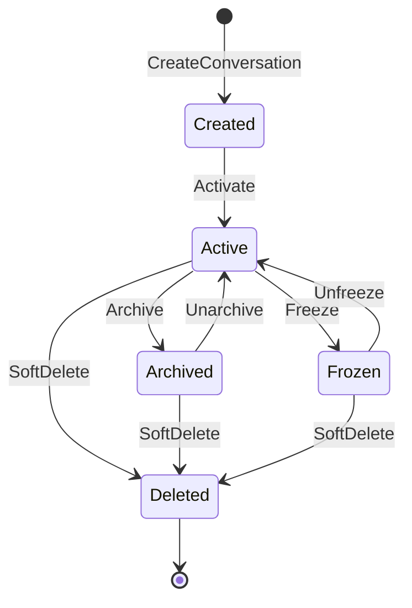
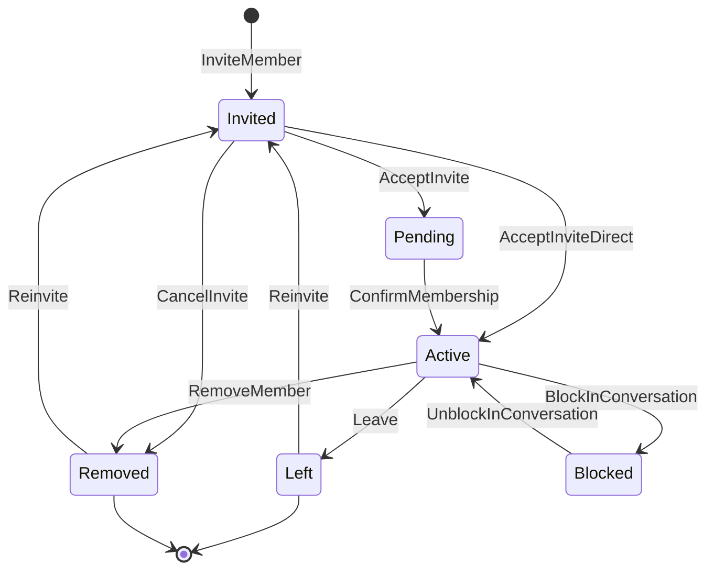

# AD-007 — Conversation Model (Decision Recommendation)

| Field | Value |
|---|---|
| **Status** | Approved |
| **Owner** | Architecture |
| **Version** | 2.1.0 |
| **Last Updated** | 2026-07-18 |
| **Workshop** | [WS-007](workshops/WS-007-conversation-model.md) |
| **Architecture Review** | [AR-007](reviews/AR-007-conversation-model.md) |
| **Related Research** | [RS-001 Conversation Models](../research/RS-001-conversation-models.md) |

## Question

How should conversations (one-to-one, group, and future channels) be modeled so that membership, roles, and message association are consistent while content remains E2EE?

---

## Context

Conversations are the container for all messaging. The platform must support 1:1 and groups at launch (FR-004, FR-005) and reserve channels (FR-006). Authorization (AD-003) is membership/role based. Group encryption (AD-004 sender-keys; future AD-020) depends on stable membership events. Sync and ordering (AD-009, AD-010) require a stable `ConversationId`.

Approved constraints AD-001..AD-006 are binding. Evidence for this decision is **RS-001**; workshop **WS-007** prepared options; review **AR-007** challenged the recommendation.

---

## Problem

Without a single conversation model, the platform risks duplicated message pipelines, inconsistent sync, and brittle authorization/encryption hooks when channels arrive. The model must unify Direct and Group today without building Discord-style hierarchy or server-readable content features.

---

## Constraints

| ID | Constraint |
|---|---|
| INV-01 | Backend never decrypts message content; conversation data is metadata-only. |
| AD-001 | Membership keyed by opaque `UserId`. |
| AD-003 | Authz over membership/roles only; deny-by-default. |
| AD-004 / AD-005 | Membership changes must be able to drive group re-keying. |
| AD-006 | Devices inherit the owning user's membership; history gated by device trust. |
| AP-09 | Conversations module remains extractable. |
| FR-006 | Channels deferred; type may be reserved, not implemented. |

---

## Decision

**Adopt RS-001 Alternative B:** a **unified `Conversation` aggregate** with:

- `ConversationId` — opaque, immutable identifier (ULID/UUID).
- `type` — `Direct` | `Group` | `Channel` (Channel **not creatable** until FS-03).
- Separate **Membership** entities: `(ConversationId, UserId, role, membership_state, …)`.
- Value objects within the aggregate: **Role**, **ConversationMetadata**, **ConversationSettings**.
- Messages always reference exactly one `ConversationId` (message shape owned by AD-008).

**Direct (1:1):** fixed-membership two-party conversation. Exactly two distinct `UserId`s with `Active` membership. Identity is deterministic via a **canonical pair key** (sorted pair of UserIds) with a uniqueness constraint and idempotent create.

**Group:** dynamic membership with roles `owner` | `admin` | `moderator` | `member` (AD-003). Membership changes emit durable domain events.

**Channel (future):** reserved type for restricted-write / subscription membership. API and domain reject Channel creation until FS-03.

Membership is **per user**, not per device. All of a user's devices share the same membership for authorization; encryption fan-out still addresses each device (AD-006).

Lifecycle, invariants, ownership, extensibility, and aggregate structure are normative below (Amendments 2026-07-18). They **do not change** the chosen design; they make implicit rules explicit.

### Required supporting structures

- **Membership-by-user projection** for conversation list.
- **Domain events** on conversation lifecycle, membership lifecycle, and role changes for authz cache invalidation, notifications, sync, and future sender-key rotation.
- Server rejects messages from non-`Active` members (or non-publishers on Channel) at accept time.

---

## Aggregate Structure

**Aggregate root:** `Conversation`.  
**Entities inside the boundary:** `Membership` (with `Role`).  
**Value objects inside the boundary:** `ConversationMetadata`, `ConversationSettings`, `CanonicalPairKey` (Direct only).  
**Outside the boundary (referenced by ID only):** `User` (Identity), `Message` (Messaging / AD-008), `Device` (Identity).

---

## Conversation Lifecycle

**State ownership:** Conversations module (domain aggregate). Transitions are commanded through application services; the aggregate enforces valid transitions. Persistence stores `lifecycle_state`; DB check constraints reject unknown values.

### States

| State | Meaning |
|---|---|
| `Created` | Aggregate persisted; membership seeded; not yet open for messaging (transient; usually advances immediately to `Active`). |
| `Active` | Normal operation; eligible members may send/receive per type rules. |
| `Archived` | Hidden from default inbox projections; history retained; messaging disabled unless explicitly unarchived. |
| `Frozen` | Temporary admin/system lock; no new messages; membership changes restricted to owner/system. |
| `Deleted` | Terminal soft-delete; no messaging; metadata retained per retention policy; `ConversationId` never reused. |

### State machine (all types)

### Transition rules

| Transition | Who may initiate | Business rules | Invalid if |
|---|---|---|---|
| → `Created` | Authenticated user (create command) | Seeds membership per type; Direct uses pair key | Channel create before FS-03; duplicate Direct pair |
| `Created` → `Active` | System (same transaction as create at launch) | Required before first message accept | Membership invariants violated |
| `Active` → `Archived` | Direct: either peer; Group: owner/admin | Emits `ConversationArchived`; disables send | Already Archived/Deleted |
| `Archived` → `Active` | Same authority as Archive | Emits `ConversationUnarchived` | Deleted/Frozen |
| `Active` → `Frozen` | Group: owner; system/Trust & Safety | Emits `ConversationFrozen`; blocks sends | Direct: product may disallow (default: **not used** for Direct at launch) |
| `Frozen` → `Active` | Same authority as Freeze | Emits `ConversationUnfrozen` | Deleted |
| → `Deleted` | Direct: either peer (delete-for-me is client-local; delete conversation soft-deletes for both only via mutual or product rule — **launch:** either peer may soft-delete the shared Direct); Group: owner | Emits `ConversationDeleted`; terminal | Already Deleted |

### Type differences

| Aspect | Direct | Group | Channel (future) |
|---|---|---|---|
| `Frozen` | Not used at launch (reject Freeze) | Supported | Supported (moderation) |
| `Archived` | Per-user archive may be a **user projection** preference; shared `Archived` state optional — **launch:** shared state supported | Shared | Shared |
| `Deleted` | Soft-delete; pair key remains reserved (no new Direct for same pair until product allows recreate — **launch:** pair key stays unique; resurrect via Unarchive/reactivate policy, not second create) | Soft-delete | Soft-delete |

### Messaging eligibility by conversation state

| State | Accept new messages? |
|---|---|
| `Created` | No |
| `Active` | Yes (subject to membership) |
| `Archived` | No |
| `Frozen` | No |
| `Deleted` | No |

---

## Membership Lifecycle

**State ownership:** Conversations aggregate (`Membership` entity). Devices do not have separate membership states.

### States

| State | Meaning |
|---|---|
| `Invited` | Invite issued; user not yet able to send (Group/Channel). |
| `Pending` | Invite accepted on client but server confirmation/key setup incomplete (optional; may collapse into `Invited`→`Active` if unused at launch). |
| `Active` | Full membership for authz and messaging (subject to role). |
| `Left` | User voluntarily left; terminal for that membership row unless re-invited (new transition to `Invited`/`Active`). |
| `Removed` | Removed by authorized actor; terminal unless re-invited. |
| `Blocked` | Blocked relative to this conversation (or inherits user-level block); cannot rejoin until cleared. |

### State machine (Group / Channel)

**Launch simplification (Group):** `InviteMember` may create `Active` directly (no invite UX). States `Invited`/`Pending` remain in the model for FS-02 evolution. **Direct:** both members created as `Active` in the create transaction; no invite flow.

### Direct membership rules

| Rule | Detail |
|---|---|
| Initial | Both users → `Active` on create |
| Allowed transitions | None that add/remove members; optional per-user block is **Identity/relationship** (FR-022), not a third membership seat |
| `Left` / `Removed` | **Invalid** for Direct |
| Block | User-level block may suppress messaging UX; conversation and two memberships remain; server still enforces block policy in application layer |

### Authorization for membership transitions (Group)

| Action | Minimum role |
|---|---|
| Invite / add member | `admin` or `owner` |
| Remove member | `admin` or `owner` (cannot remove last owner — see invariants) |
| Leave | Self (`Active` member), except last owner without transfer |
| Change role | `owner` (or `admin` promoting to `member`/`moderator` only — **launch:** only `owner` changes roles) |
| Block in conversation | `admin` or `owner` |

### Effects of membership changes

| Concern | Effect |
|---|---|
| **Authorization** | Only `Active` (+ role) grants access; event invalidates authz cache immediately (AD-003). |
| **Notifications** | Membership events fan out metadata-only pushes to affected users' devices (no plaintext content). |
| **Key rotation** | `Active`→`Left`/`Removed`/`Blocked` and role-driven access loss **must** trigger group sender-key rotation before further group sends (AD-004 / future ADR-0020). |
| **Synchronization** | Membership snapshots/events are syncable control-plane data (AD-010); clients update local member lists and stop sending if not `Active`. |
| **Read models** | Membership-by-user and conversation-list projections update from the same events. |

### Triggering domain events

| Transition | Event |
|---|---|
| → `Invited` | `MemberInvited` |
| → `Active` (join/confirm) | `MemberJoined` |
| → `Left` | `MemberLeft` |
| → `Removed` | `MemberRemoved` |
| → `Blocked` | `MemberBlocked` |
| Role change while `Active` | `MemberRoleChanged` |

---

## Domain Invariants

Every rule below is immutable for the aggregate type. Enforcement layers: **D** = domain aggregate, **A** = application service, **DB** = database constraint/index.

### Direct

| ID | Invariant | Enforcement |
|---|---|---|
| D-INV-01 | Exactly two distinct `UserId`s with membership. | D + DB (count check / fixed insert) |
| D-INV-02 | Both memberships are `Active` after create; no add/remove. | D |
| D-INV-03 | Only one conversation per canonical pair key `(minUserId, maxUserId)`. | D + A (idempotent) + **DB UNIQUE** |
| D-INV-04 | `type` is immutable after create. | D + DB |
| D-INV-05 | No `owner`/`admin`/`moderator` role hierarchy; peers only. | D |
| D-INV-06 | `Freeze` transition rejected at launch. | D + A |
| D-INV-07 | Messages accepted only when conversation is `Active` and sender membership is `Active`. | A (Messaging + Conversations authz) |

### Group

| ID | Invariant | Enforcement |
|---|---|---|
| G-INV-01 | Always ≥1 membership with role `owner` and state `Active`. | D |
| G-INV-02 | Last `owner` cannot `Leave` or be `Removed` without transferring ownership first. | D |
| G-INV-03 | Membership count (`Active` + `Invited` + `Pending`) ≤ `settings.maxMembers` (default from OQ-CONV-01). | D + A |
| G-INV-04 | `type` immutable; Channel creation forbidden until FS-03. | D + A |
| G-INV-05 | Only `Active` members with sufficient role may mutate membership/settings. | D + A |
| G-INV-06 | Role ∈ {`owner`, `admin`, `moderator`, `member`}. | D + DB |
| G-INV-07 | Messages accepted only when conversation `Active`/`not Frozen` and sender `Active`. | A |

### Channel (future — reserved)

| ID | Invariant | Enforcement |
|---|---|---|
| C-INV-01 | Only roles with publish permission may create messages; subscribers are read-only unless elevated. | D + A (when FS-03) |
| C-INV-02 | Not creatable until FS-03. | D + A |
| C-INV-03 | Same lifecycle states as Group; membership may use subscription semantics. | D (future) |

### Cross-cutting

| ID | Invariant | Enforcement |
|---|---|---|
| X-INV-01 | `ConversationId` immutable and never reused. | D + DB |
| X-INV-02 | Membership is per `UserId`; devices inherit authz. | D + A |
| X-INV-03 | Aggregate never stores message plaintext (INV-01). | D + A + review |
| X-INV-04 | `Deleted` is terminal for conversation lifecycle. | D |

---

## Ownership Model

### Role catalog

| Role | Direct | Group | Channel (future) |
|---|---|---|---|
| **Owner** | N/A — peers; no owner | Yes — ultimate authority | Yes — channel owner |
| **Administrator** (`admin`) | N/A | Yes — manage members/settings except destroy ownership rules | Yes — manage subscribers/publishers per policy |
| **Moderator** | N/A | Yes — limited: freeze content actions are metadata-only (e.g., delete tombstone requests); cannot transfer ownership | Yes — moderation without content inspection |
| **Member** | Both parties are peer members | Default participant | Subscriber (read) or publisher (write) — mapped from role |

### Authority matrix (Group)

| Action | Owner | Admin | Moderator | Member |
|---|---|---|---|---|
| Send message | ✓ | ✓ | ✓ | ✓ |
| Edit own message | ✓ | ✓ | ✓ | ✓ |
| Invite/remove members | ✓ | ✓ | — | — |
| Change roles | ✓ | —* | — | — |
| Transfer ownership | ✓ | — | — | — |
| Update settings/metadata | ✓ | ✓ | — | — |
| Archive / Freeze | ✓ | ✓ (archive); Freeze: owner (+ system) | — | — |
| Soft-delete conversation | ✓ | — | — | — |
| Leave | ✓** | ✓ | ✓ | ✓ |

\* Launch: only owner changes roles.  
\*\* Owner may leave only after transferring ownership (G-INV-02).

### Direct ownership

- **No Owner / Admin / Moderator.** Both participants are peers.
- **Deletion authority:** either peer may soft-delete (`Deleted`) per launch rule above.
- **Administrative authority:** none beyond peer actions (archive/unarchive if shared archive is enabled).
- **Ownership transfer:** not applicable.

### Ownership transfer (Group)

1. Current `owner` designates another `Active` member as `owner` (`MemberRoleChanged` ×2 or atomic transfer command).
2. Former owner demoted to `admin` or `member` in the same transaction.
3. Invariant G-INV-01 held for the entire transaction.

### Owner removal

- Removing or demoting an owner is allowed only if ≥1 other `Active` owner remains, **or** transfer completes in the same transaction.
- System/Trust & Safety may freeze a conversation and appoint an owner only under documented abuse procedures (out of band; still emits domain events).

---

## Future Extensibility Strategy

The unified aggregate is extended by **type**, **settings**, **roles**, and **external wrapper aggregates** — not by new message pipelines.

| Future concept | Extension approach | Compatibility |
|---|---|---|
| **Channels** | Activate `type=Channel` + publish/subscribe role rules (FS-03) | Same `ConversationId` / message stream |
| **Communities** | New **Community** aggregate referencing many `ConversationId`s | No change to Conversation aggregate root |
| **Topics** | Settings/metadata or lightweight child pointer; prefer not a new conversation type | Backward compatible |
| **Threads** | Message relations (AD-008 / RS-002), not nested conversations | No Conversation redesign |
| **Broadcast Lists** | Client-side or server fan-out to many Directs; or Channel type | Prefer Channel when server-side |
| **Business Conversations** | `settings.typeSpecific` + role pack; optional verified business `UserId` | Additive settings |
| **AI Conversations** | `type` extension or Group with AI `UserId` participant + policy flags | Treat AI as UserId with constrained role |
| **Temporary Conversations** | `settings` TTL + lifecycle auto-`Deleted` | Additive |
| **Support Conversations** | Role pack (agent vs customer) + settings; may be Group subtype via settings | Additive |

**Extension points:** `ConversationType` enum (additive values), `ConversationSettings.typeSpecific`, role packs per type, domain events (versioned), wrapper aggregates outside the boundary.

**Compatibility strategy:** Additive changes only; unknown types rejected by old clients via protocol versioning; old clients ignore unknown settings fields; never reuse `ConversationId`; never split the message stream by type.

**Non-goals:** Do not implement these features now; do not introduce space/room hierarchy as the core model.

---

## Decision Drivers

1. **E2EE-first simplicity** — one pipeline minimizes crypto and sync edge cases (RS-001, INV-01).
2. **Uniform sync/storage** — AD-009/AD-010 need a single conversation-scoped stream.
3. **Authz fit** — Membership/Role maps cleanly to AD-003.
4. **Group crypto hook** — membership events are the control plane for sender-keys (AD-004).
5. **Channel readiness without hierarchy** — type reservation beats Alternative C complexity.
6. **Extractability** — Conversations module owns Conversation + Membership schemas (INV-06).
7. **Explicit lifecycles & invariants** — reduce implementation ambiguity without changing the design.

---

## Alternatives Considered

Aligned with **RS-001** lettering (supersedes earlier draft lettering).

### Alternative A — Separate models per type (DirectChat, Group, Channel)

- **Pros:** Explicit per-type code; independent optimization.
- **Cons:** Duplicated messaging/sync/storage paths; higher operational surface.
- **Rejected:** Fails uniformity drivers for AD-008..AD-010.

### Alternative B — Unified Conversation + Membership/Role *(chosen)*

- **Pros:** Single pipeline; channel-ready; clean authz/crypto events; corroborated by RS-001.
- **Cons:** Type invariants must be enforced; Channel semantics deferred.
- **Accepted** with AR-007 required changes and lifecycle/ownership amendments applied above.

### Alternative C — Generic space/room hierarchy

- **Pros:** Maximum community flexibility.
- **Cons:** Authorization explosion; premature vs. FR scope; poor launch fit for E2EE messenger.
- **Rejected:** Over-engineering; can layer communities later without splitting the message stream.

---

## Consequences

**Positive**

- One message association and sync path for all conversation types.
- Clear membership control plane for AD-003 and future AD-020.
- Deterministic Direct conversations under concurrency.
- Channel addition does not require a new message store.
- Lifecycles, invariants, and ownership are implementable without guesswork.

**Negative**

- Type-specific rules must be tested and documented continuously.
- Channel product rules still undefined (intentionally).
- Group display-name privacy posture still an open product/security question.
- Invite/`Pending` states add model surface even if launch collapses them.

**Neutral / deferred**

- Threads modeled as message relations (AD-008 / RS-002), not nested conversations.
- Communities as optional future wrapper aggregates.

---

## Risks

| ID | Risk | Severity |
|---|---|---|
| R-007-01 | Type conditionals erode into inconsistent behavior | Medium |
| R-007-02 | Membership event loss delays re-key → former member reads new ciphertext | High |
| R-007-03 | Duplicate Direct conversations under race | Medium |
| R-007-04 | Premature Channel usage under load | Medium |
| R-007-05 | Plaintext group titles increase metadata exposure | Low–Medium |
| R-007-06 | Lifecycle states unused inconsistently across clients | Medium |

---

## Mitigations

| Risk | Mitigation |
|---|---|
| R-007-01 | Normative per-type invariants; architecture tests; AD-026 may deepen later |
| R-007-02 | Durable outbox for membership events; crypto layer must rotate before further sends (AD-020); authz denies non-`Active` immediately |
| R-007-03 | Canonical pair key + unique index + idempotent create |
| R-007-04 | Channel creation disabled until FS-03; reject unknown types |
| R-007-05 | Minimize stored display metadata; OQ-CONV-04 tracks encryption of titles |
| R-007-06 | State machines in AD-007/DOC-024 are normative; protocol exposes states explicitly |

---

## Future Evolution

See **Future Extensibility Strategy**. Summary:

- Enable `Channel` with FS-03.
- Optional Community aggregate referencing conversations.
- Threads/topics as message relations, not child conversations.
- MLS trigger when group size exceeds sender-key comfort zone (OQ-CONV-01).

---

## Related Research

- **[RS-001 Conversation Models](../research/RS-001-conversation-models.md)** — primary evidence; Alternative B adopted.

---

## Related ADRs

- **ADR-0031** — Unified Conversation Model (ratification of this decision)
- **ADR-0020** — Group Encryption (depends on membership events; not ratified in this topic)

---

## Related Documents

- `docs/architecture-decisions/workshops/WS-007-conversation-model.md`
- `docs/architecture-decisions/reviews/AR-007-conversation-model.md`
- `docs/30-domain/30-domain-model-overview.md`
- `docs/30-domain/31-bounded-contexts-and-modules.md` *(pending full write)*
- `docs/70-features/FS-01-one-to-one-chat.md` *(pending)*
- `docs/70-features/FS-02-group-chat.md` *(pending)*
- `docs/20-architecture/20-architecture-overview.md`

---

## Open Questions

| ID | Question | Owner | Blocking? |
|---|---|---|---|
| OQ-CONV-01 | Maximum group size at launch (`maxMembers` default)? | Product + Security | No (model stable) |
| OQ-CONV-02 | Group-DM vs named group at launch? | Product | No |
| OQ-CONV-03 | Channel schema fields to reserve now? | Architecture | No |
| OQ-CONV-04 | Group title/avatar plaintext vs encrypted? | Security + Product | No |
| OQ-CONV-05 | Membership retention after leave for abuse forensics? | Trust & Safety | No |
| OQ-CONV-06 | Direct: shared soft-delete vs per-user hide projection? | Product | No |
| OQ-CONV-07 | Launch Group invite UX: direct-add vs Invited state? | Product | No |

---

## Review Outcome (2026-07-18)

**Reviewer:** Chief Software Architect · **Verdict:** Approve with Changes  
**Review artifact:** [AR-007](reviews/AR-007-conversation-model.md)

**Required changes applied:**

- Alternatives aligned to **RS-001** lettering; **RS-001** cited as Related Research.
- Per-type invariants table added; Direct treated as constrained type, not "group of 2" without rules.
- Canonical Direct pair key + uniqueness + idempotent create mandated.
- Membership clarified as **per UserId** (devices inherit).
- Channel creation gated until FS-03.
- Membership domain events and membership-by-user projection required.
- Risks/mitigations/future evolution expanded per sprint decision template.

**Residual open questions:** OQ-CONV-01..05 (non-blocking).

**Quality scores** — Architecture 9 · Security 9 · Scalability 9 · Maintainability 9 · Documentation 9 · **Overall 9.2**

---

## Amendment Outcome (2026-07-18) — Finalization Pass

**Trigger:** Mandatory architectural amendments prior to treating AD-007 as finalized.  
**Design change:** None. Unified Conversation + Membership + canonical Direct + event-driven membership retained.

**Amendments applied:**

1. Conversation lifecycle states, transitions, invalid transitions, ownership of state, type differences, Mermaid state diagram.
2. Membership lifecycle states, transitions, authz rules, effects on authz/notifications/keys/sync/read models, events.
3. Explicit domain invariants per type with enforcement layers (D / A / DB).
4. Ownership model (Owner/Admin/Moderator/Member) including Direct N/A, transfer, deletion authority.
5. Future extensibility strategy for communities, threads, channels, business/AI/temp/support, etc.
6. Aggregate structure class + ER diagrams (boundaries, metadata, settings, role).

**Consistency:** ADR-0031, DOC-024, architecture overview, glossary, WS-007, AR-007, and review package updated to match.

---

## Approval

- **Status:** Approved
- **Owner:** Architecture
- **Reviewed by:** Chief Software Architect (Messaging Core Architecture Sprint — Conversation Model)
- **Review Date:** 2026-07-18
- **Decision Date:** 2026-07-18
- **Amendment Date:** 2026-07-18 (finalization amendments; design unchanged)
