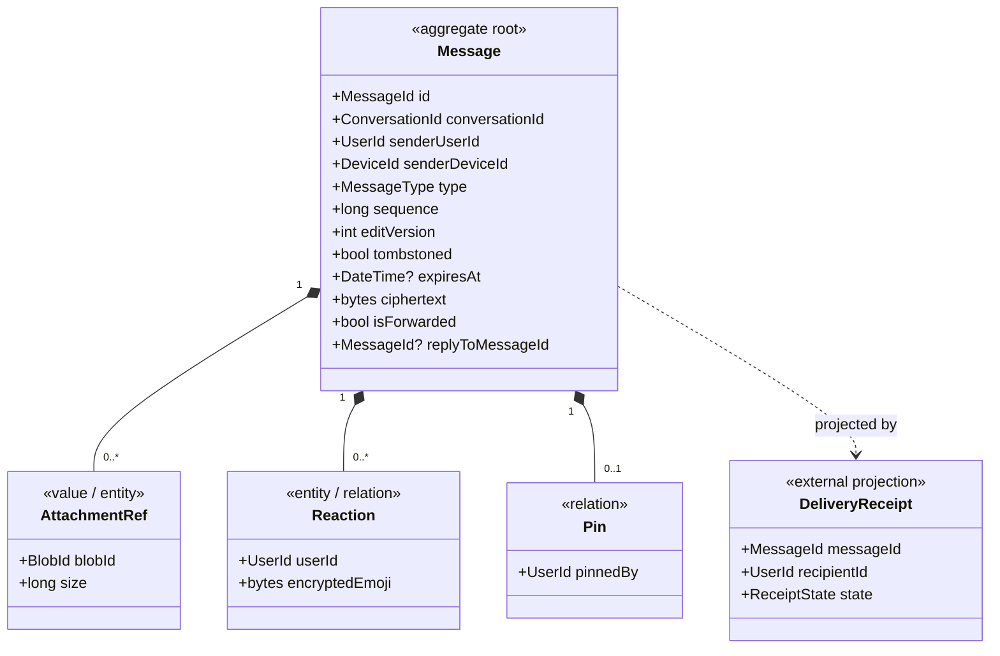
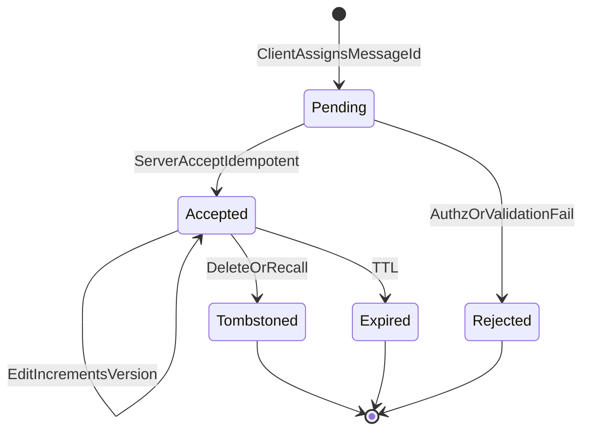

# AD-008 — Message Model (Decision Recommendation)

| Field | Value |
|---|---|
| **Status** | Approved |
| **Owner** | Architecture |
| **Version** | 2.0.0 |
| **Last Updated** | 2026-07-18 |
| **Workshop** | [WS-008](workshops/WS-008-message-model.md) |
| **Architecture Review** | [AR-008](reviews/AR-008-message-model.md) |
| **Related Research** | [RS-002 Message Models](../research/RS-002-message-models.md) |

## Question

How is a message represented — identity, aggregate boundaries, mutability, types, relations, encryption/ordering/sync metadata — given E2EE and the approved Conversation model (AD-007)?

---

## Context

The message is the atomic unit of messaging. It must support edits, deletes, replies, reactions, forwards, attachments, receipts, offline send, and years of extension without redesign. The server stores ciphertext and bounded metadata only (INV-01). Conversation membership (AD-007) gates accept. Ordering algorithms are AD-009; sync protocol is AD-010 — this decision defines the **model and fields** those decisions consume.

Evidence: **RS-002**. Workshop: **WS-008**. Review: **AR-008** (Approve with Changes).

---

## Problem Statement

Mutable in-place messages break immutable identity and multi-device sync. Pure opaque blobs prevent server-mediated receipts and relations. Full event sourcing is heavier than launch needs. The platform needs an immutable, relation-friendly, E2EE-compatible Message model that stays stable.

---

## Constraints

| ID | Constraint |
|---|---|
| INV-01 | No plaintext content on backend |
| INV-02 / INV-12 | Immutable MessageId; never reused for a different logical message |
| INV-04 | Idempotent accept |
| AD-004 / AD-005 | Ciphertext + encryption envelope metadata only |
| AD-006 | SenderDeviceId; multi-device fan-out |
| AD-007 | Exactly one ConversationId; sender Active member; messages outside Conversation aggregate |
| AD-003 | Authz on membership/authorship metadata |
| FR-007..020 | Media, edit, delete, reply, reaction, forward |

---

## Decision

**Adopt RS-002 Alternative B**, refined by AR-008:

A **Message aggregate root** in the Messaging module with:

1. **Immutable identity:** client-generated **ULID** `MessageId` (OQ-MSG-05 allows UUIDv7 equivalent).
2. **Ciphertext payload** + **bounded metadata envelope** (never plaintext business content).
3. **Edit-as-new-version** (`editVersion`, new ciphertext; same MessageId).
4. **Soft-delete / recall tombstones** (clear ciphertext; preserve id + sequence position).
5. **Attachment-by-reference** to encrypted object storage.
6. **Relations** for reply, reaction, pin (and forward as new message + flag).
7. **Delivery/Read as separate projections** — not Message lifecycle states.
8. Fields reserved for **AD-009** (`Sequence`) and **AD-010** (idempotent sync by MessageId).

### Aggregate structure

**Root:** `Message`  
**Owns:** ciphertext (current version), envelope fields, attachment refs, relation records (reply pointer, reactions, pins), tombstone/expiry flags, editVersion.  
**References:** `ConversationId`, `SenderUserId`, `SenderDeviceId`, blob ids.  
**Does not own:** Conversation/Membership, receipt rows, sync cursors, blob bytes.

### Metadata envelope (server-visible, bounded)

| Field | Purpose |
|---|---|
| `MessageId` | Immutable identity (ULID) |
| `ConversationId` | Stream association |
| `SenderUserId` / `SenderDeviceId` | Authorship / crypto |
| `type` | Extensible message kind |
| `Sequence` | Per-conversation total order (**AD-009**) |
| `serverReceivedAt` / `clientSentAt` | Timestamps |
| `editVersion` | Monotonic edit counter |
| `tombstoned` / `recalled` / `expiresAt` | Deletion/TTL |
| `replyToMessageId` | Reply relation |
| `isForwarded` | Forward marker (no source id by default) |
| `attachmentRefs[]` | Encrypted blob pointers |
| Encryption: algo/protocol version, sender-key/session ids as required | AD-004/005 |

Sensitive sub-content (body, reaction emoji, reply preview, captions) lives **only** in ciphertext.

### Message types

Additive enum: `Text`, `Image`, `Video`, `Audio`, `VoiceNote`, `Document`, `Contact`, `Location`, `Poll`, `Sticker`, `Gif`, `System`, `CallEvent`, …  
Payload schema versioned inside ciphertext. Unknown types stored and synced; clients degrade gracefully.

---

## Message Persistence Lifecycle

Delivery/read are **not** Message states.

| State | Rules |
|---|---|
| `Pending` | Client-local / in-flight; may retry with same MessageId |
| `Accepted` | Persisted; Sequence assigned; ciphertext immutable except via editVersion replace |
| `Tombstoned` | Ciphertext cleared; id/sequence retained; edits rejected |
| `Expired` | TTL applied; treat as tombstone for content |
| `Rejected` | Never in conversation stream |

**Invalid:** in-place plaintext/ciphertext overwrite without version bump; accept without Active membership; reuse MessageId for different content family; store clear reaction emoji.

**Draft:** client-only; not a server state.

---

## Editing, Deletion, Forwarding, Replies, Attachments

| Concern | Decision |
|---|---|
| **Edit** | New ciphertext + `editVersion++` within product window (OQ-MSG-01); same MessageId; emit `MessageEdited`. Launch history: **latest only**. |
| **Delete-for-everyone / Recall** | Time-bounded tombstone + ciphertext clear; emit `MessageRecalled`. |
| **Delete-for-me** | Per-user hide projection; row may remain. |
| **Hard purge** | Retention job after policy; Sequence gap policy per AD-009/retention. |
| **Forward** | New Message in target conversation; client re-encrypts; `isForwarded=true`; no `forwardedFrom` by default. |
| **Reply** | `replyToMessageId` in same conversation; preview in ciphertext. |
| **Reaction** | Relation row `(MessageId, UserId)` + **encrypted** emoji payload; emit events. |
| **Attachment** | Encrypt-then-upload; Message stores refs only. |

---

## Ordering & Sync Field Ownership

| Concern | Owner |
|---|---|
| Total order / gap detection algorithm | **AD-009** (uses `Sequence`) |
| Cursor/checkpoint sync protocol | **AD-010** (uses ConversationId + Sequence + MessageId dedup) |
| Message model fields | **This decision** |

---

## Domain Events

| Event | Consumers |
|---|---|
| `MessageAccepted` | Fan-out, push, sync, metadata search |
| `MessageEdited` | Fan-out, push, sync |
| `MessageRecalled` / `MessageTombstoned` | Fan-out, push, sync |
| `MessageExpired` | Sync, purge |
| `ReactionAdded` / `ReactionRemoved` | Fan-out, sync |
| `MessagePinned` / `Unpinned` | Sync, read models |
| `AttachmentReferenced` | Media GC |

---

## Domain Invariants

| ID | Invariant | Enforcement |
|---|---|---|
| M-INV-01 | Every message belongs to exactly one Conversation | D + DB |
| M-INV-02 | Exactly one sender UserId (+ DeviceId at send) | D + DB |
| M-INV-03 | MessageId immutable after accept | D + DB |
| M-INV-04 | Ciphertext not overwritten except via editVersion replacement | D |
| M-INV-05 | replyToMessageId, if set, same ConversationId | D + A |
| M-INV-06 | Accept requires Active membership (AD-007) | A |
| M-INV-07 | No plaintext content / emoji / preview columns | D + A + review |
| M-INV-08 | Tombstone clears ciphertext | D |
| M-INV-09 | MessageId unique globally | DB |
| M-INV-10 | editVersion monotonic per MessageId | D |

---

## Decision Drivers

1. Uphold INV-01/02/12 and RS-002 evidence.
2. Multi-device deterministic edits/deletes via versions/tombstones.
3. Feature completeness without content leakage.
4. Extractable Messaging module (AP-09 / INV-06).
5. Clean handoff to AD-009/AD-010.
6. Extensibility via types + relations, not redesign.

---

## Alternatives Considered

### RS-002 Alternative A — Mutable in-place messages

Rejected: breaks invariants; sync races; loses history.

### RS-002 Alternative B — Immutable + relations *(chosen)*

Accepted with AR-008 refinements (persistence vs delivery states; ULID; encrypted reactions; forward flag-only; latest-only edit history).

### RS-002 Alternative C — Full event-sourced message log

Rejected for launch complexity/storage; revisit for compliance-grade audit if required.

### Envelope extremes (draft AD-008)

- **Opaque blob only:** insufficient for receipts/relations — rejected.
- **Explicit bounded envelope:** accepted as part of B.
- **Everything in encrypted client schema, zero structural metadata:** rejected for server-mediated features.

---

## Consequences

**Positive:** Stable, E2EE-safe, sync-ready model; clear aggregate boundaries; extensible types/relations.  
**Negative:** Tombstone/version purge jobs; metadata governance (AD-021); reaction/edit write amplification.  
**Neutral:** Ordering/sync algorithms deferred to AD-009/AD-010.

---

## Risks

| ID | Risk | Severity |
|---|---|---|
| R-008-01 | Metadata over-collection | High |
| R-008-02 | Receipts accidentally on Message row | Medium |
| R-008-03 | Unbounded edit/reaction storage | Medium |
| R-008-04 | False expectation of perfect remote delete | Medium |
| R-008-05 | Sequence/MessageId confusion in clients | Medium |

---

## Mitigations

| Risk | Mitigation |
|---|---|
| R-008-01 | Bounded envelope list; AD-021 review; no clear emoji/preview |
| R-008-02 | Normative: receipts are projections only |
| R-008-03 | Latest-only edits; reaction row model; retention jobs |
| R-008-04 | Product copy on E2EE delete limits |
| R-008-05 | Docs: MessageId = identity; Sequence = total order |

---

## Future Evolution

Threads via relations; scheduled messages via delayed accept; TTL already modeled; AI/business via type + sender UserId; legal hold via retention flags without content access; search = client content + server metadata; full event sourcing only if mandated.

---

## Related Research

- **[RS-002 Message Models](../research/RS-002-message-models.md)** — primary evidence; Alternative B adopted.

---

## Related ADRs

- **ADR-0032** — Immutable Message Model (ratification)
- **ADR-0008** / **ADR-0010** — Message ID & ordering strategy detail (with AD-009)
- **ADR-0013** — Message versioning (aligns with editVersion)

---

## Related Documents

- WS-008, AR-008
- `docs/30-domain/30-domain-model-overview.md`
- `docs/30-domain/36-message-lifecycle.md` *(pending detailed DOC)*
- `docs/20-architecture/20-architecture-overview.md`
- AD-007, AD-009, AD-010, AD-004, AD-021

---

## Open Questions

| ID | Question | Owner | Blocking? |
|---|---|---|---|
| OQ-MSG-01 | Edit / delete-for-everyone windows | Product | No |
| OQ-MSG-02 | Reaction UX density / custom emoji | Product | No (model fixed) |
| OQ-MSG-03 | Retain N edit versions beyond latest | Product | No (launch latest-only) |
| OQ-MSG-04 | Forward source attribution metadata | Privacy + Abuse | No |
| OQ-MSG-05 | ULID vs UUIDv7 standardization | Architecture | No (ULID default) |

---

## Review Outcome (2026-07-18)

**Reviewer:** Chief Software Architect · **Verdict:** Approve with Changes  
**Review artifact:** [AR-008](reviews/AR-008-message-model.md)

**Required changes applied:**

- RS-002 cited; Alternative B chosen with A/C rejected.
- Message aggregate root; receipts externalized.
- Persistence lifecycle distinct from Delivered/Read.
- ULID MessageId; Sequence reserved for AD-009.
- Encrypted reaction relations; forward flag-only default.
- Latest-only edit history at launch; invariants + diagrams + events.

**Quality scores** — Architecture 9 · Security 10 · Scalability 9 · Maintainability 9 · Documentation 9 · **Overall 9.3**

---

## Approval

- **Status:** Approved
- **Owner:** Architecture
- **Reviewed by:** Chief Software Architect (Messaging Core — Message Model)
- **Review Date:** 2026-07-18
- **Decision Date:** 2026-07-18
