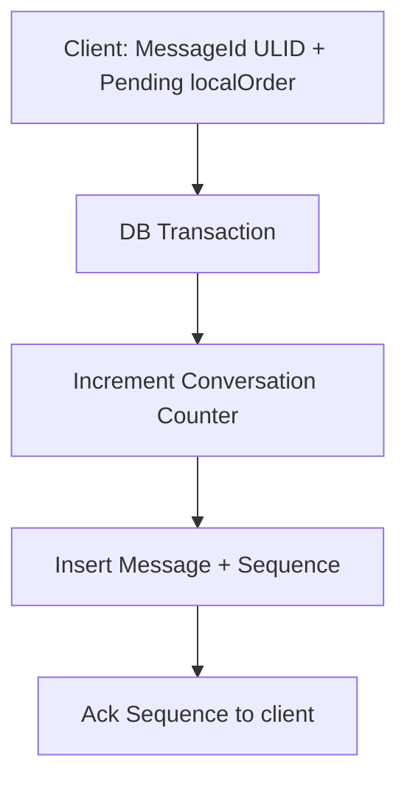
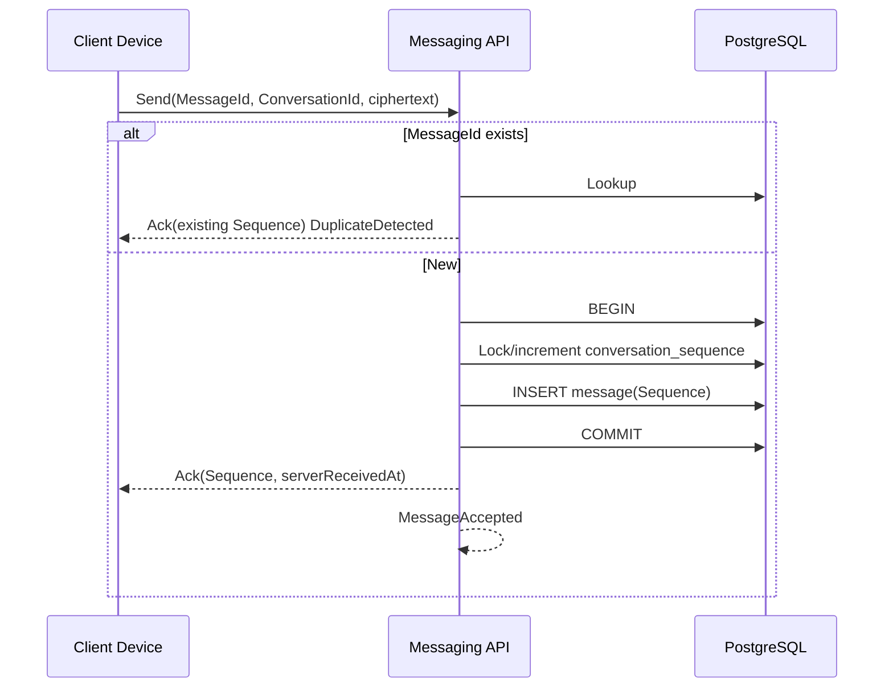

# AD-009 — Message Ordering (Decision Recommendation)

| Field | Value |
|---|---|
| **Status** | Approved |
| **Owner** | Architecture |
| **Version** | 2.0.0 |
| **Last Updated** | 2026-07-18 |
| **Workshop** | [WS-009](workshops/WS-009-message-ordering.md) |
| **Architecture Review** | [AR-009](reviews/AR-009-message-ordering.md) |
| **Related Research** | [RS-003 Message Ordering](../research/RS-003-message-ordering.md) |

## Question

How is a deterministic, total ordering of messages within a conversation established and communicated to clients, and how does it integrate with the approved MessageId (AD-008) at global scale?

---

## Context

Users expect consistent order on every device. Ordering is INV-05. AD-008 already separates **MessageId** (ULID identity) from **`Sequence`** (ordering field). This decision defines how Sequence is allocated, invariants, offline/multi-device behavior, dedup, and multi-region readiness. Sync protocol details remain AD-010.

Evidence: **RS-003**. Workshop: **WS-009**. Review: **AR-009**.

---

## Problem Statement

Without a server-authoritative, gap-detectable total order, offline clients, concurrent sends, and retries produce reorderings and duplicates that destroy trust. Client clocks and ID-only ordering are insufficient for INV-05.

---

## Constraints

| ID | Constraint |
|---|---|
| INV-05 | Deterministic total order per conversation |
| INV-02 / AD-008 | MessageId immutable ULID; ≠ Sequence |
| INV-04 | Idempotent accept |
| INV-01 | Ordering uses metadata only |
| AD-007 | Scope = ConversationId |
| AD-008 | Envelope fields; edits do not imply new identity |

---

## Decision

**Adopt RS-003 Alternative C:**

1. **Identity:** `MessageId` = client-generated **ULID** (AD-008; UUIDv7 equivalent allowed).
2. **Order:** Per-conversation server-assigned monotonic **`Sequence`** (`int64`) — sole authoritative sort key within a conversation.
3. **Allocation:** In the **same database transaction** as message insert: atomically increment a per-conversation counter and persist `(ConversationId, Sequence)` with the message.
4. **Uniqueness:** `UNIQUE (ConversationId, Sequence)` and `UNIQUE (MessageId)`.
5. **Idempotency:** Duplicate submit with same `MessageId` returns the original Sequence; does **not** allocate a new Sequence.
6. **Authority:** Server only. Clients never assign Sequence.
7. **Mutations:** Edits, tombstones, reactions do **not** allocate a new Sequence (AD-008).
8. **Multi-region:** Single-region Sequence authority at launch; design is **HLC-ready** without changing MessageId; no dual-primary Sequence until HLC design lands.
9. **Tombstones:** Retain Sequence on tombstone rows so positions remain stable for sync.

### Accept flow

### Client optimistic ordering

1. Assign MessageId; place in Pending with `localOrder`.
2. Render optimistically at bottom of local pending lane.
3. On Ack: bind Sequence; **re-sort** conversation by Sequence.
4. Never treat `clientSentAt` as authoritative order.

### Offline / retry

- Offline creates Pending with MessageId.
- On reconnect, flush; Sequence reflects **server accept order**.
- Lost Ack → retry same MessageId → same Sequence.

### Gap semantics (handoff to AD-010)

| Observation | Meaning |
|---|---|
| Contiguous Sequences 1..N locally | In sync through N |
| Missing k in 1..N | Not yet fetched **or** (future) purged — AD-010 distinguishes |
| Tombstone at k | Position exists; content cleared |

Launch: do not skip Sequence numbers on successful commits.

---

## Ordering Metadata

| Field | Set by | Role |
|---|---|---|
| `MessageId` | Client | Identity / dedup |
| `Sequence` | Server | Total order |
| `SenderDeviceId` | Client | Device context |
| `serverReceivedAt` | Server | Informational / ops |
| `clientSentAt` | Client | Informational only |
| `editVersion` | Server | Version facet; not order |

---

## Domain Events

| Event | Notes |
|---|---|
| `MessageAccepted` | Includes Sequence (primary) |
| `DuplicateDetected` | Same MessageId re-submitted |
| `MessageRejected` | No Sequence allocated |
| `SequenceGapObserved` | Client/sync-side (AD-010) |

`SequenceAllocated` may be folded into `MessageAccepted`.

---

## Domain Invariants

| ID | Invariant | Enforcement |
|---|---|---|
| O-INV-01 | Every Accepted message has exactly one Sequence | D + DB |
| O-INV-02 | Sequence strictly increases per ConversationId for successive accepts | D + DB |
| O-INV-03 | Sequence never reused within a conversation | DB UNIQUE |
| O-INV-04 | Duplicate MessageId does not create a second row/Sequence | A + DB |
| O-INV-05 | Sequence immutable after persist | D + DB |
| O-INV-06 | Client timestamps are never sort authority | A + clients |
| O-INV-07 | Edits/tombstones/reactions do not allocate new Sequence | D |
| O-INV-08 | Sequence allocated in same txn as insert | A + DB |

---

## Decision Drivers

1. Satisfy INV-05 with gap-detectable total order (RS-003).
2. Preserve AD-008 MessageId contract.
3. Idempotent multi-device / offline retries (INV-04).
4. Operational simplicity for single-region launch.
5. Non-disruptive multi-region path (HLC later).
6. Clean cursor foundation for AD-010.

---

## Alternatives Considered

Aligned with **RS-003** lettering (supersedes earlier draft A/B/C).

### Alternative A — Client timestamps

Rejected: skew, tampering; violates INV-05.

### Alternative B — Time-sortable ID only (Snowflake / ULID order)

Rejected: approximate order; weak gap detection; concurrent ties.

### Alternative C — Per-conversation server Sequence + ULID identity *(chosen)*

Accepted with AR-009 refinements (txn allocate, tombstone retention, client resort rules).

### Alternative D — HLC from day one

Deferred: unnecessary complexity for single-region launch; reserved as evolution path.

---

## Consequences

**Positive:** Deterministic order; trivial gap detection; idempotent retries; sync-ready cursors.  
**Negative:** Per-conversation counter contention on hot chats; multi-region Sequence authority deferred.  
**Neutral:** MessageId generation unchanged (AD-008).

---

## Risks

| ID | Risk | Severity |
|---|---|---|
| R-009-01 | Hot conversation Sequence lock latency | High |
| R-009-02 | Premature multi-region dual writes | High |
| R-009-03 | Clients sorting by timestamp | Medium |
| R-009-04 | Sequence gaps confused with sync holes | Medium |

---

## Mitigations

| Risk | Mitigation |
|---|---|
| R-009-01 | Efficient counter; monitor; partition by conversation |
| R-009-02 | Single-region authority; HLC design gate before active-active |
| R-009-03 | Protocol/SDK: Sequence is sort key; tests |
| R-009-04 | AD-010 defines fetch-vs-purged; tombstones retain Sequence |

---

## Future Evolution

- Adopt **HLC** (or equivalent) for cross-region causal/total order when DOC-103 multi-region active-active is approved — **without changing MessageId**.
- Channels/threads reuse the same Sequence stream per ConversationId.
- Scheduled messages receive Sequence at accept/publish time.

---

## Related Research

- **[RS-003 Message Ordering](../research/RS-003-message-ordering.md)** — Alternative C adopted.

---

## Related ADRs

- **ADR-0008** — Message ID and Ordering Strategy
- **ADR-0010** — Per-Conversation Message Ordering
- ADR-0032 — Immutable Message Model (MessageId)
- ADR-0016 — Offline Synchronization (future; AD-010)

---

## Related Documents

- WS-009, AR-009
- AD-008, AD-007, AD-010
- `docs/30-domain/30-domain-model-overview.md`
- `docs/50-data/54-message-sync-and-storage.md` *(pending)*
- `docs/85-protocol/85.9-synchronization-protocol.md` *(pending)*

---

## Open Questions

| ID | Question | Owner | Blocking? |
|---|---|---|---|
| OQ-ORD-01 | Counter: row `FOR UPDATE` vs other atomic pattern? | Backend | No |
| OQ-ORD-02 | Hard-purge gap policy details? | Architecture + AD-010 | No |
| OQ-ORD-03 | HLC adoption triggers? | Architecture + SRE | No |

---

## Review Outcome (2026-07-18)

**Reviewer:** Chief Software Architect · **Verdict:** Approve with Changes  
**Artifact:** [AR-009](reviews/AR-009-message-ordering.md)

**Changes applied:** RS-003 lettering; txn allocate+insert; idempotent MessageId; client resort rules; edit/tombstone Sequence rules; O-INV-*; HLC-ready multi-region; tombstone retains Sequence.

**Quality scores** — Architecture 10 · Security 9 · Scalability 9 · Maintainability 9 · Documentation 9 · **Overall 9.4**

---

## Approval

- **Status:** Approved
- **Owner:** Architecture
- **Reviewed by:** Chief Software Architect (Messaging Core — Message Ordering)
- **Review Date:** 2026-07-18
- **Decision Date:** 2026-07-18
