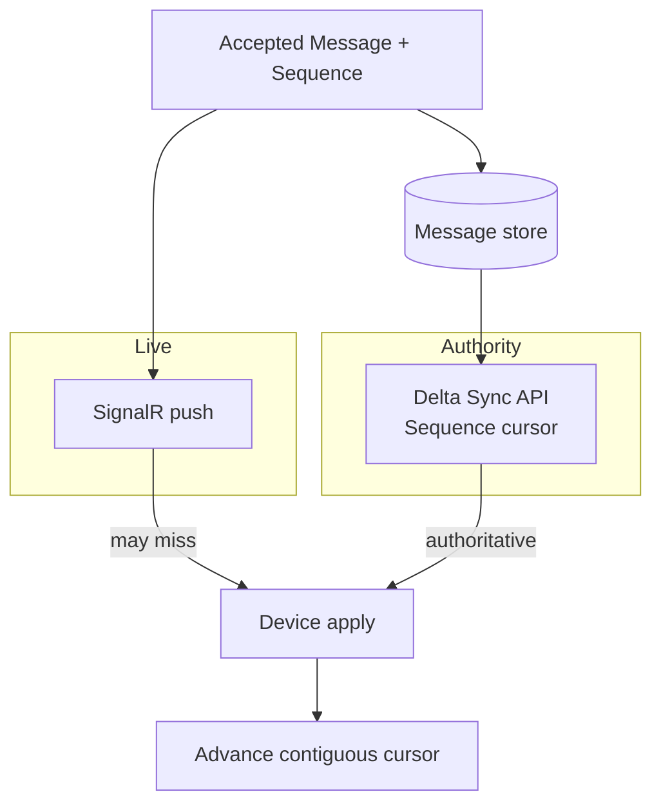
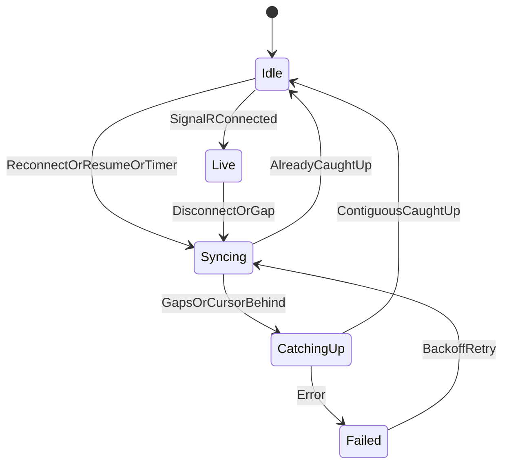

# AD-010 — Synchronization (Decision Recommendation)

| Field | Value |
|---|---|
| **Status** | Approved |
| **Owner** | Architecture |
| **Version** | 2.0.0 |
| **Last Updated** | 2026-07-18 |
| **Workshop** | [WS-010](workshops/WS-010-synchronization.md) |
| **Architecture Review** | [AR-010](reviews/AR-010-synchronization.md) |
| **Related Research** | [RS-004 Synchronization](../research/RS-004-synchronization.md) |

## Question

How do a user's devices synchronize conversation state — catch-up after disconnect, multi-device convergence, and new-device backfill — while the backend handles only ciphertext and ConversationSequence is the canonical cursor?

---

## Context

Multi-device continuity is a core promise. AD-009 provides per-conversation `Sequence` (ConversationSequence). AD-008 provides immutable `MessageId` for dedup. AD-006 gates new-device history. Sync must be deterministic, idempotent, and E2EE-safe.

Evidence: **RS-004**. Workshop: **WS-010**. Review: **AR-010**.

---

## Problem Statement

Push-only delivery loses messages under disconnect. Full snapshot sync does not scale. Without a Sequence-based cursor protocol, devices diverge, duplicate, or reorder. Synchronization must make Ordering observable and convergent on every authorized device.

---

## Constraints

| ID | Constraint |
|---|---|
| AD-009 | ConversationSequence is canonical order and cursor |
| INV-05 / INV-04 / INV-01 | Deterministic order; idempotent; ciphertext only |
| AD-006 / AD-007 / AD-003 | Device trust; membership; authz on sync |
| AD-008 | MessageId dedup; edits without new Sequence |
| NFR-P-05 | Reconnect catch-up latency |

---

## Decision

**Adopt RS-004 Alternative B** (refined by AR-010):

1. **Hybrid delivery:** SignalR (WSS) for **best-effort live push**; **cursor delta sync** as the **authoritative** catch-up and gap-fill mechanism.
2. **Canonical cursor:** Per `(DeviceId, ConversationId)` store `cursorSequence` = last **contiguous** applied ConversationSequence.
3. **Incremental sync:** Return messages/events with `Sequence > cursor` ordered by Sequence, paged (`LIMIT`).
4. **Mandatory pull on reconnect** (and on resume from background); do not rely on push alone.
5. **Idempotent apply** keyed by `MessageId`; safe under at-least-once push + sync overlap.
6. **Multi-conversation sync:** Batch API to fetch deltas for many conversations in one request (launch requirement).
7. **Backfill:** New/trusted device — paged, **recent-first**, then older on demand (window: OQ-SYNC-01).
8. **Offline outbound:** Pending queue + MessageId retries (AD-009); inbound via server ciphertext retention + sync.
9. **Authz:** Every sync request authenticated and authorized; revoked members receive no further content deltas.
10. **CRDTs / global changefeed:** Not required for message path at launch (RS-004 D rejected; C deferred).



### Cursor rules

| Rule | Detail |
|---|---|
| Name | ConversationSequence cursor (`Sequence`) |
| Advance | Only after applying all Sequences through N with no holes |
| Never | Advance past a gap; never use timestamps as cursor |
| Reset | Explicit recovery only (lost local state) → resync from policy base |
| Server hint | Optional durable checkpoint; **client cursor is primary** |

### Sync modes



### Reconnect sequence

```mermaid
sequenceDiagram
    participant D as Device
    participant H as SignalR Hub
    participant S as Sync API
    participant DB as Store
    D->>H: Connect + auth
    D->>S: SyncBatch(conversations[], cursors)
    S->>DB: Range scan Sequence > cursor
    S-->>D: Pages of ciphertext envelopes
    D->>D: Apply by Sequence; dedup MessageId
    D->>D: Advance contiguous cursors
    H-->>D: Live pushes (best effort)
    Note over D,S: On any gap suspicion, Sync again
```

### Conflict resolution

| Case | Resolution |
|---|---|
| Duplicate MessageId | Ignore |
| Higher editVersion | Apply edit |
| Tombstone | Clear content; keep Sequence |
| Out-of-order push | Buffer or ignore until sync fill |
| Missing blob | Keep message; lazy fetch attachment |

### Retry / backoff

Exponential backoff + jitter; honor rate limits; cursor unchanged on failure; MessageId makes accept/sync retries safe.

### Performance defaults (normative bounds, values tunable)

- Page size capped (implementation default band 50–200).
- Multi-conversation batch with server-side prioritization (active first).
- Reconnect jitter to prevent stampedes.
- Lazy media download.

---

## Domain Events / Signals

| Name | Role |
|---|---|
| `MessageAccepted` (existing) | Drives push + store |
| `SyncStarted` / `SyncCompleted` | Client telemetry |
| `CursorAdvanced` | Client-local |
| `CursorReset` | Recovery |
| `DeviceCaughtUp` | UX |
| `SyncFailed` / `RetryScheduled` | Client resilience |

---

## Domain Invariants

| ID | Invariant | Enforcement |
|---|---|---|
| S-INV-01 | Cursor advances only forward except explicit reset | A + Client |
| S-INV-02 | Re-applying a sync page is idempotent | A + Client |
| S-INV-03 | Canonical cursor is ConversationSequence | A |
| S-INV-04 | Sync requires authn/authz; no membership bypass | A |
| S-INV-05 | New-device history requires trusted device (AD-006) | A |
| S-INV-06 | Dedup by MessageId | A + DB |
| S-INV-07 | Contiguous cursor semantics (no hole skip) | A + Client |
| S-INV-08 | After successful catch-up, devices share the same Sequence-ordered message set (within retention/authz) | A + Client |

---

## Decision Drivers

1. Leverage AD-009 Sequence for gap detection (RS-004).
2. Mobile-efficient deltas; not full snapshots.
3. Push for UX latency; pull for correctness.
4. E2EE and device trust preserved.
5. Operational simplicity vs global changefeed at launch.
6. Foundation for receipts/reactions as future delta types.

---

## Alternatives Considered

### RS-004 Alternative A — Full snapshot on connect

Rejected as primary: cost and latency.

### RS-004 Alternative B — Cursor delta + realtime push *(chosen)*

Accepted with AR-010 changes (contiguous cursor, batch sync, mandatory reconnect pull, stampede controls).

### RS-004 Alternative C — Global per-device changefeed

Deferred until many-conversation catch-up demands it.

### RS-004 Alternative D — CRDT / version vectors

Rejected for append-only messages given server Sequence.

---

## Consequences

**Positive:** Deterministic multi-device convergence; efficient catch-up; E2EE-safe backfill; clear push vs pull roles.  
**Negative:** Cursor bookkeeping; backfill paging; reconnect stampede controls required.  
**Neutral:** Global changefeed and HLC multi-region sync remain future work.

---

## Risks

| ID | Risk | Severity |
|---|---|---|
| R-010-01 | Clients trust push only | High |
| R-010-02 | Cursor advanced over gaps | High |
| R-010-03 | Sync stampede after outage | High |
| R-010-04 | Backfill bandwidth for new devices | Medium |
| R-010-05 | Cursor table growth | Medium |

---

## Mitigations

| Risk | Mitigation |
|---|---|
| R-010-01 | Mandatory sync on reconnect; SDK contract tests |
| R-010-02 | Contiguous advancement rule; code review + tests |
| R-010-03 | Jitter, rate limits, batched sync |
| R-010-04 | Recent-first pages; on-demand history (OQ-SYNC-01) |
| R-010-05 | Lazy cursor rows; delete on device revoke |

---

## Future Evolution

- Optional global changefeed (RS-004 C).
- Align cursors with HLC if multi-region active-active (AD-009).
- Extend delta types: receipts, typing (ephemeral may stay push-only), reactions, pins.
- Selective sync for archived conversations.

---

## Related Research

- **[RS-004 Synchronization](../research/RS-004-synchronization.md)** — Alternative B adopted.

---

## Related ADRs

- **ADR-0016** — Offline Synchronization (ratification)
- **ADR-0011** — Cursor Pagination (Sequence-range pages)
- ADR-0008 / ADR-0010 — Ordering foundation
- ADR-0019 — Multi-Device (related)

---

## Related Documents

- WS-010, AR-010
- AD-009, AD-008, AD-006, AD-007
- `docs/30-domain/30-domain-model-overview.md`
- `docs/85-protocol/85.9-synchronization-protocol.md` *(pending detail DOC)*
- `docs/50-data/54-message-sync-and-storage.md` *(pending)*

---

## Open Questions

| ID | Question | Owner | Blocking? |
|---|---|---|---|
| OQ-SYNC-01 | New-device recent backfill window | Product | No |
| OQ-SYNC-02 | Cursor durability store details | Backend | No |
| OQ-SYNC-03 | Global changefeed timing | Architecture | No (deferred) |
| OQ-SYNC-04 | Offline ciphertext retention TTL | Product + SRE | No |

---

## Review Outcome (2026-07-18)

**Reviewer:** Chief Software Architect · **Verdict:** Approve with Changes  
**Artifact:** [AR-010](reviews/AR-010-synchronization.md)

**Changes applied:** RS-004 B; ConversationSequence contiguous cursor; hybrid push/pull with mandatory reconnect sync; batch multi-conversation sync; conflict/idempotency rules; S-INV-*; stampede mitigations; device trust on backfill.

**Quality scores** — Architecture 9 · Security 10 · Scalability 9 · Maintainability 9 · Documentation 9 · **Overall 9.4**

---

## Approval

- **Status:** Approved
- **Owner:** Architecture
- **Reviewed by:** Chief Software Architect (Messaging Core — Synchronization)
- **Review Date:** 2026-07-18
- **Decision Date:** 2026-07-18
