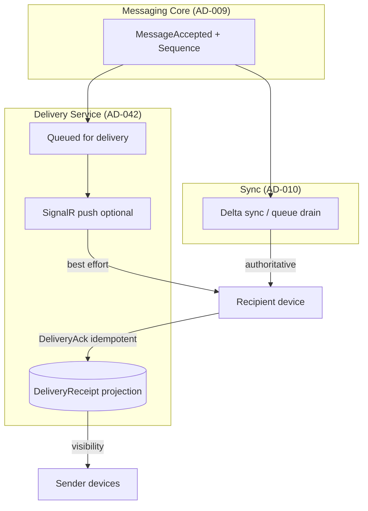

# AD-042 — Delivery Semantics (Decision Recommendation)

| Field | Value |
|---|---|
| **Status** | Approved |
| **Owner** | Architecture |
| **Version** | 2.0.0 |
| **Last Updated** | 2026-07-18 |
| **Workshop** | [WS-042](workshops/WS-042-delivery-and-acknowledgements.md) |
| **Architecture Review** | [AR-042](reviews/AR-042-delivery-and-acknowledgements.md) |
| **Related Research** | [RS-005 Delivery & Acknowledgements](../research/RS-005-delivery-and-acknowledgements.md) |

## Question

How do messages move from Accepted persistence to recipient devices, what acknowledgements mean to senders and operators, and how is per-device delivery tracked — without mutating the Message aggregate, contradicting Ordering or Synchronization, or decrypting ciphertext on the server?

---

## Context

Phase 3 established the Messaging Core: Conversation (AD-007), Message (AD-008), Ordering (AD-009), and Synchronization (AD-010). AD-008 defines delivery/read as **external projections**, not Message lifecycle states. AD-009 defines **AcceptAck** (server Accepted + Sequence). AD-010 defines hybrid push + authoritative sync for content convergence.

Phase 4 Sprint 1 closes the gap DOC-154 explicitly deferred: operational delivery semantics beyond accept/persist.

Evidence: **RS-005**. Workshop: **WS-042**. Review: **AR-042** (Approved for Architecture Decision).

---

## Problem Statement

Server acceptance alone does not tell a sender whether any recipient device obtained the message. Multi-device E2EE fan-out requires per-device truth. Push may miss; sync must recover. Without explicit DeliveryAck projections, downstream services (read receipts, push, analytics) lack a stable foundation. Delivery state must not pollute the Message aggregate or reorder messages by ack time.

---

## Constraints

| ID | Constraint |
|---|---|
| AD-008 | Delivery/read are projections; Message immutability after accept |
| AD-009 | AcceptAck + Sequence; MessageId idempotency on accept |
| AD-010 | Push best-effort; sync authoritative; MessageId dedup on apply |
| INV-01 / INV-04 / INV-05 | Ciphertext only; idempotent; Sequence is order |
| AD-006 / AD-007 / AD-003 | Device trust; membership; authz |
| DOC-156 | Extend core via events; no cyclic dependencies |

---

## Decision

**Adopt RS-005 Alternative B** (refined by AR-042):

1. **Dual acknowledgement model:** retain **AcceptAck** (AD-009) and introduce **DeliveryAck** as a per-device projection.
2. **AcceptAck** confirms durable server acceptance and assigned ConversationSequence — one per MessageId, immutable after emission.
3. **DeliveryAck** confirms a recipient device has successfully applied the message locally — scoped to `(MessageId, DeviceId)`, idempotent.
4. **Delivery guarantee:** at-least-once transport (push and/or sync) with idempotent apply; not exactly-once E2E.
5. **Authority split:** SignalR push is liveness only; delta sync / queue drain remains authoritative for recovery (AD-010).
6. **Projection storage:** `DeliveryReceipt` (or equivalent) lives outside the Message aggregate; never mutates Message ciphertext or Sequence.
7. **DeliveryAck emission gate:** integrity verified, auth validated, duplicate detection complete, durable local apply satisfied, message available for presentation (AR-042 normative semantics).
8. **User-level "delivered" UX:** derived rollup policy (OQ-DEL-01); system of record remains per-device.
9. **Events:** consume `MessageAccepted`; publish `MessageDeliveredToDevice` (and batch variants as needed).
10. **Read receipts, push providers, retention TTL:** explicitly out of scope (AD-044, AD-012, AD-038).



### Delivery lifecycle

```text
Message Created → Durably Persisted → AcceptAck → Queued For Delivery
  → Push Attempt (optional) → Delivered To Device → DeliveryAck → Read (AD-044)
```

| Rule | Detail |
|---|---|
| Push ≠ delivered | Receiving a push frame does not imply DeliveryAck |
| DeliveryAck ≠ read | DeliveryAck does not imply user read (AD-044) |
| Order | UI sorts by Sequence, never by ack timestamp |

### AcceptAck (normative — AD-009, reaffirmed)

| Rule | Detail |
|---|---|
| Cardinality | One AcceptAck per MessageId |
| Emission | Only after durable persistence + Sequence allocation |
| Payload | Includes assigned ConversationSequence |
| Immutability | Never changes after emission |
| Ordering | Does not modify ordering semantics |

### DeliveryAck (normative)

| Rule | Detail |
|---|---|
| Scope | `(MessageId, RecipientDeviceId)` |
| Idempotency | Duplicate acknowledgements have no side effects |
| Message | Never mutates Message content or lifecycle |
| Sequence | Never modifies ConversationSequence |
| AuthZ | Never changes authorization state; only authorized device may ack for itself |
| Precedence | AcceptAck must exist before DeliveryAck for that MessageId |
| Emission | Only after all AR-042 conditions satisfied (see below) |

### DeliveryAck emission conditions (all required)

1. Message integrity verified (envelope/hash/signature per client crypto policy).
2. Authorization validated (device is authorized recipient for conversation at apply time).
3. Duplicate detection completed (MessageId dedup per AD-010).
4. Message durably applied to local message store (sync or live path).
5. Message available to local application for presentation (decrypted or policy-equivalent for presentation layer).

Undecryptable messages follow client retry/request paths; **no success DeliveryAck** until resolved or explicitly abandoned per client policy.

### Multi-device delivery sequence

```mermaid
sequenceDiagram
    participant S as Sender
    participant API as Messaging API
    participant DB as Message Store
    participant H as SignalR
    participant R1 as Recipient Phone
    participant R2 as Recipient Desktop
    S->>API: Send(MessageId, ciphertext)
    API->>DB: Accept + Sequence
    API-->>S: AcceptAck(Sequence)
    API->>H: Push envelope (best effort)
    H-->>R1: Live frame
    R1->>R1: Apply; dedup; local store
    R1->>API: DeliveryAck(MessageId, DeviceId)
    Note over R2: Offline — push missed
    R2->>API: SyncBatch(cursor)
    API-->>R2: Envelopes Sequence > cursor
    R2->>R2: Apply; dedup; local store
    R2->>API: DeliveryAck(MessageId, DeviceId)
    API-->>S: Delivery visibility (sync/push)
```

### Integration with AD-010

| Concern | Rule |
|---|---|
| Recovery | Devices always recover content via sync after reconnect |
| Cursors | Sync cursors remain ConversationSequence-based; DeliveryAck is not a sync checkpoint |
| Overlap | Push + sync overlap safe via MessageId dedup |
| Offline | Inbound ciphertext retained until sync drain; then DeliveryAck |

---

## Domain Events / Signals

| Name | Producer | Consumers |
|---|---|---|
| `MessageAccepted` | Messaging Core (existing) | Delivery queue, push, sync |
| `MessageDeliveredToDevice` | Delivery service | Sender visibility, analytics, AD-044 prep |
| `DeliveryAckBatch` | Client / API (optional) | Rate-limited fan-in for groups |
| `UndeliveredLagDetected` | Ops / metrics | AD-012 push wake-up (future) |

Delivery events carry metadata only (MessageId, DeviceId, timestamps) — never plaintext (INV-01, INV-11).

---

## Domain Invariants

| ID | Invariant | Enforcement |
|---|---|---|
| D-INV-01 | Delivery state is never stored as Message lifecycle | A + DB |
| D-INV-02 | DeliveryAck is idempotent per (MessageId, DeviceId) | A + DB |
| D-INV-03 | DeliveryAck only from authorized recipient DeviceId | A |
| D-INV-04 | AcceptAck precedes any DeliveryAck for that MessageId | A + Client |
| D-INV-05 | Push cannot be the sole delivery authority | A + Client (AD-010) |
| D-INV-06 | Sequence remains canonical display order | Client |
| D-INV-07 | Revoked devices cannot obtain new content or emit valid new acks | A |
| D-INV-08 | One AcceptAck per MessageId; immutable after emission | A + DB |
| D-INV-09 | DeliveryAck never mutates Message content or Sequence | A + DB |
| D-INV-10 | DeliveryAck never changes authorization state | A |

---

## Decision Drivers

1. Industry dual-checkmark model (RS-005) without breaking AD-008 projections.
2. Multi-device per-device truth (Signal/WhatsApp pattern).
3. Preserve AD-010 sync authority; avoid push-only correctness traps.
4. Foundation for AD-044 read receipts and AD-012 push wake-ups.
5. INV-04 idempotency across at-least-once paths.
6. Horizontal scalability via projection upserts independent of Message writes.

---

## Alternatives Considered

### RS-005 Alternative A — Server-accept ack only

Rejected: confirms persistence, not device delivery; insufficient for multi-device UX.

### RS-005 Alternative B — Dual ack + per-device projections *(chosen)*

Accepted per AR-042.

### RS-005 Alternative C — First-device-wins as sole record

Rejected as system of record; optional UX rollup only.

### RS-005 Alternative D — Exactly-once E2E delivery

Rejected as primary guarantee; at-least-once + idempotency adopted.

---

## Consequences

**Positive:** Clear sender UX ladder; multi-device accuracy; stable projection model for downstream services; preserves core immutability and ordering.  
**Negative:** Per-device receipt storage growth; delivery ack timing is a presence side channel (mitigate via AD-020 privacy settings).  
**Neutral:** User-level rollup policy deferred to product (OQ-DEL-01); wire batching deferred to protocol docs.

---

## Risks

| ID | Risk | Severity |
|---|---|---|
| R-042-01 | Clients emit DeliveryAck on push receipt only | High |
| R-042-02 | Receipt table growth (devices × messages) | Medium |
| R-042-03 | DeliveryAck timing reveals device online status | Medium |
| R-042-04 | Undecryptable messages never ack — sender sees stuck "sent" | Medium |

---

## Mitigations

| Risk | Mitigation |
|---|---|
| R-042-01 | SDK contract: ack only after durable apply + presentation readiness; AR-042 semantics in client guidelines |
| R-042-02 | Upsert semantics; retention/prune policy (AD-038); index by MessageId/DeviceId |
| R-042-03 | Privacy settings (AD-020); rate limits; document side channel |
| R-042-04 | Client retry/request path; explicit UX for decrypt failures; no false success ack |

---

## Future Evolution

- AD-044 ReadAck builds on DeliveryAck (read normally follows delivered for same device).
- AD-012 push wake-ups subscribe to undelivered lag without carrying plaintext.
- Sealed-sender-style anonymous delivery receipts (optional privacy enhancement).
- Multi-region: receipt upserts idempotent; causal with Sequence/HLC evolution.

---

## Related Research

- **[RS-005 Delivery & Acknowledgements](../research/RS-005-delivery-and-acknowledgements.md)** — Alternative B adopted.

---

## Related ADRs

- **ADR-0018** — Idempotency (ratification target on approval)
- ADR-0016 / ADR-0011 — Sync foundation (AD-010)
- ADR-0032 — Message model (projections)

---

## Related Documents

- WS-042, AR-042
- AD-008, AD-009, AD-010
- `docs/30-domain/30-domain-model-overview.md`
- `docs/60-realtime/62-delivery-and-read-receipts.md` *(pending DOC-066)*
- `docs/85-protocol/85.5-delivery-state-machine.md` *(pending DOC-091)*
- [DOC-156](../20-architecture/20.3-phase-4-messaging-services-plan.md)

---

## Open Questions

| ID | Question | Owner | Blocking? |
|---|---|---|---|
| OQ-DEL-01 | User-level delivered rollup: any device vs all vs primary? | Product | No |
| OQ-DEL-03 | Offline retention TTL / max undelivered depth | Product + SRE (+ AD-038) | No |
| OQ-DEL-04 | Wire batching for stacked DeliveryAcks | Protocol | No |
| OQ-DEL-05 | Default privacy: DeliveryAcks on/off by conversation type | Product (+ AD-020) | No |

*OQ-DEL-02 (decrypt vs persist) resolved by AR-042: durable apply + available for presentation.*

---

## Review Outcome (2026-07-18)

**Reviewer:** Chief Software Architect · **Verdict:** Approved for Architecture Decision  
**Artifact:** [AR-042](reviews/AR-042-delivery-and-acknowledgements.md)

**Changes applied:** RS-005 B; dual ack model; AcceptAck/DeliveryAck invariants; DeliveryAck emission semantics; AD-010 preservation; D-INV-*; lifecycle diagram; event contracts; rejected alternatives documented.

**Quality scores** — Architecture 10 · Security 9 · Scalability 9 · Maintainability 9 · Documentation 9 · **Overall 9.5**

---

## Approval

- **Status:** Approved
- **Owner:** Architecture
- **Reviewed by:** Chief Software Architect (Phase 4 — Delivery & Acknowledgements)
- **Review Date:** 2026-07-18
- **Decision Date:** 2026-07-18
