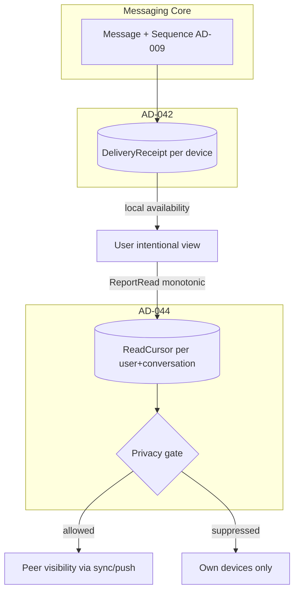
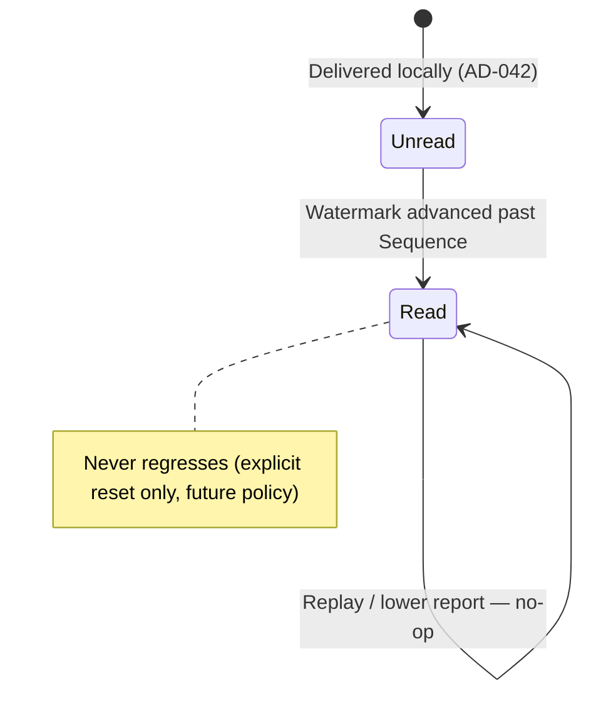
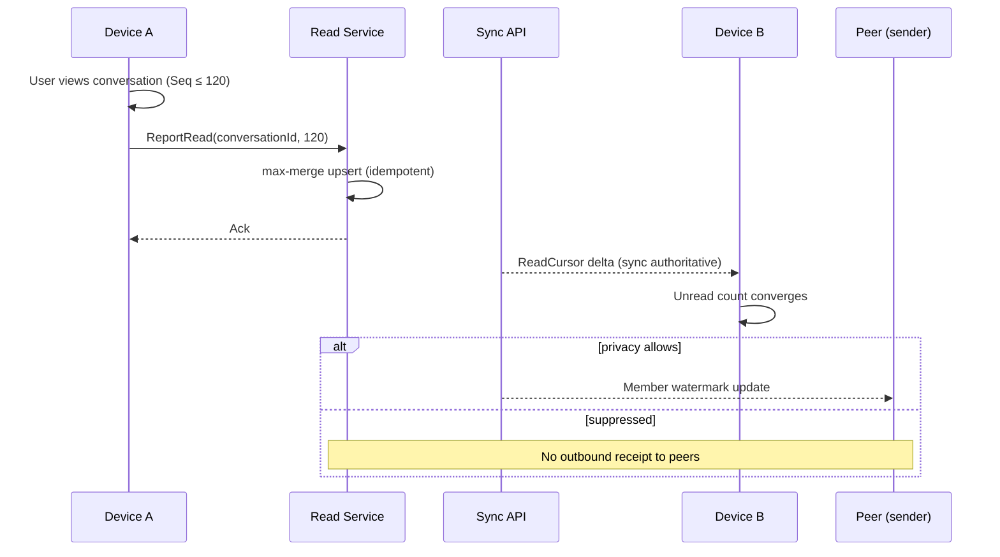

# AD-044 — Read Receipts (Decision Recommendation)

| Field | Value |
|---|---|
| **Status** | Under Review |
| **Owner** | Architecture |
| **Version** | 1.0.0 |
| **Last Updated** | 2026-07-18 |
| **Workshop** | [WS-044](workshops/WS-044-read-receipts.md) |
| **Architecture Review** | [AR-044](reviews/AR-044-read-receipts.md) |
| **Related Research** | [RS-006 Read Receipts](../research/RS-006-read-receipts.md) |

## Question

How is user read state represented, synchronized across a user's devices, and optionally exposed to conversation peers — independently from device delivery (AD-042), without mutating the Message aggregate or ConversationSequence, and with enforceable privacy controls?

---

## Context

The acknowledgement ladder is now: **AcceptAck** (AD-009, server durability + Sequence) → **DeliveryAck** (AD-042, per-device apply) → **Read** (this decision, user attention). AD-008 mandates that read state is an external projection. AD-010 provides hybrid push + authoritative delta sync for state convergence.

Evidence: **RS-006**. Workshop: **WS-044**. Review: **AR-044** (Approved for Architecture Decision).

**Guiding principle (Sprint 2 charter):** Delivery confirms that a device successfully received and applied a message. Read confirms that a user has intentionally viewed that message. These concepts are independent and remain separate.

---

## Problem Statement

Per-message read rows for every reader do not scale in large groups. Device-scoped read fragments the user's own experience across linked devices. Coupling read to delivery produces false "read" states. Without an explicit, monotonic, privacy-gated read model, senders receive misleading signals and multi-device users see inconsistent unread counts.

---

## Constraints

| ID | Constraint |
|---|---|
| AD-008 | Read is a projection; Message immutable |
| AD-009 | Sequence is the only order; read never reorders |
| AD-042 | DeliveryAck per device; read is a separate concept |
| AD-010 | Sync authoritative; push best-effort |
| INV-01 / INV-04 | Metadata-only server; idempotent replay |
| ADR-0018 | Idempotency keys and dedup discipline |
| Charter | User-level read; privacy-aware; deterministic multi-device |

---

## Decision

**Adopt RS-006 Alternative B** (refined by AR-044):

1. **ReadCursor projection** — system of record: `readUpToSequence` per `(UserId, ConversationId)`, unique per pair, with `updatedAt` and privacy epoch.
2. **Semantics:** message M is read by user U iff `Sequence(M) ≤ readUpToSequence(U, conversation)`. Per-message read views are **derived**, never primary storage for full history.
3. **Monotonic max-merge:** the watermark only advances; replays and concurrent reports resolve to `max(readUpToSequence)`; same-or-lower reports are idempotent no-ops.
4. **Independence:** ReadCursor is stored and evolved independently from DeliveryReceipt (AD-042). Neither mutates the other.
5. **Emission conditions (all required):**
   - messages up to the proposed watermark are locally applied on the reporting device (contiguous with its AD-010 sync cursor);
   - the intentional-view policy is met (in-app visibility; notification-preview policy is OQ-READ-01);
   - the authenticated user owns the watermark;
   - outbound visibility to peers passes the privacy gate.
6. **Multi-device:** reading on any device advances the user's watermark; other devices converge via **ReadCursor deltas** in AD-010 sync (push best-effort, sync authoritative). Offline concurrent reads merge by max Sequence.
7. **Privacy:** global and per-conversation opt-out suppress outbound read visibility to peers at **emission time**; the user's own devices always synchronize read state for self-consistency. Suppressed receipts are never emitted retroactively after a settings change.
8. **Groups:** senders see per-member watermarks ("read up to Sequence S"); aggregate indicators derive from them. No per-message × per-reader matrix at launch.
9. **Reconstructibility:** server projection is rebuildable from client re-reports; event-sourced audit log deferred (RS-006 D).
10. **Out of scope:** presence, typing, push providers, analytics, moderation (separate ADs).

### Read lifecycle

### ReadCursor contract (normative)

| Rule | Detail |
|---|---|
| Key | Unique `(UserId, ConversationId)` |
| Value | `readUpToSequence` (ConversationSequence), `updatedAt`, privacy epoch |
| Advance | Compare-and-max upsert; monotonic |
| Idempotency | Same/lower Sequence → no-op (ADR-0018 discipline, no new exceptions) |
| Local availability | Reporting device must have applied Sequences up to the watermark (its own contiguous sync state) |
| Cross-device gaps | Gaps pending on *other* devices do not block advancement — watermark is user-scoped |
| AuthZ | Only the authenticated owner advances their cursor; peer visibility requires conversation membership at read time |
| Ordering | Never allocates or modifies ConversationSequence; read time is never a sort key |

### Multi-device convergence

---

## Domain Events / Signals

| Name | Producer | Consumers |
|---|---|---|
| `ReadCursorAdvanced` | Read service | Own-device sync, peer visibility (gated), analytics (future) |
| `ReadReportRejected` | Read service | Client telemetry (stale/unauthorized) |

Events carry metadata only — UserId, ConversationId, Sequence, timestamps (INV-01, INV-11). Batched wire formats permitted (OQ-READ-04 → protocol docs).

---

## Domain Invariants

| ID | Invariant | Enforcement |
|---|---|---|
| R-INV-01 | Read state never stored on Message aggregate | A + DB |
| R-INV-02 | readUpToSequence monotonic per (UserId, ConversationId) | A + DB |
| R-INV-03 | Read reports idempotent (replay safe) | A |
| R-INV-04 | Read never modifies ConversationSequence | A |
| R-INV-05 | Read never mutates Message content | A |
| R-INV-06 | Outbound read visibility gated by privacy policy at emission time | A + Client |
| R-INV-07 | User read watermark syncs across the user's own devices | A + Sync |
| R-INV-08 | Read state reconstructible from client re-reports | A |
| R-INV-09 | Delivery and Read projections independent | A |
| R-INV-10 | Peer read visibility requires conversation membership at read time | A |
| R-INV-11 | Watermark advances only over Sequences locally applied on the reporting device | A + Client |

---

## Decision Drivers

1. Watermark scales O(users × conversations) vs O(messages × readers) (RS-006; Slack cursor pattern).
2. User-attention semantics match product truth; per-device read fragments UX (charter).
3. Deterministic multi-device merge (max Sequence) with no clock dependence.
4. Privacy enforceable at one boundary (emission gate), matching WhatsApp/Signal opt-out practice.
5. Zero footprint on Message, Sequence, and sync cursors — core baseline untouched.
6. Same idempotency discipline as ADR-0018; no new exception paths.

---

## Alternatives Considered

### RS-006 Alternative A — Per-message ReadReceipt rows

Rejected as primary store: O(messages × readers) storage/sync; ack storms on bulk read. Permitted as derived recent-window views only.

### RS-006 Alternative B — User read watermark *(chosen)*

Accepted per AR-044.

### RS-006 Alternative C — Per-device read records

Rejected: read is a user concept; device scoping fragments UX and amplifies side channels.

### RS-006 Alternative D — Event sourcing primary

Deferred: audit-log benefits do not justify launch complexity; projection design permits adding it later.

---

## Consequences

**Positive:** Scalable read state; deterministic unread counts across devices; single privacy enforcement point; stable base for group read indicators.  
**Negative:** Mid-history precision is inferred, not stored ("read up to" semantics); privacy epoch bookkeeping; read timing remains a side channel when enabled.  
**Neutral:** Notification-preview and default-on/off policies deferred to Product/AD-020; thread-scoped watermarks are a future extension.

---

## Risks

| ID | Risk | Severity |
|---|---|---|
| R-044-01 | Client advances watermark past locally unapplied Sequences | High |
| R-044-02 | Watermark regression via buggy client or replay | Medium |
| R-044-03 | Read delta chatter in large groups | Medium |
| R-044-04 | Read timing side channel (stalking/probing) | Medium |

---

## Mitigations

| Risk | Mitigation |
|---|---|
| R-044-01 | R-INV-11; SDK contract ties report to local sync cursor; server sanity bound (≤ conversation max Sequence) |
| R-044-02 | Compare-and-max upsert + DB constraint; reject and alert on regressions |
| R-044-03 | Debounce/coalesce reports; batch deltas; rate limits |
| R-044-04 | Privacy opt-out (AD-020); rate limiting; documented risk |

---

## Future Evolution

- Thread/topic-scoped watermarks as additive cursors.
- Optional read-event audit log (RS-006 D) for compliance/analytics with consent.
- Sealed-sender-style receipt privacy hardening.
- Group "read by N" rollup materialization if member counts demand it.

---

## Related Research

- **[RS-006 Read Receipts](../research/RS-006-read-receipts.md)** — Alternative B adopted.

---

## Related ADRs

- **ADR-0018** — Idempotency (discipline reused; no new exceptions)
- ADR-0016 / ADR-0011 — Sync and pagination foundation
- ADR-0032 — Message model (projections)
- *(Ratification target on approval: read-receipt ADR per manifest wiring)*

---

## Related Documents

- WS-044, AR-044
- AD-042, AD-010, AD-009, AD-008
- `docs/30-domain/30-domain-model-overview.md`
- `docs/60-realtime/62-delivery-and-read-receipts.md` *(pending DOC-066)*
- [DOC-156](../20-architecture/20.3-phase-4-messaging-services-plan.md)

---

## Open Questions

| ID | Question | Owner | Blocking? |
|---|---|---|---|
| OQ-READ-01 | Notification preview counts as read? | Product | No |
| OQ-READ-02 | Default read receipts on for Direct vs Group? | Product (+ AD-020) | No |
| OQ-READ-04 | Wire format: standalone ReadReport vs batched | Protocol | No |

*OQ-READ-03 resolved by AR-044: watermark advances only over Sequences locally applied on the reporting device; gaps on other devices do not block (user-scoped cursor).*

---

## Review Outcome (2026-07-18)

**Reviewer:** Chief Software Architect · **Verdict:** Approved for Architecture Decision  
**Artifact:** [AR-044](reviews/AR-044-read-receipts.md)

**Changes applied:** RS-006 B; ReadCursor normative contract; emission conditions; OQ-READ-03 resolution (local-availability rule); privacy epoch; R-INV-01..11; membership-gated peer visibility; event contracts; ADR-0018 discipline reaffirmed.

**Quality scores** — Architecture 9 · Security 9 · Scalability 10 · Maintainability 9 · Documentation 9 · **Overall 9.4**

---

## Approval

- **Status:** Under Review
- **Owner:** Architecture
- **Reviewed by:** Chief Software Architect (Phase 4 — Read Receipts)
- **Review Date:** 2026-07-18
- **Decision Date:** *(pending human approval)*
