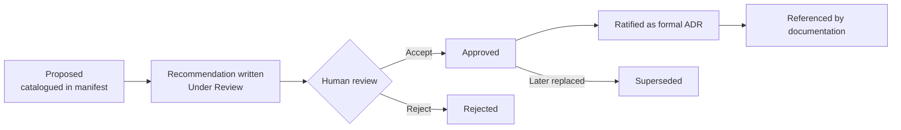

# Architecture Decision Repository (ADRP)

| Field | Value |
|---|---|
| **Status** | Active |
| **Owner** | Chief Software Architect |
| **Version** | 1.1.0 |
| **Last Updated** | 2026-07-18 |

## Purpose

The Architecture Decision Repository (ADRP) is where every major architectural decision is **researched, compared, and recommended before implementation and before detailed documentation**. Its goal is to ensure that every future document and every line of code is grounded in an explicit, reviewed engineering choice rather than an assumption.

The ADRP is distinct from the formal ADR set (`docs/ADR/`). The ADRP is the **working sprint space** where options are analyzed and a single recommendation is proposed for human approval. Once a decision is **Approved**, it is ratified as one or more formal ADRs and becomes the reference for documentation.

## Workflow

1. A decision is **catalogued** in `decision-manifest.yaml` (status `Proposed`).
2. The architect writes a **recommendation document** using the decision template; status becomes `Under Review`.
3. A human reviewer **approves** or **rejects** the recommendation.
4. Approved decisions are ratified as formal **ADRs** and referenced by documentation.
5. A superseded decision is retained for history and linked to its replacement.

## Decision Lifecycle

| Status | Meaning | Set by |
|---|---|---|
| Proposed | Decision identified and catalogued; recommendation not yet written. | Architect |
| Under Review | Recommendation written and awaiting human review. | Architect |
| Approved | Human has accepted the recommendation. | Human reviewer |
| Rejected | Human has declined the recommendation. | Human reviewer |
| Superseded | Previously approved, now replaced by another decision. | Human reviewer |

**The architect never sets a decision to Approved.** The architect only recommends. Approval is a human act.

## Review Process

- Reviewers open `decision-manifest.yaml` to see all decisions and their status.
- Each `Under Review` document is evaluated against the validation checklist: alternatives compared, trade-offs and risks explained, industry practices summarized, security and scalability impact analyzed, dependencies valid, recommendation justified.
- Reviewers record the outcome by changing `status` in the manifest and the document's Approval section.

## Approval Process

- Approval requires the named `owner` (or delegate) to set `status: Approved` and fill `decision_date` in `decision-manifest.yaml`.
- On approval, a formal ADR is created in `docs/ADR/` capturing the ratified decision (see `related_adrs`).

## Relationship with ADRs

| ADRP (this repository) | ADR (`docs/ADR/`) |
|---|---|
| Working analysis and recommendation. | Ratified, immutable record of an approved decision. |
| Multiple alternatives compared. | The chosen option and its consequences. |
| Status flows Proposed → Under Review → Approved. | Created only after approval. |

Each ADRP decision lists its `related_adrs`; approval triggers authoring those ADRs.

## Relationship with Documentation

Documentation generation is **paused** while the ADRP is built. Downstream documents (domain, security, data, realtime, features, API, protocol, infrastructure) will **reference approved decisions** instead of inventing architecture. Every decision lists its `related_documents` so the impact of approval is explicit.

## Files

| File | Role |
|---|---|
| `decision-manifest.yaml` | Single source of truth: every decision, its status, and dependencies. |
| `AD-XXX-*.md` | Individual decision recommendation documents. |
| `workshops/WS-XXX-*.md` | Architecture workshops preparing a decision (evidence + alternatives; no final decision). |
| `reviews/AR-XXX-*.md` | Critical architecture reviews of workshop recommendations. |
| `README.md` | This file. |

## Messaging Core Sprint Progress

| Topic | Workshop | Review | Decision | ADR |
|---|---|---|---|---|
| Conversation Model | WS-007 | AR-007 | AD-007 **Approved** (v2.1 amendments) | ADR-0031 **Accepted** |
| Message Model | WS-008 | AR-008 | AD-008 **Approved** | ADR-0032 **Accepted** |
| Message Ordering | WS-009 | AR-009 | AD-009 **Approved** | ADR-0008 / ADR-0010 **Accepted** |
| Synchronization | WS-010 | AR-010 | AD-010 **Approved** | ADR-0016 / ADR-0011 **Accepted** |

**Entry-point overview:** [`docs/20-architecture/20.1-messaging-core-architecture.md`](../20-architecture/20.1-messaging-core-architecture.md) (DOC-154).

**Phase 3 closure:** [`docs/20-architecture/20.2-phase-3-messaging-core-completion.md`](../20-architecture/20.2-phase-3-messaging-core-completion.md) (DOC-155) — Messaging Core **COMPLETE**.

**Phase 4 plan:** [`docs/20-architecture/20.3-phase-4-messaging-services-plan.md`](../20-architecture/20.3-phase-4-messaging-services-plan.md) (DOC-156) — Messaging Services **IN PROGRESS** (Sprint 1: AD-042).

### Messaging Services Sprint Progress (Phase 4)

| Topic | Research | Workshop | Review | Decision | ADR |
|---|---|---|---|---|---|
| Delivery & Acknowledgements | RS-005 | WS-042 | — | AD-042 Proposed | ADR-0018 (planned) |

## Validation Gate (per decision)

Before a recommendation is saved it must satisfy: alternatives compared; trade-offs explained; risks documented; industry practices summarized; security impact analyzed; scalability impact analyzed; related documents listed; related ADRs listed; dependencies valid; recommendation justified.
