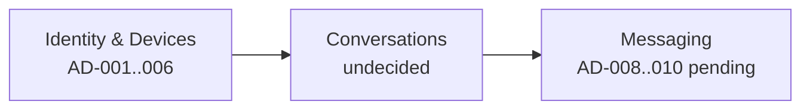

# WS-007 — Architecture Workshop: Conversation Model

| Field | Value |
|---|---|
| **Workshop ID** | WS-007 |
| **Topic** | Conversation Model |
| **Status** | Completed — Decision Approved (AD-007); amendments applied in AD-007 v2.1 |
| **Owner** | Principal Software Architect |
| **Facilitators** | Distributed Systems Engineer, Backend Architect, Security Architect, Product Architect |
| **Version** | 1.1.0 |
| **Date** | 2026-07-18 |
| **Feeds Decision** | AD-007 Conversation Model |
| **Evidence Base** | [RS-001 Conversation Models](../../research/RS-001-conversation-models.md) |
| **Respects** | AD-001..AD-006 (Approved) |

> This workshop prepares a decision. It does **not** make the final decision. The Architecture Decision (AD-007) and subsequent human ratification remain authoritative.

---

## Executive Summary

The conversation model is the container for every message, membership change, and group-key event. Evidence from RS-001 and constraints from AD-001..AD-006 favor a **unified `Conversation` aggregate** with a type discriminator (`Direct` | `Group` | `Channel`-future) and a **separate Membership/Role sub-model**, treating 1:1 as a fixed-membership two-party conversation. Separate per-type pipelines and Discord-style space hierarchies are rejected for launch because they duplicate the message path or over-engineer an E2EE-first product. This workshop documents alternatives, trade-offs, and open questions for AD-007.

---

## Context

ChatSolution is an E2EE-first messaging platform. Approved decisions already fix:

| Decision | Constraint on conversation modeling |
|---|---|
| AD-001 | Membership and authorship keyed by opaque `UserId` |
| AD-002 | Authenticated sessions are per-device |
| AD-003 | Authorization over membership/roles/metadata only |
| AD-004 | Signal Protocol + sender-keys for groups; content never server-readable |
| AD-005 | Private keys stay on devices; membership changes drive re-keying |
| AD-006 | Multi-device; encrypt-to-all-devices; device trust gates history |

Functional scope requires 1:1 (FR-004) and groups (FR-005) now, channels later (FR-006). Sync (AD-010), ordering (AD-009), and message identity (AD-008) all assume a stable conversation identity.

---

## Problem Statement

How should conversations be modeled so that:

1. One-to-one and group messaging share a correct, uniform message pipeline.
2. Membership and roles support deny-by-default authorization (AD-003).
3. Membership changes can drive sender-key updates (AD-004 / future AD-020).
4. Channels can be added later without rewriting the messaging core.
5. The backend never stores or requires plaintext content (INV-01).

---

## Goals

| ID | Goal |
|---|---|
| G-1 | Single message association path: every message references one `ConversationId`. |
| G-2 | Explicit membership and roles for authorization and group crypto. |
| G-3 | Deterministic 1:1 conversation identity for a given pair of users. |
| G-4 | Reserve a channel/broadcast type without implementing broadcast semantics now. |
| G-5 | Keep operational and client complexity low enough for multi-device sync. |

---

## Constraints

| Source | Constraint |
|---|---|
| INV-01 | Backend never decrypts content; conversation model is metadata-only. |
| AD-003 | Access control is membership/role based; no content-based authz. |
| AD-004 | Group encryption depends on stable membership events. |
| AD-006 | Devices participate via membership of the owning user. |
| AP-09 | Conversations module must remain extractable. |
| NFR-S / RISK-03 | Group fan-out and membership size bound cost. |
| FR-006 | Channels are future; do not over-build hierarchy now. |

---

## Existing Architecture

- Modules: Identity → Conversations → Messaging (architecture overview).
- No formal domain aggregates for Conversation/Membership exist on disk yet.
- Draft AD-007 already leans unified conversation; RS-001 corroborates with aligned alternatives (lettering to be normalized in the decision).

---

## Industry Research Summary

Full evidence: **RS-001**. Condensed findings:

| Platform class | Pattern | Relevance |
|---|---|---|
| Signal / WhatsApp | Simple Direct + Group; E2EE; sender-keys; minimal hierarchy | Primary fit for E2EE-first product |
| Telegram | Groups + channels; cloud chats not E2EE by default | Channels scale differently; secret chats are 1:1-only |
| Discord / Slack / Teams | Guilds/workspaces → channels → threads; rich roles | Powerful but conflicts with launch scope and typically non-E2EE content |
| Matrix (pattern) | Room with membership; 1:1 as two-member room | Strong pattern for unified pipeline |

**Documented facts** and **industry patterns** are distinguished in RS-001; this workshop does not re-research them.

---

## Alternative Designs

### Alternative A — Separate models per type

Distinct aggregates/pipelines: `DirectChat`, `Group`, later `Channel`.

- **Strengths:** Type-specific invariants are explicit; each pipeline can be optimized independently.
- **Weaknesses:** Duplicated send/receive/sync/storage paths; higher defect surface; harder extraction story.

### Alternative B — Unified Conversation + Membership/Role

One `Conversation` aggregate with `type ∈ {Direct, Group, Channel}`, separate `Membership` (UserId, role, joined_at, …). Direct = exactly two members, immutable membership. Messages always attach to `ConversationId`.

- **Strengths:** One pipeline; channel-ready; clean authz and sender-key hooks; matches RS-001 recommendation.
- **Weaknesses:** Requires enforced type invariants; channel broadcast semantics still deferred.

### Alternative C — Generic space/room hierarchy

Communities/spaces containing rooms/channels/threads (Discord/Matrix-spaces style).

- **Strengths:** Maximum future flexibility for communities and nested structure.
- **Weaknesses:** Authorization explosion; premature for FR scope; poor fit for E2EE-first launch complexity budget.

---

## Trade-off Analysis

| Dimension | A Separate | B Unified + Membership | C Hierarchy |
|---|---|---|---|
| Pipeline uniformity | Poor | Excellent | Medium (nested) |
| Authz clarity | Good per type | Good (roles on membership) | Complex |
| E2EE / sender-key fit | Medium | Excellent | Risky at launch |
| Channel readiness | Rebuild later | Reserve type | Built-in but heavy |
| Operational surface | High | Low | Highest |
| Launch complexity | Medium-High | Low-Medium | Very High |

Central trade-off: **uniformity and E2EE simplicity (B)** vs. **per-type optimization (A)** vs. **maximal social structure (C)**.

---

## Security Analysis

- Membership is security-critical metadata: join/leave/role-change must emit domain events that invalidate authz caches (AD-003) and trigger group re-keying (AD-004/AD-005).
- Backend must not infer content from conversation titles/topics if those are user-supplied sensitive fields — prefer encrypted title/avatar blobs for groups where product requires privacy (open question).
- Direct conversations must prevent third-party injection into membership.
- Channel type changes threat model (large audience, moderation without content) — reserve only.

---

## Scalability Analysis

- Sender-keys keep per-message group cost bounded vs. pairwise fan-out (AD-004).
- Membership table keyed by `(ConversationId, UserId)` supports cacheable lookups; shard/partition by conversation later.
- Very large broadcast audiences are a different regime — deferred with Channel type.
- Canonical Direct index (sorted pair of UserIds → ConversationId) avoids duplicate 1:1 conversations under concurrency.

---

## Operational Analysis

- One pipeline reduces metrics, alerts, and on-call runbooks.
- Moderation cannot inspect content; tooling operates on membership abuse, reports, and metadata rates.
- Fewer aggregates simplify outbox event contracts for Conversations → Messaging/Identity.

---

## Performance Analysis

- Hot path: membership check + append message (metadata). Must be O(1)/O(log n) membership lookup with caching.
- Group size bound (product decision) caps fan-out and device encryption fan-out (AD-006).
- Direct conversation resolve-or-create must be idempotent under concurrent first-message races.

---

## Failure Scenarios

| Scenario | Risk | Mitigation direction |
|---|---|---|
| Concurrent Direct create for same pair | Duplicate 1:1 conversations | Deterministic pair key + unique constraint + idempotent create |
| Membership change lost before re-key | Former member retains group key | Durable membership events + outbox; crypto rotation required before further sends |
| Role demotion lag in cache | Privilege window | Event-driven cache invalidation (AD-003 review outcome) |
| Type invariant bypass (add member to Direct) | Authz/crypto confusion | Hard reject at aggregate boundary; tests |
| Channel type used prematurely | Unsupported broadcast load | Feature flag / type not creatable until FS-03 |

---

## Migration Considerations

- Launch schema: `Conversation` + `Membership` is sufficient for Direct and Group.
- Adding `Channel` later is a type + permission rule change, not a new message store.
- If hierarchy (C) is ever needed, communities can wrap conversations without splitting the message stream.
- Avoid encoding type-specific tables that force dual-write migrations later (argument against A).

---

## Recommendation

*(Workshop recommendation — not a decision.)*

Adopt **Alternative B**: unified `Conversation` aggregate with type discriminator and separate Membership/Role model; Direct as fixed two-party conversation; Channel reserved.

This matches RS-001 Alternative B and keeps AD-008..AD-010, AD-020, and FS-01/FS-02 on a single foundation.

---

## Open Questions

| ID | Question | Owner |
|---|---|---|
| OQ-CONV-01 | Maximum group size at launch (sender-keys vs. MLS trigger)? | Product + Security |
| OQ-CONV-02 | Are unnamed group-DMs distinct from named groups at launch? | Product |
| OQ-CONV-03 | Which Channel fields to reserve in schema now vs. migrate later? | Architecture |
| OQ-CONV-04 | Are group title/avatar plaintext metadata or encrypted client blobs? | Security + Product |
| OQ-CONV-05 | Soft-delete / leave vs. hard-remove membership retention for abuse forensics? | Trust & Safety |

---

## Human Decisions Required

1. **Accept or reject** Alternative B as the AD-007 decision (after Architecture Review).
2. **Set launch max group size** (blocks precise fan-out and MLS trigger planning).
3. **Confirm** group-DM vs. named-group product split for v1.
4. **Confirm** metadata posture for group display names (plaintext vs. encrypted).

---

## Post-Decision Note (Finalization Amendments)

AD-007 was approved on Alternative B. A subsequent finalization pass (2026-07-18) **did not change the recommendation**; it made implicit rules explicit in AD-007 / ADR-0031 / DOC-024:

- Conversation lifecycle (`Created` / `Active` / `Archived` / `Frozen` / `Deleted`)
- Membership lifecycle (`Invited` / `Pending` / `Active` / `Left` / `Removed` / `Blocked`)
- Domain invariants with enforcement layers
- Ownership model (including Direct N/A)
- Future extensibility strategy
- Aggregate structure diagrams (Metadata, Settings, Role, boundaries)

This workshop remains historical evidence for the decision; normative rules live in AD-007 v2.1+.

---

## References

- [RS-001 Conversation Models](../../research/RS-001-conversation-models.md)
- [AD-001..AD-006](../) (Approved constraints)
- [AD-007](../AD-007-conversation-model.md) (Approved v2.1)
- `docs/10-product/12-functional-requirements.md` (FR-004, FR-005, FR-006)
- `docs/20-architecture/29.5-system-invariants.md` (INV-01)
