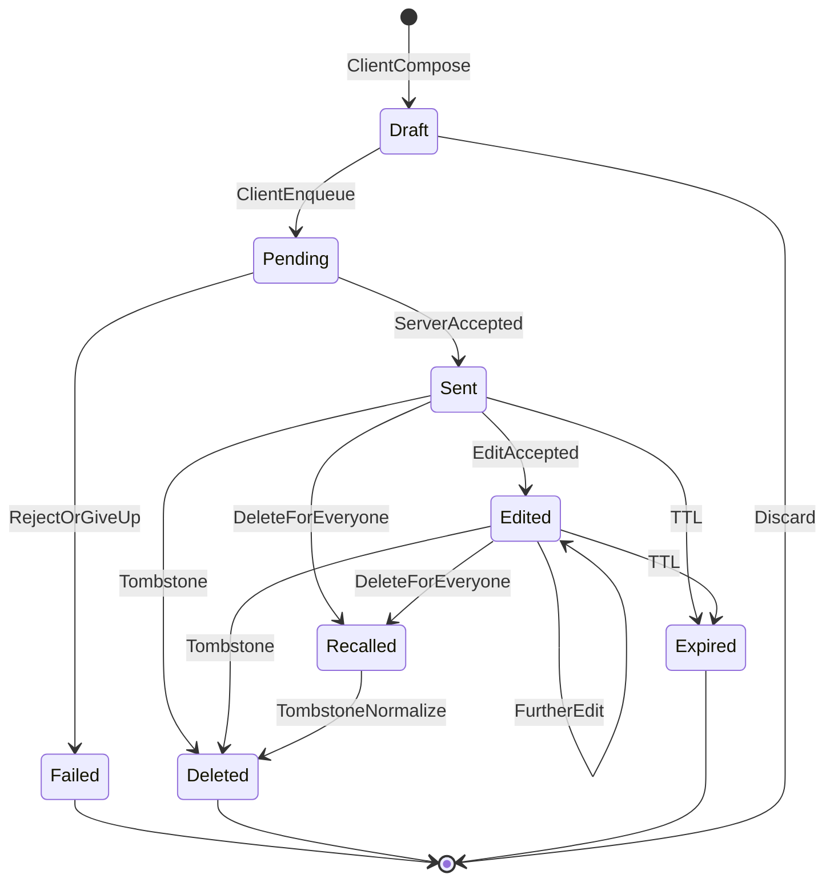

# WS-008 — Architecture Workshop: Message Model

| Field | Value |
|---|---|
| **Workshop ID** | WS-008 |
| **Topic** | Message Model |
| **Status** | Completed — Awaiting Decision |
| **Owner** | Principal Software Architect |
| **Version** | 1.0.0 |
| **Date** | 2026-07-18 |
| **Feeds Decision** | AD-008 Message Model |
| **Evidence Base** | [RS-002 Message Models](../../research/RS-002-message-models.md) |
| **Respects** | AD-001..AD-007 (Approved) |

> This workshop prepares a decision. It does **not** make the final architecture decision.

---

## Executive Summary

Evidence from **RS-002** and constraints from AD-001..AD-007 favor an **immutable Message aggregate root** in the Messaging context: client-generated time-sortable `MessageId` (ULID/UUIDv7), ciphertext payload + **bounded metadata envelope**, **edit-as-new-version**, **soft-delete tombstones**, **attachment-by-reference**, and **relations** for replies/reactions/forwards/pins. Sensitive sub-content stays encrypted. Ordering algorithm and sync protocol remain AD-009/AD-010; this workshop only places the fields those decisions will consume.

---

## Context

| Constraint | Implication for Message Model |
|---|---|
| INV-01 / AD-004 | Backend stores ciphertext + metadata only |
| INV-02 / INV-12 | One immutable MessageId; never reused across edits |
| AD-007 | Every message references exactly one `ConversationId`; messages are **outside** the Conversation aggregate |
| AD-003 | Authz via membership; authorship checks on metadata |
| AD-006 | `SenderDeviceId` required for multi-device crypto fan-out |
| FR-004..020 | Text/media/edit/delete/reply/reaction/forward/sync |

---

## Problem Statement

How should a message be identified, aggregated, versioned, typed, encrypted, related, and extended so the platform supports years of feature growth without redesign, while remaining E2EE-correct and sync-ready?

---

## Goals

| ID | Goal |
|---|---|
| G-1 | Stable identity and aggregate boundaries |
| G-2 | Explicit lifecycle with sync-safe mutations |
| G-3 | Extensible types without schema redesign |
| G-4 | Clear separation of content vs metadata concerns |
| G-5 | Foundation for AD-009 ordering and AD-010 sync |

---

## Investigation Topics

### 1. Message Identity

| Strategy | Ordering | Multi-region | Offline create | Storage | Index | Collision |
|---|---|---|---|---|---|---|
| UUID v4 | Poor alone | Excellent | Excellent | 16 B | Random I/O | Negligible |
| ULID / UUIDv7 | Time-sortable | Good | Excellent | 16 B | Better locality | Negligible |
| Snowflake | Excellent | Needs coordination | Hard offline | 8 B | Excellent | Low if epochs OK |
| DB sequential | Perfect per shard | Poor globally | Impossible | Small | Excellent | N/A |
| Client seq only | Insufficient | — | Yes | Small | — | High across devices |

**Workshop recommendation:** **Client-generated ULID or UUIDv7** as immutable `MessageId` (offline-capable, globally unique, time-sortable for indexes). **Server per-conversation `Sequence`** is a separate field owned by AD-009 for total order/gap detection — not a substitute for MessageId. Aligns with RS-002 DB implications and INV-02.

### 2. Aggregate Design

| Option | Assessment |
|---|---|
| Child of Conversation aggregate | Rejected — would bloat Conversation, block Messaging extraction, contradict AD-007 boundary |
| Message as Aggregate Root | **Preferred** — Messaging module owns Message + Relations + AttachmentRefs |
| Pure event without aggregate | Rejected for launch — higher complexity (RS-002 Alt C) |

**Owns:** Message record, edit-version chain links, tombstone flag, attachment references, relation records (reply/reaction/pin/forward markers as modeled).  
**References by ID:** `ConversationId`, `UserId`, `DeviceId`, object-storage blob IDs.  
**Does not own:** Conversation/Membership, delivery receipts (may be separate projection — prepare fields only), sync cursors (AD-010).

### 3. Message Lifecycle

Delivery/read are **per-recipient projections**, not mutations of ciphertext. Core message lifecycle:

| State | Meaning | Terminal? |
|---|---|---|
| `Draft` | Local only; not server-visible | No (or discard) |
| `Pending` | Client retry / awaiting ack; may use client MsgId | No |
| `Sent` | Persisted; `Sequence` assigned (AD-009) | No |
| `Edited` | Latest version supersedes prior ciphertext; same MessageId | No |
| `Recalled` | Delete-for-everyone within window; tombstone + ciphertext cleared | Effectively terminal for content |
| `Deleted` | Tombstone visible in timeline | Terminal for content |
| `Expired` | TTL disappearing message | Terminal |
| `Failed` | Never accepted | Terminal |

**Invalid:** mutate ciphertext in place; reuse MessageId for a different logical message; edit after `Recalled`/`Deleted`/`Expired` (except admin metadata repair).  
**Delivered/Read:** tracked in delivery/read projections keyed by `(MessageId, RecipientUserId[/DeviceId])` — not Message aggregate state (avoids hot-row writes).

### 4. Message Immutability

| Approach | Pros | Cons |
|---|---|---|
| Mutable in-place | Simple | Breaks INV-02/12; sync races (RS-002 A) |
| Immutable + versions/relations | Sync-safe; audit | More rows (RS-002 B) |
| Full event sourcing | Complete history | Over-engineered at launch (RS-002 C) |

**Recommendation:** **Immutable core + edit-as-new-version + relations** (RS-002 Alternative B). Ciphertext bytes never overwritten after accept; edit stores new ciphertext version linked by `supersedes`/`editVersion`.

### 5. Message Types

Use `MessageType` enum (additive) + typed ciphertext schema version inside payload:

`Text | Image | Video | Audio | VoiceNote | Document | Contact | Location | Poll | Sticker | Gif | System | CallEvent | Reaction | Custom(ext)`

Server stores `type` for routing/UX hints and indexing; **payload schema is client-encrypted**. Unknown types: store and sync; clients show graceful fallback. No table-per-type.

### 6. Message Content Separation

| Concern | Location | Server-visible? |
|---|---|---|
| Business content (text, media keys, previews) | Ciphertext payload | No (ciphertext only) |
| Presentation hints | Minimal: `type`, optional attachment count | Bounded metadata |
| Encryption metadata | Envelope: algo/version, ratchet/sender-key ids as needed | Yes, non-content |
| Delivery metadata | Receipt projections | Yes |
| Sync metadata | `MessageId`, `clientMsgId`, `Sequence`, timestamps | Yes |

Do not mix receipt counters into the Message row’s hot path.

### 7. Attachments

| Approach | Assessment |
|---|---|
| Embed bytes in message row | Rejected — breaks size/scale |
| Separate Attachment aggregate | Optional later; not required at launch |
| External object storage + metadata refs | **Preferred** |
| Metadata-only refs on Message | **Preferred** |

**Lifecycle:** client encrypts → upload blob → message carries `AttachmentRef[]` (blobId, size, content-type opaque/encrypted as required, hash). Ownership: Messaging references blobs; Media/Object storage owns bytes. Orphan GC via retention jobs.

### 8. Replies

| Model | Assessment |
|---|---|
| `replyToMessageId` same conversation | **Preferred** — simple, E2EE-friendly |
| Full thread hierarchy / tree container | Defer — threads as relations later |
| Conversation branch | Rejected — splits stream |

**Rule:** Reply target must be same `ConversationId` (invariant). Quoted preview inside ciphertext.

### 9. Forwarding

Forward = **new Message** in destination conversation with new ciphertext (re-encrypt per AD-004). Optional metadata: `forwarded=true`, optional `forwardedFromMessageId` (privacy-sensitive — prefer omit or hash; product/abuse policy). No server-side content copy. Attribution is client-rendered from encrypted payload when desired.

### 10. Editing

| Approach | Assessment |
|---|---|
| In-place overwrite | Rejected |
| Immutable revision chain | **Preferred** |
| Full event store | Deferred |

Edit within policy window (OQ): new version row or versioned ciphertext field; `editVersion`++; `supersedesMessageId` or version chain; original MessageId stable (INV-12). Sync ships edit events; clients replace displayed body.

**History retention:** launch — latest version + `edited` marker; optional retain N versions (OQ). Full history not required at launch.

### 11. Deletion

| Mode | Behavior |
|---|---|
| Soft delete / tombstone | Preserve MessageId + Sequence position; clear ciphertext |
| Delete-for-everyone (Recall) | Time-bounded; tombstone fan-out |
| Delete-for-me | Per-user projection hide; server row may remain |
| Hard delete / purge | Retention job after policy |
| Expiration (TTL) | Auto-tombstone |

Cannot guarantee erase from devices that already decrypted (E2EE limitation — communicate in product).

### 12. Encryption Metadata (AD-004 / AD-005)

On Message / envelope (server-visible, non-secret):

- Ciphertext blob(s)
- Encryption protocol / algo version
- Optional session / sender-key distribution id or epoch (as required by library spike)
- Sender device id

**Never:** plaintext, private keys, reaction emoji cleartext, reply preview cleartext.

### 13. Ordering Metadata (fields only — algorithm AD-009)

| Field | Role |
|---|---|
| `MessageId` (ULID/UUIDv7) | Immutable identity; approximate time order |
| `Sequence` | Per-conversation server total order (AD-009) |
| `clientSentAt` | Client clock (untrusted) |
| `serverReceivedAt` | Server receive time |
| `clientSequence` (optional) | Per-device send ordering aid |

### 14. Synchronization Metadata (prepare AD-010)

| Field | Role |
|---|---|
| `MessageId` | Idempotent dedup |
| `clientMsgId` | Optional alias if distinct from MessageId during Pending |
| `ConversationId` + `Sequence` | Cursor/checkpoint sync |
| `editVersion` / tombstone | Conflict-free apply of mutations |
| Idempotency key on accept | INV-04 |

Offline: client assigns MessageId, queues Pending, server accepts idempotently.

### 15. Domain Events

| Event | Producer | Consumers |
|---|---|---|
| `MessageAccepted` / `MessageCreated` | Messaging | Sync, fan-out, push, search(metadata) |
| `MessageEdited` | Messaging | Sync, fan-out, push |
| `MessageDeleted` / `MessageRecalled` | Messaging | Sync, fan-out, push |
| `MessageForwarded` | Messaging (as new create + flag) | Analytics/abuse (metadata) |
| `AttachmentReferenced` | Messaging | Media GC, CDN |
| `MessagePinned` / `Unpinned` | Messaging | Sync, read models |
| `MessageExpired` | Worker | Sync, purge |

### 16. Domain Invariants (draft)

| ID | Invariant | Enforce |
|---|---|---|
| M-INV-01 | Exactly one `ConversationId` | D+DB |
| M-INV-02 | Exactly one sender `UserId` (+ `DeviceId`) | D+DB |
| M-INV-03 | `MessageId` immutable | D+DB |
| M-INV-04 | Ciphertext immutable after accept; edits = new version | D |
| M-INV-05 | Reply target same conversation (if present) | D+A |
| M-INV-06 | Sender must be Active member at accept | A |
| M-INV-07 | No plaintext content fields | D+A+review |
| M-INV-08 | Tombstone clears ciphertext | D |

### 17. Future Compatibility

| Capability | Extension |
|---|---|
| Threads | Relation `threadRootId` / reply chains — still one stream |
| Reactions | Relation records + encrypted emoji payload |
| Scheduled | `ScheduledMessage` outbox → becomes Message at fire time |
| Temporary / TTL | `expiresAt` + worker |
| AI / Business | `type` + settings; AI as UserId sender |
| Translation | Client-side; or encrypted alt payloads |
| Moderation / Legal hold | Metadata flags + retention hold; no content inspection |
| Search | Client content search; server metadata only |
| Analytics | Event metadata only |

**Strategy:** additive types, relations, settings; never mutate MessageId semantics; never require dual message pipelines.

---

## Alternative Designs (Message Representation)

Aligned with **RS-002**:

| Alt | Summary | Workshop lean |
|---|---|---|
| A | Mutable in-place | Reject |
| B | Immutable + envelope + relations | **Recommend** |
| C | Full event-sourced log | Defer |

(Identity/envelope alternatives in draft AD-008 A/B/C map onto privacy vs feature trade-offs; workshop prefers RS-002 B combined with explicit envelope metadata.)

---

## Trade-off Analysis

Immutability + relations costs storage and purge jobs but buys multi-device correctness, INV compliance, and feature extensibility. Full event sourcing is deferred. Mutable messages are incompatible with platform invariants.

---

## Security / Scalability / Operational / Performance

- **Security:** Bounded metadata; encrypted sensitive relations; forward = re-encrypt; E2EE delete limits documented.
- **Scalability:** Partition by conversation/time; reactions as separate rows; attachments external.
- **Operational:** Retention/purge; edit/delete window config.
- **Performance:** Avoid updating Message row for every receipt; use projections.

---

## Failure Scenarios

| Scenario | Mitigation direction |
|---|---|
| Duplicate offline submit | Idempotent accept by MessageId |
| Edit after delete | Reject |
| Reply to missing/tombstoned | Allow or reject per product; prefer allow with broken-reply UI |
| Attachment upload without message | Orphan GC |
| Member removed mid-send | Reject at accept (AD-007) |

---

## Migration Considerations

Launch schema: Message + AttachmentRef + Relation tables. Additive columns/types only. Avoid embedding blobs.

---

## Recommendation

*(Not a decision.)* Adopt **RS-002 Alternative B**: Message as **Messaging aggregate root**; **ULID/UUIDv7 MessageId**; ciphertext + bounded envelope; edit versions; tombstones; attachment refs; relations for reply/reaction/forward/pin; delivery/read as separate projections; Sequence/timestamps reserved for AD-009/AD-010.

---

## Open Questions

| ID | Question | Owner |
|---|---|---|
| OQ-MSG-01 | Edit / delete-for-everyone windows? | Product |
| OQ-MSG-02 | Reactions: encrypted relation messages vs compact rows? | Architecture |
| OQ-MSG-03 | Retain full edit history vs latest only? | Product |
| OQ-MSG-04 | Forward attribution metadata vs flag-only? | Privacy + Abuse |
| OQ-MSG-05 | ULID vs UUIDv7 final pick? | Architecture |

---

## Human Decisions Required

1. Accept RS-002 Alternative B as AD-008 direction after AR-008.
2. Confirm edit/delete windows (OQ-MSG-01).
3. Confirm reaction modeling (OQ-MSG-02).

---

## References

- [RS-002](../../research/RS-002-message-models.md)
- AD-001..AD-007
- INV-01, INV-02, INV-04, INV-12
