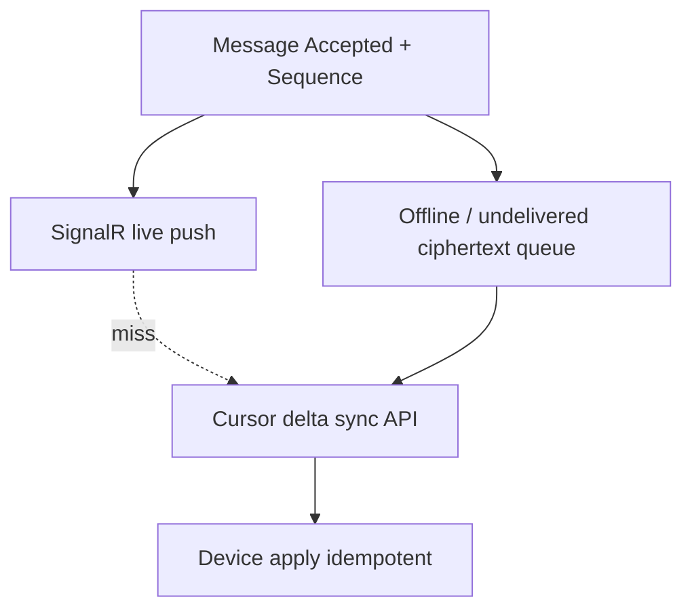

# WS-010 — Architecture Workshop: Synchronization

| Field | Value |
|---|---|
| **Workshop ID** | WS-010 |
| **Topic** | Synchronization |
| **Status** | Completed — Awaiting Decision |
| **Owner** | Principal Software Architect |
| **Version** | 1.0.0 |
| **Date** | 2026-07-18 |
| **Feeds Decision** | AD-010 Synchronization |
| **Evidence Base** | [RS-004 Synchronization](../../research/RS-004-synchronization.md) |
| **Respects** | AD-001..AD-009 (Approved) |

> This workshop prepares a decision. It does **not** make the final architecture decision.

---

## Executive Summary

Given AD-009’s per-conversation `Sequence`, **RS-004** favors **hybrid push + pull**: SignalR for live delivery, **authoritative cursor/delta sync** using **ConversationSequence as the canonical cursor**, idempotent apply by `MessageId`, server ciphertext queues for offline, and **paged backfill** for new devices. CRDTs are unnecessary for the append-only message path. Full snapshot-on-connect is rejected.

---

## Context

| Constraint | Implication |
|---|---|
| AD-009 / INV-05 | Sequence is total order; cursor = last contiguous Sequence |
| AD-008 | Ciphertext + envelope; dedup by MessageId |
| AD-006 / AD-007 | Device trust gates backfill; Active membership gates access |
| INV-01 / INV-04 | Ciphertext only; idempotent retries |
| NFR-P-05 | Fast reconnect catch-up |

**Canonical cursor (product constraint):** `ConversationSequence` (field `Sequence` on Accepted messages).

---

## Problem Statement

How do devices converge on the same authorized conversation state after offline periods, missed pushes, duplicates, and new-device link — without server decryption and without redesigning Ordering?

---

## Investigation Topics

### 1. Synchronization Model

| Approach | Latency | Scale | Mobile | Reliability | Ops |
|---|---|---|---|---|---|
| Pull-only | Med | High | Good | Good | Low |
| Push-only | Low | Med | Risk of loss | Weak alone | Med |
| Hybrid push + pull | **Best** | High | **Best** | **Best** | Med |
| Long poll | Med | Med | OK | OK | Med |
| SignalR / WSS | Low live | High w/ backplane | Good | Needs catch-up | Med |
| Event streams (global) | Low | Infra-heavy | OK | Strong | High |

**Lean:** Hybrid — SignalR push for liveness; **cursor delta sync as source of truth** for gaps (RS-004 B).

### 2. Synchronization Cursor

| Candidate | Assessment |
|---|---|
| **ConversationSequence** | **Canonical** — gap-detectable, AD-009 aligned |
| Global sequence | Unnecessary; cross-conversation order not required |
| Timestamp | Rejected (skew) |
| Version vectors | Overkill for messages |
| Hybrid HLC cursor | Future multi-region |

**Persistence:** Per `(DeviceId, ConversationId)` → `cursorSequence` (last contiguous applied Sequence).  
**Advancement:** Only after contiguous apply through N; never skip holes.  
**Validation:** Cursor ≤ max Sequence; device authorized; membership Active (or history policy).  
**Recovery:** Lost cursor → re-establish from server watermark or resync from 0 / recent window (policy).

### 3. Incremental Synchronization

| Mode | Behavior |
|---|---|
| Initial (new device) | Paged backfill recent-first; then older on demand |
| Incremental | `GET deltas WHERE Sequence > cursor ORDER BY Sequence LIMIT B` |
| Resume | Same cursor; idempotent re-apply |
| Long offline | Batched pages + backpressure; prioritize active conversations |

### 4. Multi-Device Synchronization

- Each device has independent cursors; converge to same message set for authorized membership.
- Concurrent sends: Sequence orders globally for conversation; all devices apply in Sequence order.
- Device register: empty cursors → backfill gated by AD-006 trust.
- Device remove/revoke: stop delivery; cursors discarded; keys rotated (AD-005/006).
- Late ack: push may miss; pull catch-up fills.

### 5. Offline Operation

- Outbound: local Pending queue; MessageId; retry with backoff; Ack binds Sequence (AD-009).
- Inbound: server retains ciphertext until delivered/synced (retention bound).
- Optimistic UI for outbound; inbound only after decrypt on device.
- Reconciliation: apply by Sequence; dedup MessageId.

### 6. Retry and Idempotency

| Mechanism | Rule |
|---|---|
| MessageId | Dedup accept and client apply |
| Sync batch replay | Same batch → same local state (idempotent fold) |
| Backoff | Exponential + jitter; cap; respect server Retry-After |
| Limits | Max retries then surface SyncFailed; cursor unchanged |

### 7. Conflict Resolution

| Conflict | Resolution |
|---|---|
| Duplicate message | Ignore by MessageId |
| Delayed edit | Apply if `editVersion` > local; else ignore |
| Tombstone before content | Buffer or apply tombstone; content later ignored if tombstoned |
| Out-of-order push | Buffer until Sequence contiguous or pull fill |
| Missing attachment blob | Message metadata present; lazy fetch; UI placeholder |

### 8. Synchronization Events

| Event | Producer | Consumers |
|---|---|---|
| `SyncStarted` / `SyncCompleted` | Client / Sync API | Telemetry |
| `CursorAdvanced` | Client after apply | Local store |
| `CursorReset` | Client/Server recovery | Catch-up |
| `DeviceCaughtUp` | Client | UI |
| `SyncFailed` / `RetryScheduled` | Client | UI / scheduler |

Server may emit delivery metrics; primary sync control plane is request/response + push frames.

### 9. Delivery Pipeline

**Realtime ≠ recovery.** Push is best-effort liveness; sync is authoritative recovery.

### 10. Failure Scenarios

| Failure | Recovery |
|---|---|
| Lost WebSocket | Reconnect → delta sync from cursor |
| Server restart | Durable messages/cursors in DB; resume |
| DB failover | Sync after promote; cursors durable |
| Retry storms | Idempotency + backoff + rate limits |
| Duplicate events | MessageId dedup |
| Partial sync page | Cursor advances only on full contiguous apply |
| Clock skew | Irrelevant for Sequence cursor |
| Partition | Eventual catch-up when healed |

### 11. Security

- Ciphertext only (INV-01).
- AuthN session + device binding (AD-002/006).
- AuthZ membership per conversation (AD-003/007).
- New-device backfill requires trusted device (AD-006).
- Key rotation: sync membership/key events as control-plane deltas (metadata).
- Cursors are metadata; no content encoding.

### 12. Performance

| Tactic | Default lean |
|---|---|
| Batch size | Bounded page (e.g., 50–200 msgs) — tune later |
| Pagination | Sequence range cursors |
| Compression | Optional transport compression |
| Delta | Sequence > cursor only |
| Lazy media | Attachment refs; fetch on demand |
| Backpressure | Limit concurrent sync conversations; server 429 |
| Large conv | Recent-first; archive on demand |

### 13. Domain Invariants (draft)

| ID | Invariant | Enforce |
|---|---|---|
| S-INV-01 | Cursor moves forward only (except explicit reset) | A + Client |
| S-INV-02 | Sync batch apply is idempotent | A + Client |
| S-INV-03 | Authorized devices eventually receive Accepted messages (within retention) | A + Infra |
| S-INV-04 | Sync never bypasses authz | A |
| S-INV-05 | Devices converge on same Sequence-ordered set after catch-up | A + Client |
| S-INV-06 | Canonical cursor is ConversationSequence | A |
| S-INV-07 | Dedup by MessageId | A + DB |

### 14. Future Compatibility

Receipts/reactions/threads as additional delta types or relation sync; scheduled messages appear at accept Sequence; multi-region aligns with HLC evolution (AD-009); analytics on metadata events only; global changefeed (RS-004 C) deferred.

---

## Alternatives (RS-004)

| Alt | Lean |
|---|---|
| A Full snapshot | Reject as primary |
| B Cursor delta + push | **Recommend** |
| C Global changefeed | Defer |
| D CRDT | Reject for messages |

---

## Recommendation

*(Not a decision.)* Adopt **RS-004 Alternative B**: per-device per-conversation **ConversationSequence cursor**, hybrid SignalR + delta sync, MessageId idempotency, paged backfill, server offline queue.

---

## Open Questions

| ID | Question | Owner |
|---|---|---|
| OQ-SYNC-01 | New-device backfill: recent window size? | Product |
| OQ-SYNC-02 | Cursor store: Postgres vs Redis+durable? | Backend |
| OQ-SYNC-03 | Global changefeed at launch? | Architecture (lean: no) |
| OQ-SYNC-04 | Offline queue retention TTL? | Product + SRE |

---

## References

- [RS-004](../../research/RS-004-synchronization.md)
- AD-009, AD-008, AD-006, AD-007
