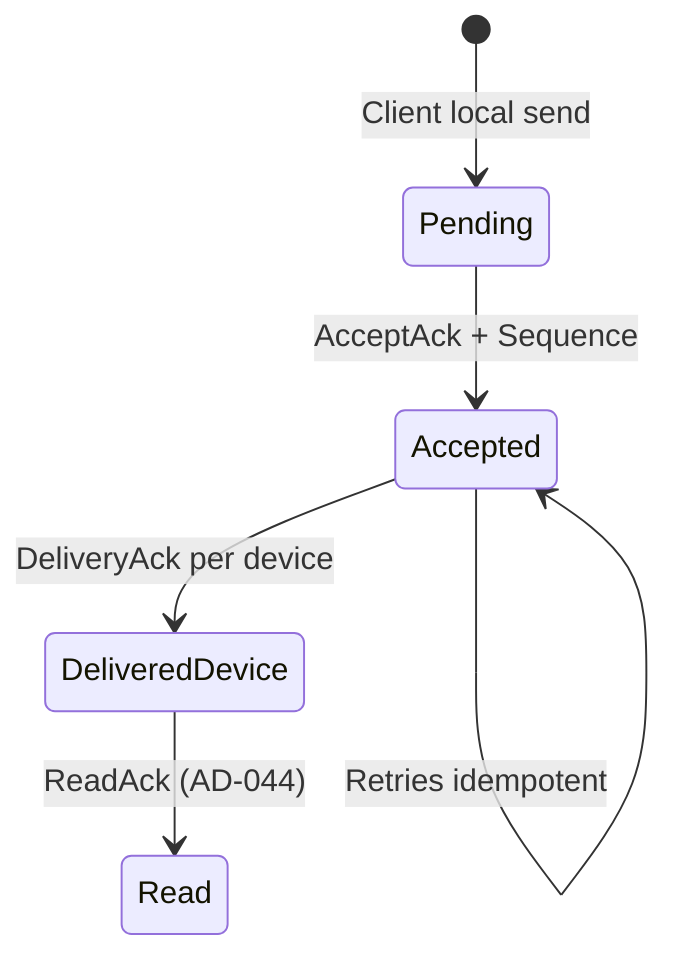
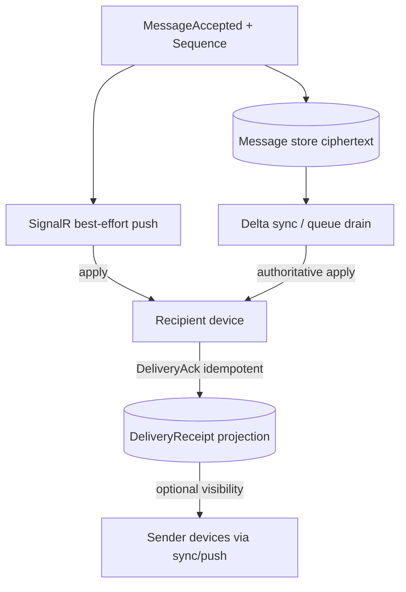

# WS-042 — Architecture Workshop: Delivery & Acknowledgements

| Field | Value |
|---|---|
| **Workshop ID** | WS-042 |
| **Topic** | Delivery & Acknowledgements |
| **Status** | Completed — Awaiting Decision |
| **Owner** | Principal Software Architect |
| **Version** | 1.0.0 |
| **Date** | 2026-07-18 |
| **Feeds Decision** | AD-042 Delivery Semantics |
| **Evidence Base** | [RS-005 Delivery & Acknowledgements](../../research/RS-005-delivery-and-acknowledgements.md) |
| **Respects** | AD-001..AD-010 (Approved), DOC-156 Phase 4 principles |

> This workshop prepares a decision. It does **not** make the final architecture decision.

---

## Executive Summary

**RS-005** favors a **dual acknowledgement model** on top of the Messaging Core: **AcceptAck** (AD-009) plus **per-device DeliveryAck projections** (AD-008-compatible). Live SignalR push remains best-effort; **cursor sync / queue drain** remains authoritative (AD-010). Delivery state must not mutate the Message aggregate. Read receipts stay out of scope (AD-044). Exactly-once and first-device-wins-as-sole-truth are rejected for the system of record.

---

## Context

| Constraint | Implication |
|---|---|
| AD-008 | Delivery/read are projections, not Message states |
| AD-009 | Accept + Sequence is server durability/order ack |
| AD-010 | Hybrid push + authoritative Sequence cursor sync |
| INV-01 / INV-04 / INV-05 | Ciphertext only; idempotent; Sequence order |
| AD-006 / AD-007 | Device trust + Active membership gate delivery |
| DOC-156 | Services extend core via events; no cyclic deps |

**Phase 4 position:** Sprint 1 foundation for AD-044 (Read) and AD-012 (Push).

---

## Problem Statement

How do we define reliable delivery from Accepted persistence to recipient devices, what acknowledgements mean to senders and operators, and how multi-device/offline paths remain correct — without redesigning Conversation, Message, Ordering, or Synchronization?

---

## Investigation Topics

### 1. Acknowledgement Ladder

| Layer | Meaning | Owner | Phase |
|---|---|---|---|
| **AcceptAck** | Server Accepted message; Sequence assigned; durable | Messaging Core (AD-009) | Done |
| **DeliveryAck** | Recipient **device** obtained message (policy: persist and/or decrypt) | Delivery service (AD-042) | This sprint |
| **ReadAck** | User attention / conversation opened policy | AD-044 | Later |

**Lean:** Explicit dual ack now; do not collapse Delivered into Accepted.

### 2. Delivery Guarantee

| Model | Assessment |
|---|---|
| At-most-once | Reject — silent loss under mobile disconnect |
| **At-least-once + MessageId idempotency** | **Adopt** — matches AD-010 |
| Exactly-once E2E | Reject as primary (RS-005 D) |

**Normative:** A message is **reliably deliverable** if every authorized recipient device can obtain it within retention via push and/or sync. Duplicates are safe.

### 3. Per-Device vs Per-User Tracking

| Approach | System of record | UX rollup |
|---|---|---|
| **Per-device DeliveryReceipt** | **Yes (lean)** | Optional aggregate |
| First-device-wins only | No (hides multi-device) | Possible but misleading alone |
| All-devices-required for “delivered” | Policy choice | Product (OQ) |

**Lean:** Persist per `(MessageId, RecipientDeviceId)`. User-level “delivered” is a **derived view** with an explicit policy (open question).

### 4. When DeliveryAck Is Emitted

| Trigger candidate | Notes |
|---|---|
| Server pushed frame | Insufficient alone (may not apply) |
| Device contiguous sync apply | Strong — aligns AD-010 |
| Device durable local persist of envelope | Strong for offline-safe ack |
| Successful client decrypt | Strongest semantic; fails closed on key issues |

**Lean (workshop):** Emit DeliveryAck after the recipient device has **durably applied** the envelope into its local store (sync or live path), preferably after **successful decrypt**. Undecryptable messages follow a retry/request path (client-driven); do not ack deliver as success until policy satisfied. Exact decrypt-vs-persist choice remains an open question for AD-042.

### 5. Integration with Messaging Core

| Rule | Detail |
|---|---|
| Message immutability | No delivery fields on Message aggregate |
| Ordering | Delivery UI never reorders by ack time; Sequence remains order |
| Events | Consume `MessageAccepted`; publish `MessageDeliveredToDevice` (name TBD) |
| AuthZ | Only the device (or its user session) may ack for that DeviceId |

### 6. Offline & Queue Semantics

| Concern | Lean |
|---|---|
| Offline inbound | Ciphertext retained; device drains via AD-010 sync |
| Undelivered definition | Device cursor behind max Sequence **or** explicit outbox — must be consistent |
| Purge | After all target devices delivered **or** retention TTL (AD-038 / OQ) |
| Sender offline | AcceptAck still durable; DeliveryAcks sync to sender on reconnect |

**Realtime ≠ recovery** (reaffirm AD-010 Topic 9).

### 7. Sender Visibility & Fan-In

| Topic | Lean |
|---|---|
| Direct chat UX | AcceptAck → DeliveryAck (device/user rollup) |
| Group fan-in | Batch/stack receipts; rate-limit; avoid per-message ack storms |
| Self devices | Sender’s other devices learn Accept via sync; optional self-delivery markers |

### 8. Idempotency & Retries

| Key | Behavior |
|---|---|
| Accept | MessageId (AD-009) |
| DeliveryAck | Upsert `(MessageId, DeviceId)` — duplicate = no-op |
| Transport | At-least-once push/sync overlap safe |
| Failure | Ack not recorded → device may retry; cursor rules unchanged |

Feeds ratification of **ADR-0018** idempotency patterns for delivery paths.

### 9. Failure Scenarios

| Failure | Recovery |
|---|---|
| Missed push | Sync drain; then DeliveryAck |
| Duplicate ack | Idempotent upsert |
| Device revoked mid-flight | Stop delivery; no further acks; key/membership events |
| Undecryptable ciphertext | Client retry/request; no success DeliveryAck until resolved or abandoned |
| Partial group delivery | Per-device truth; sender sees partial rollup |
| Projection store loss | Rebuild from ack log or re-ack on next apply (design in AD) |

### 10. Security & Privacy

- Ciphertext only (INV-01).
- DeliveryAck metadata must not encode plaintext.
- Side channel: ack timing ≈ device online — document; mitigate via privacy settings (AD-020), not by removing per-device truth from the model.
- Telemetry: counts/latencies only (INV-11).

### 11. Domain Invariants (draft)

| ID | Invariant | Enforce |
|---|---|---|
| D-INV-01 | Delivery state is never stored as Message lifecycle | A + DB |
| D-INV-02 | DeliveryAck is idempotent per (MessageId, DeviceId) | A + DB |
| D-INV-03 | DeliveryAck only from authorized recipient DeviceId | A |
| D-INV-04 | AcceptAck precedes any DeliveryAck for that MessageId | A + Client |
| D-INV-05 | Push cannot be the sole delivery authority | A + Client (AD-010) |
| D-INV-06 | Sequence remains canonical display order | Client |
| D-INV-07 | Revoked devices cannot obtain new content or emit valid new acks | A |

### 12. Out of Scope (explicit)

| Item | Deferred to |
|---|---|
| Read receipts | AD-044 |
| Push provider architecture | AD-012 |
| Retention TTL product policy | AD-038 / OQ |
| Reaction delivery | AD-051 |
| Media blob transport | AD-054 |

### 13. Future Compatibility

Read receipts should normally require prior DeliveryAck for the same device; push wake-ups subscribe to undelivered lag; sealed-sender-style receipt privacy can wrap DeliveryAck later without changing projection keys.

---

## Alternatives (RS-005)

| Alt | Lean |
|---|---|
| A Server-accept only | Reject as sole product model |
| B Dual ack + per-device projections | **Recommend** |
| C First-device-wins sole record | Reject as sole record; optional UX rollup only |
| D Exactly-once E2E | Reject as primary guarantee |

---

## Recommendation

*(Not a decision.)* Adopt **RS-005 Alternative B**:

1. Retain **AcceptAck** (AD-009) as server durability/order acknowledgement.
2. Introduce **per-device DeliveryAck projections** for recipient devices after durable apply (prefer post-decrypt).
3. Keep hybrid push + authoritative sync (AD-010).
4. Never mutate Message for delivery/read.
5. Define user-level delivered as a derived policy (open question).
6. Prepare event + projection contracts for AD-044 and AD-012.

---

## Open Questions

| ID | Question | Owner |
|---|---|---|
| OQ-DEL-01 | User-level delivered rollup: any device vs all devices vs primary? | Product |
| OQ-DEL-02 | DeliveryAck after decrypt vs after local envelope persist? | Architecture + Client |
| OQ-DEL-03 | Offline retention TTL / max undelivered depth? | Product + SRE (+ AD-038) |
| OQ-DEL-04 | Wire batching for stacked DeliveryAcks? | Protocol |
| OQ-DEL-05 | Default privacy: DeliveryAcks on/off by conversation type? | Product (+ AD-020) |

---

## References

- [RS-005](../../research/RS-005-delivery-and-acknowledgements.md)
- AD-008, AD-009, AD-010
- [DOC-154](../../20-architecture/20.1-messaging-core-architecture.md)
- [DOC-156](../../20-architecture/20.3-phase-4-messaging-services-plan.md)
- ADR-0018 (planned ratification target for idempotency)
