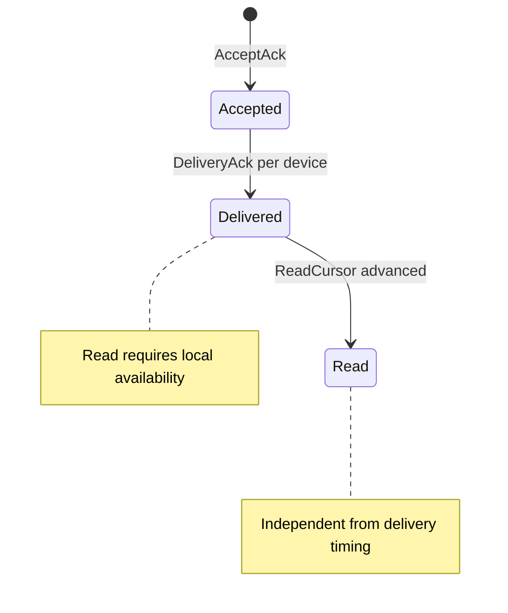
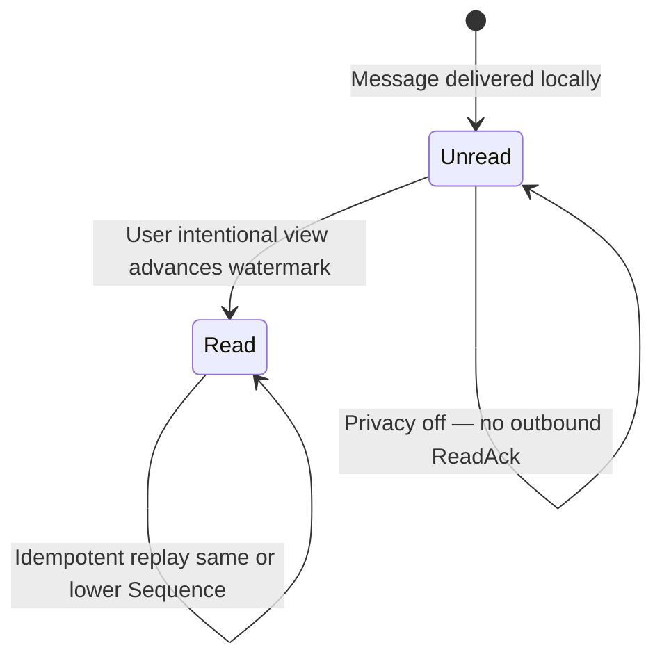
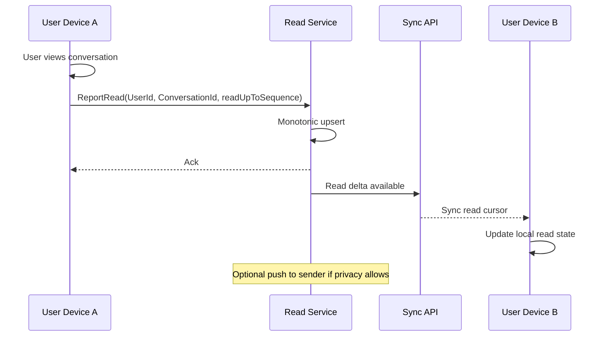

# WS-044 — Architecture Workshop: Read Receipts

| Field | Value |
|---|---|
| **Workshop ID** | WS-044 |
| **Topic** | Read Receipts |
| **Status** | Completed — Awaiting Decision |
| **Owner** | Principal Software Architect |
| **Version** | 1.0.0 |
| **Date** | 2026-07-18 |
| **Feeds Decision** | AD-044 Read Receipts |
| **Evidence Base** | [RS-006 Read Receipts](../../research/RS-006-read-receipts.md) |
| **Respects** | AD-001..AD-010, AD-042 (Approved), DOC-156 Sprint 2 charter |

> This workshop prepares a decision. It does **not** make the final architecture decision.

---

## Executive Summary

**RS-006** recommends **user-scoped read watermarks** (`readUpToSequence` per `(UserId, ConversationId)`) as the system of record, separate from AD-042 per-device DeliveryAck. Read confirms **intentional user view**, synced across the user's devices via AD-010 read deltas. Per-message read rows are derived for UI where needed, not stored for full history at launch. Privacy opt-out suppresses outbound ReadAck to peers. Message aggregate and ConversationSequence remain untouched.

**Guiding principle:** Delivery confirms device apply; Read confirms user attention — independent concepts.

---

## Context

| Baseline | Implication |
|---|---|
| AD-008 | Read is external projection, not Message state |
| AD-042 | DeliveryAck per device; AcceptAck per MessageId |
| AD-010 | Hybrid push + authoritative sync for state convergence |
| AD-009 | Sequence is order; read never reorders |
| INV-01 / INV-04 | Metadata-only server; idempotent monotonic read |
| Charter | User-level read; privacy-aware; multi-device deterministic |

---

## Problem Statement

How do we represent, synchronize, and optionally expose **user read state** for messages — without mutating Message, without using read time as order, without conflating read with delivery, and at scale for large group conversations?

---

## Investigation Topics

### 1. Acknowledgement Ladder (complete model)

| Layer | Meaning | Scope | Owner |
|---|---|---|---|
| AcceptAck | Server durable accept | MessageId | AD-009 |
| DeliveryAck | Device applied message | (MessageId, DeviceId) | AD-042 |
| **ReadAck / ReadCursor** | User intentionally viewed | (UserId, ConversationId) → readUpToSequence | AD-044 |

### 2. User-level vs Device-level Read

| Approach | Assessment |
|---|---|
| **User read watermark** | **Lean** — matches "user viewed"; convergent multi-device UX |
| Per-device read (mirror delivery) | Reject as sole record — fragments UX; side-channel amplification |
| Hybrid | User watermark + optional device hint for debugging only (non-normative) |

**Multi-device rule:** When user reads on device A, watermark advances for UserId; delta sync updates devices B/C to same readUpToSequence.

### 3. Highest-Read-Sequence vs Per-Message Receipts

| Model | Storage | Sync | Scale |
|---|---|---|---|
| **Watermark readUpToSequence** | O(users × conversations) | Small deltas | **Best** |
| Per-message ReadReceipt | O(messages × readers) | Large | Poor in groups |
| Hybrid | Watermark + derived recent list | Moderate | **Acceptable** |

**Lean:** Watermark authoritative. UI derives "message M is read" iff `Sequence(M) ≤ readUpToSequence`. Group member list shows each member's watermark.

### 4. Read State Lifecycle

| Transition | Trigger |
|---|---|
| Unread → Read | User opens conversation / scrolls message into intentional view policy |
| Read → Read | Duplicate or stale read report — no-op (monotonic max) |
| Outbound suppressed | Recipient privacy disables read receipts to senders |

### 5. ReadAck Emission Contract (draft)

Read advancement reported when **all** satisfied:

1. Message(s) locally available (post-delivery / local store).
2. User **intentional view** policy met (in-app visible, not push preview-only unless product defines otherwise — OQ-READ-01).
3. `Sequence ≤ proposed readUpToSequence` already delivered or accepted in local store.
4. Authenticated user matches watermark owner.
5. Privacy policy allows **outbound** notification to peers (if disabled, update local + sync own devices only).

**Monotonicity:** `readUpToSequence` never decreases except explicit conversation reset (leave/rejoin policy — future).

### 6. Aggregate Ownership

| Entity | Owns read? |
|---|---|
| Message | **No** |
| Conversation | **No** (membership only) |
| ReadCursor projection | **Yes** — `(UserId, ConversationId, readUpToSequence, updatedAt, privacyEpoch?)` |

Read service owns projections; Messaging Core unchanged.

### 7. Synchronization Behavior

| Concern | Rule |
|---|---|
| Authority | AD-010 delta sync includes **ReadCursor deltas** |
| Push | Best-effort read update frames |
| Offline | Queue read advancement; merge on reconnect with **max Sequence** |
| Idempotency | Same or lower readUpToSequence → no-op (INV-04) |
| Ordering | Read metadata never reorders message list |

### 8. Group Conversation Aggregation

| View | Source |
|---|---|
| "Alice read up to Seq 120" | Alice's ReadCursor |
| "Bob has not read" | Bob's watermark < message Sequence |
| Sender UX | Per-member watermarks; no full per-message matrix at scale |

Bulk open: single watermark jump covers many messages.

### 9. Privacy Behavior

| Control | Behavior |
|---|---|
| Global off | No outbound ReadAck to any peer; local read still tracked for self |
| Per-conversation off | Suppress to peers in that conversation only |
| Delivery vs read | Delivery receipts may remain on when read off (product — AD-020) |
| Side channel | Document read timing risk; rate-limit updates |

Coordinate with **AD-020** Privacy Model; do not block AD-044 on AD-020 approval — define interfaces now.

### 10. Failure Scenarios

| Failure | Recovery |
|---|---|
| Missed read push | Sync read deltas |
| Duplicate read report | Monotonic idempotent upsert |
| Offline concurrent read on two devices | Max readUpToSequence wins |
| Read before delivery visible | Do not advance past delivered/available messages |
| Privacy toggled mid-flight | Outbound gate at emit time; no retroactive forge |
| Projection loss | Rebuild from event log if added later; clients may re-report |

### 11. Extension Strategy

| Future | Hook |
|---|---|
| AD-012 Push | Wake on read? Unlikely — low priority |
| Analytics | Subscribe to ReadCursorAdvanced metadata |
| Threads | Watermark per thread scope (extension) or same conversation cursor |
| Reactions read | Separate from message body read |

### 12. Domain Invariants (draft)

| ID | Invariant | Enforce |
|---|---|---|
| R-INV-01 | Read state never stored on Message aggregate | A + DB |
| R-INV-02 | readUpToSequence monotonic per (UserId, ConversationId) | A + DB |
| R-INV-03 | Read reports idempotent (replay safe) | A |
| R-INV-04 | Read never modifies ConversationSequence | A |
| R-INV-05 | Read never mutates Message content | A |
| R-INV-06 | Outbound ReadAck gated by privacy policy | A + Client |
| R-INV-07 | User read watermark synced across own devices | A + Sync |
| R-INV-08 | Read state reconstructible from projection store | A |
| R-INV-09 | Delivery and Read projections independent | A |

### 13. Out of Scope

Presence, typing, push, analytics, moderation — separate ADs per charter.

---

## Alternatives (RS-006)

| Alt | Lean |
|---|---|
| A Per-message ReadReceipt | Derived UI only; not primary store |
| B User read watermark | **Recommend** |
| C Per-device read sole record | **Reject** |
| D Event sourcing primary | **Defer** |

---

## Recommendation

*(Not a decision.)* Adopt **RS-006 Alternative B**:

1. **ReadCursor** projection: `readUpToSequence` per `(UserId, ConversationId)`.
2. **Independent** from DeliveryAck; intentional view semantics.
3. **Sync** read deltas via AD-010; push best-effort.
4. **Privacy** outbound gate; local read always tracked for self.
5. **Groups:** per-member watermarks; sender aggregates.
6. **Monotonic idempotent** advancement (ADR-0018 pattern extension).

---

## Open Questions

| ID | Question | Owner |
|---|---|---|
| OQ-READ-01 | Notification preview counts as read? | Product |
| OQ-READ-02 | Default read receipts on for Direct vs Group? | Product (+ AD-020) |
| OQ-READ-03 | Max gap: can user mark read without every intermediate message delivered to all devices? | Architecture |
| OQ-READ-04 | Wire format: standalone ReadReport vs batched | Protocol |

---

## References

- [RS-006](../../research/RS-006-read-receipts.md)
- AD-042, AD-008, AD-010, AD-009
- [DOC-156](../../20-architecture/20.3-phase-4-messaging-services-plan.md)
- DOC-156 Sprint 2 charter
