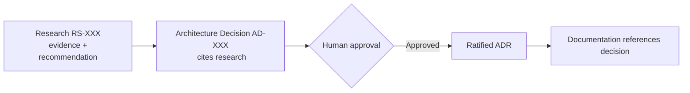

# Research Repository

| Field | Value |
|---|---|
| **Status** | Active |
| **Owner** | Principal Software Architect |
| **Version** | 1.0.0 |
| **Last Updated** | 2026-07-18 |

## Purpose

The Research Repository holds **objective engineering research** that precedes and informs Architecture Decisions. Its goal is to ensure that each Architecture Decision Sprint is grounded in **evidence** — comparative analysis of publicly documented practices, common industry patterns, and critically evaluated trade-offs — rather than assumptions.

Research documents (`RS-XXX`) are **evidence, not decisions**. They compare options and recommend a direction, but they never approve architecture.

## Relationship to Architecture Decisions (ADRP)

- Research documents map to decisions:
  - `RS-001 Conversation Models` → **AD-007 Conversation Model**
  - `RS-002 Message Models` → **AD-008 Message Model**
  - `RS-003 Message Ordering` → **AD-009 Message Ordering**
  - `RS-004 Synchronization` → **AD-010 Synchronization**
  - `RS-005 Delivery & Acknowledgements` → **AD-042 Delivery Semantics**
- Every Architecture Decision **must cite** its corresponding research document when research was authored.
- Research recommends; the ADRP decision records the chosen option and its consequences; a human approves.

## Relationship to ADRs

Once a decision informed by research is **Approved** in the ADRP, it is ratified as a formal ADR in `docs/ADR/`. The research document is referenced by both the ADRP decision and the ratifying ADR as the evidentiary basis.

## Relationship to Documentation

Documentation generation remains **paused**. When it resumes, the affected documents (domain, data, protocol, realtime) will reference the approved decisions, which in turn cite this research. Research therefore sits upstream of both decisions and documentation.

## Research Workflow

1. Author an `RS-XXX` document following the research standards (below).
2. The next Architecture Decision Sprint reviews the research and drafts the corresponding `AD-XXX`, citing it.
3. A human approves the decision; it is ratified as an ADR; documentation later references it.

## Research Standards

Every `RS-XXX` document contains: Executive Summary; Problem Statement; Why This Decision Matters; Industry Research; Publicly Documented Practices; Common Architectural Patterns; Alternative Designs; Advantages; Disadvantages; Trade-offs; Security Considerations; Scalability Considerations; Operational Considerations; Mobile Considerations; Backend Considerations; Database Implications; Future Evolution; Recommendation; Open Questions; References.

Every claim is labelled as one of:
- **Documented fact** — publicly published by the vendor or in a specification.
- **Industry pattern** — a common engineering approach not tied to one vendor's internals.
- **Project recommendation** — guidance specific to this platform.

Undocumented vendor internals are not speculated upon.

## Documents

| ID | Title | Feeds Decision |
|---|---|---|
| RS-001 | Conversation Models | AD-007 |
| RS-002 | Message Models | AD-008 |
| RS-003 | Message Ordering | AD-009 |
| RS-004 | Synchronization | AD-010 |
| RS-005 | Delivery & Acknowledgements | AD-042 |
