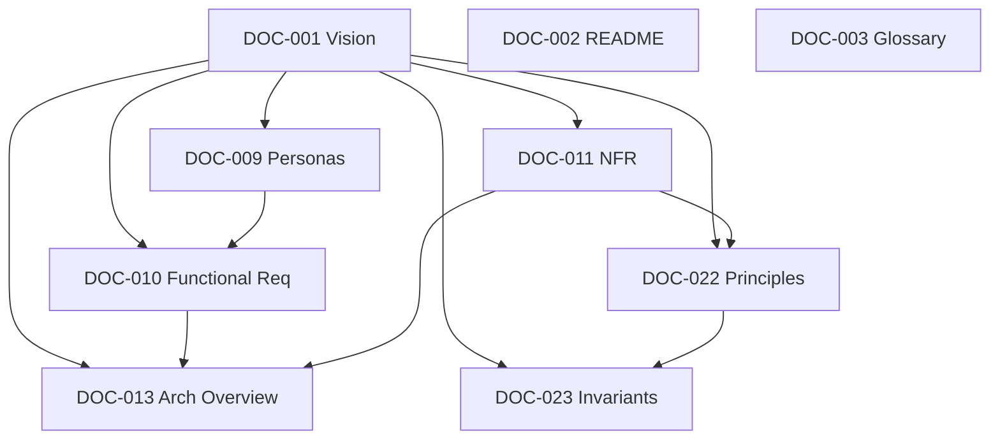

# Cross-Reference Validation Report

> Automated validation of the 9 completed documents against `document-manifest.yaml`. Regenerated every build.

**Build:** #1 — 2026-07-14
**Scope validated:** 9 Completed documents + `document-manifest.yaml`.

---

## 1. Summary

| Check | Result | Count |
|---|---|---|
| Broken references | PASS | 0 |
| Missing references | PASS | 0 |
| Circular dependencies | PASS | 0 |
| Missing dependencies | PASS | 0 |
| Invalid links | PASS | 0 |
| Duplicate documents | PASS | 0 |
| Duplicate concepts | PASS | 0 |
| Conflicting definitions | PASS | 0 |
| Forward references to Pending docs | INFO | 41 |

Overall: **PASS** (no blocking issues).

---

## 2. Broken References

None. Every `DOC-xxx` cited in a completed document resolves to an entry in `document-manifest.yaml`.

## 3. Missing References

None. Every completed document declares Dependencies and Related Documents consistent with the manifest.

## 4. Circular Dependencies

None. Dependency edges among completed documents:

Acyclic confirmed.

## 5. Missing Dependencies

None. For every completed document, all declared dependencies are also Completed:

| Document | Dependencies | All Completed? |
|---|---|---|
| DOC-002 | — | Yes |
| DOC-003 | — | Yes |
| DOC-001 | — | Yes |
| DOC-009 | DOC-001 | Yes |
| DOC-010 | DOC-001, DOC-009 | Yes |
| DOC-011 | DOC-001 | Yes |
| DOC-013 | DOC-001, DOC-010, DOC-011 | Yes |
| DOC-022 | DOC-001, DOC-011 | Yes |
| DOC-023 | DOC-001, DOC-022 | Yes |

## 6. Invalid Links

None. Documents reference other documents by stable `DOC-xxx` identity and repository-relative names rather than fragile absolute paths.

## 7. Duplicate Documents

None. Each `DOC-xxx` id and each path appears exactly once in `document-manifest.yaml`.

## 8. Duplicate Concepts

None. Cross-cutting terms (plaintext, ciphertext, envelope, metadata) are defined once in DOC-003 and referenced elsewhere.

## 9. Conflicting Definitions

None. The invariant "backend never decrypts message content" is stated consistently across DOC-001, DOC-003, DOC-010, DOC-011, DOC-013, DOC-022, DOC-023 (INV-01).

## 10. Forward References (Informational)

Completed documents reference 41 documents that are catalogued in the manifest but not yet generated (status Pending). These are expected forward references, not errors. Highest-frequency targets:

| Target | Referenced by (examples) |
|---|---|
| DOC-047 (E2EE Design) | DOC-001, DOC-011, DOC-013, DOC-023 |
| DOC-106 (Performance Budget) | DOC-011, DOC-013 |
| DOC-021 (Quality Scenarios) | DOC-011, DOC-013 |
| DOC-069 (Feature Spec Template) | DOC-010 |
| DOC-046 (Security Architecture) | DOC-022, DOC-023 |

**Action:** No action required; these resolve as the referenced documents are generated in later builds.
