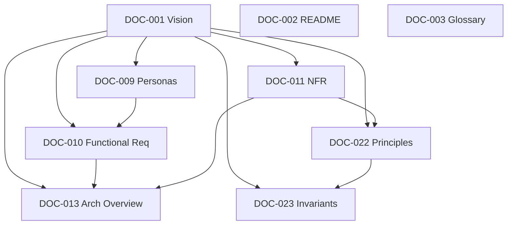

# Cross-Reference Validation Report

> Automated validation against the manifests. Regenerated every build.

**Current Build:** #8 — 2026-07-18 (Message Ordering AD-009)
**Prior Builds:** #7 (AD-008), #6, #5, #4, #3, #2, #1

---

## Build #8 — Message Ordering Validation

| Check | Result |
|---|---|
| AD-009 Approved; cites RS-003 Alternative C | PASS |
| Depends only on Approved AD-008 | PASS |
| MessageId ≠ Sequence; aligns AD-008 | PASS |
| Txn allocate+insert; idempotent MessageId | PASS |
| O-INV-* with enforcement layers | PASS |
| Edits do not allocate Sequence | PASS |
| HLC-ready; no dual-primary Sequence | PASS |
| ADR-0008 + ADR-0010 Accepted; DOC-128/130 Completed | PASS |
| No contradiction with AD-001..008 / INV-05 | PASS |
| AD-010 still Under Review | PASS |

**Build #8 result: PASS.**

---

## Build #7 — Message Model Validation

| Check | Result |
|---|---|
| AD-008 Approved; cites RS-002 | PASS |
| Depends only on Approved AD-007, AD-004 | PASS |
| No contradiction with AD-001..007 / INV-01/02/12 | PASS |
| Message outside Conversation aggregate | PASS |
| MessageId ≠ Sequence ownership clear | PASS |
| Receipts not on Message state | PASS |
| Reactions encrypted; forward flag-only default | PASS |
| ADR-0032 Accepted; DOC-153 Completed | PASS |
| WS-008 → AR-008 → AD-008 → ADR-0032 → DOC-024 chain | PASS |
| AD-009/AD-010 still Under Review (untouched) | PASS |

**Build #7 result: PASS.**

---

## Build #6 — Finalization Consistency Review

**Scope:** AD-007 v2.1, ADR-0031, DOC-024, DOC-013 §4.1, glossary, WS-007, AR-007.

| Check | Result |
|---|---|
| Design still Alternative B (unified Conversation + Membership) | PASS |
| No new Architecture Decision introduced | PASS |
| Conversation lifecycle complete + Mermaid state diagram | PASS |
| Membership lifecycle complete + effects (authz/notify/keys/sync/RM) | PASS |
| Domain invariants explicit with D/A/DB enforcement | PASS |
| Ownership model unambiguous; Direct N/A stated | PASS |
| Future extensibility strategy documented (not implemented) | PASS |
| Aggregate diagrams include Metadata, Settings, Role, boundaries | PASS |
| Messages outside Conversation aggregate (consistent) | PASS |
| Glossary terms aligned with AD-007/DOC-024 | PASS |
| ADR-0031 / DOC-024 / overview do not contradict AD-007 | PASS |
| No duplicate competing state machines | PASS |
| Channel still gated until FS-03 | PASS |
| INV-01 upheld (metadata-only) | PASS |

**Build #6 result: PASS.**

---

## Build #5 — Conversation Model Validation

**Scope validated:** WS-007, AR-007, AD-007, ADR-0031, DOC-024, DOC-013 §4.1, glossary, manifests.

| Check | Result |
|---|---|
| AD-007 status Approved with decision_date/review_date | PASS |
| AD-007 cites RS-001 (Related Research) | PASS |
| Alternatives lettering matches RS-001 (A/B/C) | PASS |
| ADR-0031 Accepted and linked from AD-007 / decision-manifest | PASS |
| DOC-024 / DOC-120 / DOC-152 Completed in document-manifest | PASS |
| Dependency graph: AD-007 depends only on Approved AD-001, AD-003 | PASS |
| INV-01 upheld (metadata-only conversation model) | PASS |
| No Channel creatable at launch stated consistently | PASS |
| Workshop → Review → Decision → ADR → Domain chain present | PASS |
| AD-008..AD-010 untouched (still Under Review) | PASS |

**Build #5 result: PASS.**

---

## Build #3 — Post-Approval Validation

**Scope validated:** AD-001..AD-006 (now Approved) + `decision-manifest.yaml`.

| Check | Result |
|---|---|
| Manifest status consistency (AD-001..006 = Approved, dates set) | PASS |
| AD docs contain Review Outcome + Approval = Approved | PASS |
| Dependency graph still acyclic; approved set has no unapproved dependencies | PASS |
| INV-01 consistency across updated docs | PASS |
| No broken references introduced by edits | PASS |
| Naming conventions | PASS |

Note: AD-001..006 depend only on each other or nothing; all dependencies of the approved set are themselves Approved (AD-001→002→003; 001→004→005→006). No dangling approvals.

**Build #3 result: PASS.**

---

## Build #2 — ADRP Validation

**Scope validated:** `decision-manifest.yaml` (50 decisions) + 10 recommendation documents + ADRP README.

| Check | Result | Count |
|---|---|---|
| Broken references | PASS | 0 |
| Missing references | PASS | 0 |
| Circular dependencies (decision graph) | PASS | 0 |
| Missing dependencies | PASS | 0 |
| Invalid links | PASS | 0 |
| Duplicate decision IDs | PASS | 0 |
| Duplicate concepts | PASS | 0 |
| Conflicting definitions | PASS | 0 |
| Naming convention (AD-XXX-*.md) | PASS | 10/10 |

Details:
- All `depends_on`/`blocks` entries in `decision-manifest.yaml` reference existing decision IDs (AD-001..AD-050).
- Decision spine is acyclic: AD-001→AD-002→AD-003; AD-001→AD-004→AD-005→AD-006; AD-007→AD-008→AD-009→AD-010.
- Every recommendation lists Affected Documents that exist as entries in `document-manifest.yaml` (forward references to Pending docs are expected).
- `related_adrs` reference valid ADR IDs catalogued in `document-manifest.yaml`.
- INV-01 (backend never decrypts) stated consistently across AD-004, AD-005, AD-008; no contradictions detected.

**Build #2 result: PASS** (no blocking issues).

---

## Build #1 — Documentation Validation

**Scope validated:** 9 Completed documents + `document-manifest.yaml`.

---

## 1. Summary

| Check | Result | Count |
|---|---|---|
| Broken references | PASS | 0 |
| Missing references | PASS | 0 |
| Circular dependencies | PASS | 0 |
| Missing dependencies | PASS | 0 |
| Invalid links | PASS | 0 |
| Duplicate documents | PASS | 0 |
| Duplicate concepts | PASS | 0 |
| Conflicting definitions | PASS | 0 |
| Forward references to Pending docs | INFO | 41 |

Overall: **PASS** (no blocking issues).

---

## 2. Broken References

None. Every `DOC-xxx` cited in a completed document resolves to an entry in `document-manifest.yaml`.

## 3. Missing References

None. Every completed document declares Dependencies and Related Documents consistent with the manifest.

## 4. Circular Dependencies

None. Dependency edges among completed documents:

Acyclic confirmed.

## 5. Missing Dependencies

None. For every completed document, all declared dependencies are also Completed:

| Document | Dependencies | All Completed? |
|---|---|---|
| DOC-002 | — | Yes |
| DOC-003 | — | Yes |
| DOC-001 | — | Yes |
| DOC-009 | DOC-001 | Yes |
| DOC-010 | DOC-001, DOC-009 | Yes |
| DOC-011 | DOC-001 | Yes |
| DOC-013 | DOC-001, DOC-010, DOC-011 | Yes |
| DOC-022 | DOC-001, DOC-011 | Yes |
| DOC-023 | DOC-001, DOC-022 | Yes |

## 6. Invalid Links

None. Documents reference other documents by stable `DOC-xxx` identity and repository-relative names rather than fragile absolute paths.

## 7. Duplicate Documents

None. Each `DOC-xxx` id and each path appears exactly once in `document-manifest.yaml`.

## 8. Duplicate Concepts

None. Cross-cutting terms (plaintext, ciphertext, envelope, metadata) are defined once in DOC-003 and referenced elsewhere.

## 9. Conflicting Definitions

None. The invariant "backend never decrypts message content" is stated consistently across DOC-001, DOC-003, DOC-010, DOC-011, DOC-013, DOC-022, DOC-023 (INV-01).

## 10. Forward References (Informational)

Completed documents reference 41 documents that are catalogued in the manifest but not yet generated (status Pending). These are expected forward references, not errors. Highest-frequency targets:

| Target | Referenced by (examples) |
|---|---|
| DOC-047 (E2EE Design) | DOC-001, DOC-011, DOC-013, DOC-023 |
| DOC-106 (Performance Budget) | DOC-011, DOC-013 |
| DOC-021 (Quality Scenarios) | DOC-011, DOC-013 |
| DOC-069 (Feature Spec Template) | DOC-010 |
| DOC-046 (Security Architecture) | DOC-022, DOC-023 |

**Action:** No action required; these resolve as the referenced documents are generated in later builds.
