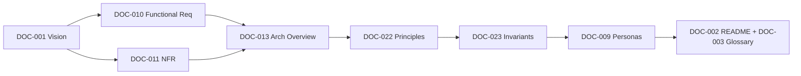

# Review Index

> Entry point for reviewers. Start here, then follow the recommended review sequence. For the machine-readable dashboard, open `review-manifest.yaml`.

**Build:** #1 — 2026-07-14 | **Branch:** main | **Documented commit:** cb5c3a4

---

## Current Project Status

- **Phase:** Phase-1 (Foundations) complete; entering Phase-2 (Core Architecture & Domain).
- **Completion:** 9 of 151 documents (6.0%).
- **Health:** All completed documents pass validation and quality gates; average quality 9.32/10.
- **Defining constraint upheld:** Backend never decrypts message content (INV-01).

## Current Build

- Manifest source of truth: `docs/document-manifest.yaml`.
- Build report: `BUILD-REPORT.md`.
- Changes: `CHANGES.md`.

## Documents Created (this build)

1. DOC-002 README & Reading Order
2. DOC-003 Glossary Overview
3. DOC-009 Personas and Use Cases
4. DOC-010 Functional Requirements
5. DOC-011 Non-Functional Requirements
6. DOC-013 Architecture Overview
7. DOC-022 Architecture Principles
8. DOC-023 System Invariants
9. DOC-001 Vision and Scope (registered)

## Review Order

## Critical Documents

| Document | Why critical |
|---|---|
| DOC-023 System Invariants | Encodes the absolute rules, including backend-never-decrypts. |
| DOC-013 Architecture Overview | The solution strategy the whole build follows. |
| DOC-011 Non-Functional Requirements | Drives scalability, performance, security targets. |
| DOC-010 Functional Requirements | Scope baseline for all feature work. |

## Known Risks

| ID | Description | Severity |
|---|---|---|
| RISK-01 | E2EE limits server-side features (search, moderation, recovery). | High |
| RISK-02 | Module boundary erosion would block microservice extraction. | Medium |
| RISK-03 | Fan-out at large group scale is the primary performance bottleneck. | High |
| RISK-04 | Availability vs. E2EE tension (no server recovery of content). | Medium |

## Open Questions

| ID | Description | Owner |
|---|---|---|
| OQ-NFR-01 | Confirmed launch availability SLO and error budget. | SRE + Product |
| OQ-INV-02 | Authoritative global ordering scheme (ULID/Snowflake/HLC). | Architecture |
| OQ-ARCH-02 | Selected E2EE protocol/library and audit status. | Security |
| OQ-PER-01 | Concurrent devices per user to support at launch. | Product + Architecture |
| OQ-FR-01 | Delete-for-everyone time window. | Product |

## Pending ADRs

See `ARCHITECTURE-DECISIONS-PENDING.md`. Highest priority: ADR-0004 (E2EE protocol), ADR-0008/0010 (message ID & ordering), ADR-0020 (group encryption).

## Recommended Review Sequence

1. `REVIEW-INDEX.md` (this file)
2. `review-manifest.yaml` (dashboard)
3. `BUILD-REPORT.md`
4. `QUALITY-REPORT.md`
5. `CROSS-REFERENCE-REPORT.md`
6. `ARCHITECTURE-DECISIONS-PENDING.md`
7. `REVIEW-CHECKLIST.md`
8. The 9 completed documents in the review order above.
