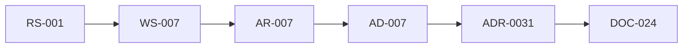

# Review Index

> Entry point for reviewers. Start here, then follow the recommended review sequence. For the machine-readable dashboard, open `review-manifest.yaml`. The Git repository is the source of truth.

**Current Build:** #5 — 2026-07-18 (Messaging Core — Conversation Model) | **Branch:** feature/messaging-core-ad-007
**Prior Builds:** #4 (Research RS-001..004), #3 (AD-001..006 Approved), #2 (ADRP Wave 1), #1 (documentation foundations)

> Build #5 completes the Conversation Model topic (WS-007 → AR-007 → AD-007 Approved → ADR-0031). **Await human approval before starting Message Model (AD-008).**

---

## Current Project Status

- **Phase:** Messaging Core Architecture Sprint — Topic 1 complete; Topics 2–4 paused for human approval.
- **Decision coverage:** 7 of 50 Approved; 3 Under Review (AD-008..AD-010); 40 Proposed.
- **Documentation completion:** 12 of 152 documents (~7.9%).
- **Health:** AD-007 approved with RS-001 evidence, workshop, and critical review; INV-01 upheld.
- **Defining constraint upheld:** Backend never decrypts message content (INV-01).

## Sprint Outcome (Build #5)

| Decision | Verdict | Status |
|---|---|---|
| AD-007 Conversation Model | Approve with Changes | Approved |

Workshop: WS-007 · Review: AR-007 · ADR: ADR-0031 Accepted · Domain: DOC-024.

## Review Scope (this build)

Conversation Model only: workshop, architecture review, AD-007, ADR-0031, domain/architecture doc updates, review package.

## Artifacts Created / Updated (this build)

1. WS-007 Conversation Model workshop
2. AR-007 Architecture Review
3. AD-007 (Approved, RS-001-cited)
4. ADR template + ADR-0031
5. Domain model overview (DOC-024)
6. Architecture overview §4.1 + glossary terms
7. Review package (this build)

## Review Order

## Critical Documents

| Document | Why critical |
|---|---|
| AD-007 / ADR-0031 | Normative conversation model for the messaging engine. |
| RS-001 | Evidence base for AD-007. |
| DOC-023 System Invariants | Backend-never-decrypts and related rules. |
| DOC-024 Domain Model | Conversation/Membership aggregates and sequences. |

## Known Risks

| ID | Description | Severity |
|---|---|---|
| RISK-01 | E2EE limits server-side features (search, moderation, recovery). | High |
| RISK-03 | Fan-out at large group scale is the primary performance bottleneck. | High |
| RISK-06 | Message ID/ordering (AD-009) and sync (AD-010) still Under Review. | Medium |
| R-007-02 | Membership event loss delaying re-key (mitigated via outbox + AD-020). | High |

## Open Questions

| ID | Description | Owner |
|---|---|---|
| OQ-CONV-01 | Max group size at launch. | Product + Security |
| OQ-CONV-04 | Group title/avatar encryption posture. | Security + Product |
| OQ-INV-02 | Authoritative global ordering scheme (AD-009). | Architecture |
| OQ-ARCH-02 | Selected E2EE protocol/library and audit status. | Security |

## Pending ADRs

See `ARCHITECTURE-DECISIONS-PENDING.md`. ADR-0031 Accepted. Highest remaining: ADR-0004, ADR-0008/0010, ADR-0020, ADR-0016.

## Recommended Review Sequence

1. `REVIEW-INDEX.md` (this file)
2. `review-manifest.yaml`
3. `BUILD-REPORT.md` (Build #5)
4. `WS-007` → `AR-007` → `AD-007` → `ADR-0031` → `DOC-024`
5. `QUALITY-REPORT.md` / `CROSS-REFERENCE-REPORT.md`
6. Confirm human approval to proceed to AD-008 Message Model
