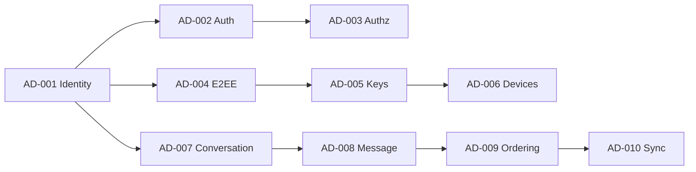

# Review Index

> Entry point for reviewers. Start here, then follow the recommended review sequence. For the machine-readable dashboard, open `review-manifest.yaml`. The Git repository is the source of truth.

**Current Build:** #3 — 2026-07-15 (Architecture Decision Review Sprint) | **Branch:** feature/architecture-decisions-wave-1 | **Base:** main
**Prior Builds:** #2 (ADRP Wave 1), #1 (documentation foundations)

---

## Current Project Status

- **Phase:** Architecture Decision Review Sprint complete for AD-001..AD-006. Documentation generation paused.
- **Decision coverage:** 6 of 50 Approved; 4 Under Review (AD-007..AD-010); 40 Proposed.
- **Documentation completion:** 9 of 151 documents (6.0%) — unchanged this build.
- **Health:** All six in-scope decisions reviewed, improved, and Approved; average review score 9.35/10.
- **Defining constraint upheld:** Backend never decrypts message content (INV-01).

## Sprint Outcome (Build #3)

| Decision | Verdict | Status |
|---|---|---|
| AD-001..AD-006 | Approve with Changes | Approved |

Approved: 6 · Rejected: 0 · Needs Revision: 0. Next sprint reviews AD-007..AD-010.

## Current Build

- Decision source of truth: `docs/architecture-decisions/decision-manifest.yaml`.
- Documentation source of truth: `docs/document-manifest.yaml`.
- Build report: `BUILD-REPORT.md` (Build #2). Changes: `CHANGES.md` (Build #2).

## Review Scope (this build)

Architecture Decision Repository (ADRP) Wave 1: README, decision manifest, and 10 recommendation documents (AD-001..AD-010). No documentation, ADRs, or code changed.

## Artifacts Created (this build)

1. ADRP README
2. decision-manifest.yaml (50 decisions)
3. AD-001 User Identity
4. AD-002 Authentication
5. AD-003 Authorization
6. AD-004 E2EE Protocol
7. AD-005 Key Management
8. AD-006 Device Model and Device Trust
9. AD-007 Conversation Model
10. AD-008 Message Model
11. AD-009 Message Ordering
12. AD-010 Synchronization

## Review Order

## Critical Documents

| Document | Why critical |
|---|---|
| DOC-023 System Invariants | Encodes the absolute rules, including backend-never-decrypts. |
| DOC-013 Architecture Overview | The solution strategy the whole build follows. |
| DOC-011 Non-Functional Requirements | Drives scalability, performance, security targets. |
| DOC-010 Functional Requirements | Scope baseline for all feature work. |

## Known Risks

| ID | Description | Severity |
|---|---|---|
| RISK-01 | E2EE limits server-side features (search, moderation, recovery). | High |
| RISK-02 | Module boundary erosion would block microservice extraction. | Medium |
| RISK-03 | Fan-out at large group scale is the primary performance bottleneck. | High |
| RISK-04 | Availability vs. E2EE tension (no server recovery of content). | Medium |

## Open Questions

| ID | Description | Owner |
|---|---|---|
| OQ-NFR-01 | Confirmed launch availability SLO and error budget. | SRE + Product |
| OQ-INV-02 | Authoritative global ordering scheme (ULID/Snowflake/HLC). | Architecture |
| OQ-ARCH-02 | Selected E2EE protocol/library and audit status. | Security |
| OQ-PER-01 | Concurrent devices per user to support at launch. | Product + Architecture |
| OQ-FR-01 | Delete-for-everyone time window. | Product |

## Pending ADRs

See `ARCHITECTURE-DECISIONS-PENDING.md`. Highest priority: ADR-0004 (E2EE protocol), ADR-0008/0010 (message ID & ordering), ADR-0020 (group encryption).

## Recommended Review Sequence

1. `REVIEW-INDEX.md` (this file)
2. `review-manifest.yaml` (dashboard)
3. `BUILD-REPORT.md` (Build #2)
4. `QUALITY-REPORT.md` (Build #2 decision scores)
5. `CROSS-REFERENCE-REPORT.md` (Build #2 ADRP validation)
6. `ARCHITECTURE-DECISIONS-PENDING.md`
7. `REVIEW-CHECKLIST.md` (ADRP section)
8. `docs/architecture-decisions/README.md` then `decision-manifest.yaml`
9. The 10 recommendation documents (AD-001..AD-010) in the review order above.
